# Arquitetura da API

## Escopo atual

A API é uma aplicação NestJS modular. A primeira fatia implementa obras, catálogo de etapas e serviços, fornecedores e configuração do cronograma base. PostgreSQL é a autoridade dos dados e também aplica parte das regras de isolamento e integridade.

```mermaid
flowchart LR
    UI[Cliente web ou Swagger] --> HTTP[NestJS]
    HTTP --> SEC[Helmet, CORS e rate limit]
    SEC --> AUTH[Validação JWT]
    AUTH --> VAL[DTO e ValidationPipe]
    VAL --> SVC[Serviço de domínio]
    SVC --> TX[Transação contextualizada]
    TX --> RLS[PostgreSQL e RLS]
    RLS --> AUD[Auditoria e histórico]
```

## Fluxo de requisição

1. O middleware aceita um `x-request-id` válido ou cria um UUID.
2. Helmet e CORS limitam a superfície HTTP; o throttler aplica a cota configurada.
3. Rotas privadas exigem Bearer JWT com assinatura, emissor e audiência válidos.
4. O `ValidationPipe` remove ambiguidades e rejeita propriedades não declaradas.
5. O serviço abre uma transação e define organização, usuário e requisição em configurações locais do PostgreSQL.
6. RLS valida o vínculo ativo com a organização e a obra.
7. Gatilhos registram alterações relevantes em tabelas append-only.
8. Erros saem como `application/problem+json`, sem stack trace.

## Módulos

- `health`: saúde do processo e conectividade com o banco.
- `projects`: cadastro e consulta de obras.
- `catalog`: catálogo reutilizável de etapas e serviços.
- `suppliers`: fornecedores segregados por organização.
- `project-config`: etapas, serviços, fornecedores e dependências da obra.
- `database`: pool, transações e contexto de segurança.
- `common/auth`: autenticação do access token.

## Decisões relevantes

- Valores decimais chegam como texto e são gravados em `numeric`, evitando arredondamento binário.
- Serviço e fornecedor principal são criados na mesma transação.
- Dependências são verificadas pela API e por gatilho recursivo no banco.
- O papel usado pela API deve ser diferente do proprietário das migrações e não pode possuir `BYPASSRLS`.
