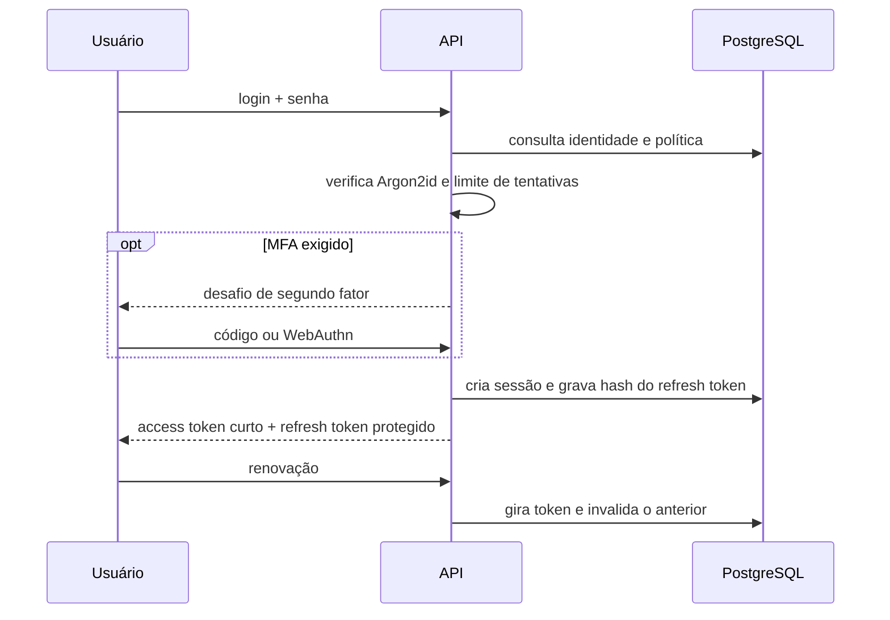

# Autenticação segura

## Estado atual

O backend valida access tokens JWT em todas as rotas privadas. A validação exige assinatura, emissor, audiência e as claims `sub` e `organizationId`. O utilitário `token:dev` é bloqueado em produção e serve apenas para testar a primeira fatia.

Ainda não existe endpoint de login de produção. Portanto, a entrega atual não deve ser divulgada como autenticação completa.

## Fluxo obrigatório para produção

## Requisitos da próxima fatia

- senha com Argon2id e parâmetros versionados;
- access token de curta duração;
- refresh token aleatório, armazenado somente como hash e rotacionado a cada uso;
- detecção de reutilização com revogação da família de tokens;
- cookie `HttpOnly`, `Secure` e `SameSite` para o cliente web;
- limite específico por conta e origem em login, MFA e recuperação;
- atraso e bloqueio progressivos sem permitir enumeração de usuário;
- MFA com TOTP ou WebAuthn para administrador e financeiro;
- códigos de recuperação armazenados como hash;
- recuperação de senha com token único, escopo restrito e expiração curta;
- encerramento de sessão individual ou de todas as sessões;
- auditoria de login, falha, renovação, logout, bloqueio e mudança de privilégios;
- invalidação das sessões após troca de senha ou suspensão do usuário;
- nenhuma senha, token, cookie ou chave em logs e eventos de auditoria.

## Segredos

As variáveis operacionais ficam em envelope AES-256-GCM. A chave de bootstrap precisa permanecer fora do repositório e ser fornecida pelo ambiente. Criptografar a chave dentro do mesmo arquivo não acrescentaria proteção, pois o processo precisaria de outra chave para abri-la.
