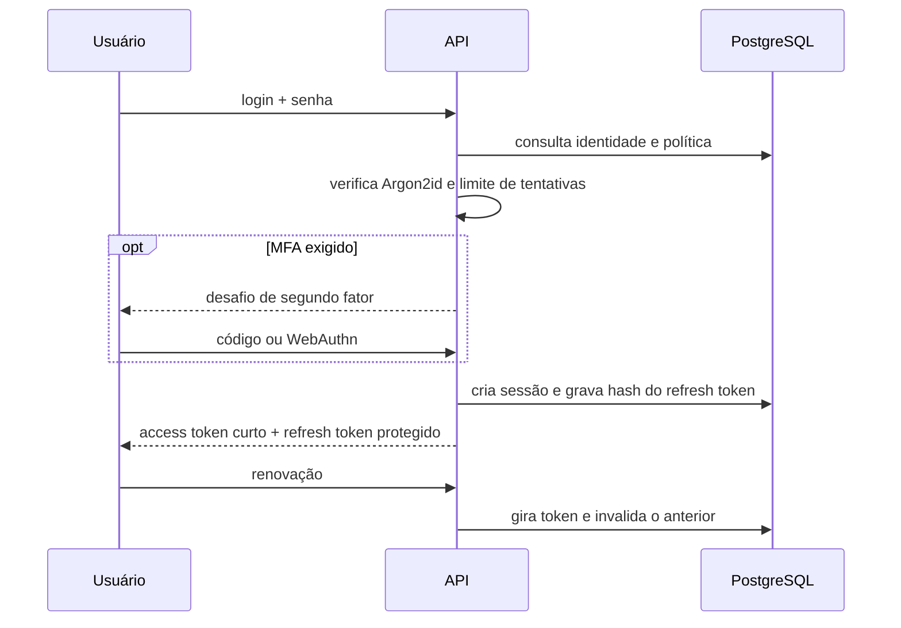

# Autenticação segura

## Estado implementado

O backend implementa login com hash Argon2id, sessão revogável, access JWT de dez minutos em cookie HttpOnly, refresh opaco de 256 bits armazenado somente como hash e rotação a cada uso. A reutilização do refresh anterior revoga a família. As rotas privadas validam assinatura, emissor, audiência, sessão, usuário e vínculo ativo com a organização antes de criar o contexto RLS.

As mutações exigem cookie e cabeçalho CSRF correspondentes e rejeitam origens fora da lista configurada. Login possui rate limit específico, bloqueio temporário após cinco falhas e resposta uniforme para reduzir enumeração. Eventos de login, falha, renovação e logout são append-only e não guardam senha ou token.

O frontend não usa mais `/auth/dev-token`, Bearer no JavaScript ou armazenamento local. Ele consulta `/auth/me`, renova a sessão uma vez após 401 e apresenta a identidade real do banco.

## Fluxo obrigatório para produção

## Controles e evoluções

- cookie `Secure` é obrigatório em produção e fica desligado somente no localhost HTTP;
- MFA com TOTP ou WebAuthn para administrador e financeiro;
- códigos de recuperação armazenados como hash;
- recuperação de senha com token único, escopo restrito e expiração curta;
- encerramento de todas as sessões e gestão visual de dispositivos;
- auditoria adicional de bloqueio, recuperação e mudança de privilégios;
- invalidação das sessões após troca de senha ou suspensão do usuário;
- nenhuma senha, token, cookie ou chave em logs e eventos de auditoria.

## Segredos

As variáveis operacionais ficam em envelope AES-256-GCM. A chave de bootstrap precisa permanecer fora do repositório e ser fornecida pelo ambiente. Criptografar a chave dentro do mesmo arquivo não acrescentaria proteção, pois o processo precisaria de outra chave para abri-la.
