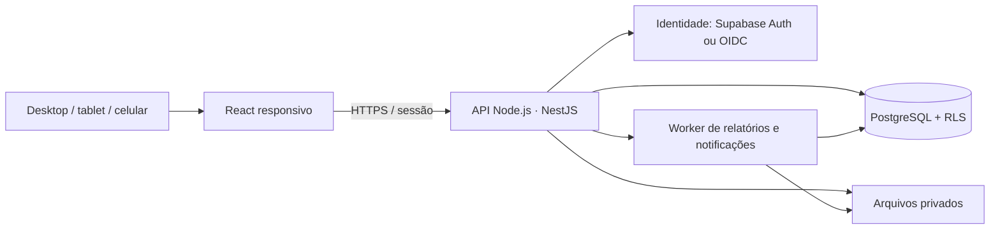

# Arquitetura proposta — ADR-001 (proposta)

## Decisão recomendada

React + TypeScript para a interface; API REST Node.js + TypeScript com NestJS; PostgreSQL como fonte de verdade. Começar como monólito modular, com uma API e um banco transacional, organizado por domínio. Supabase pode hospedar o PostgreSQL e fornecer autenticação e armazenamento, mantendo as regras financeiras na API.

Supabase não é um banco alternativo ao PostgreSQL: é uma plataforma que o inclui. A escolha é entre operar PostgreSQL e serviços auxiliares separadamente ou consumir essa plataforma.

## Stack candidata

| Camada | Escolha | Razão e limite |
|---|---|---|
| Web | React, TypeScript, Vite | Aplicação administrativa responsiva; SEO não é requisito central |
| UI | Tailwind e componentes acessíveis shadcn/ui | Consistência visual e controle do código dos componentes |
| Dados na UI | TanStack Query | Estado remoto, invalidação após mutação e erros claros |
| Formulários | React Hook Form + Zod | Validação amigável; backend continua sendo autoridade |
| API | NestJS sobre Node.js | Módulos, validação, testes e contrato REST |
| Contrato | OpenAPI 3.1 | Fonte do client e documentação da API |
| Persistência | PostgreSQL, driver pg e migrações SQL versionadas | Transações explícitas, locks, constraints e políticas RLS |
| Identidade A | Supabase Auth | Opção integrada com PostgreSQL e Storage |
| Identidade B | Keycloak/OIDC | Opção independente para PostgreSQL sem Supabase |
| Arquivos A | Supabase Storage privado | Metadados de vínculo no banco, URLs de curta duração |
| Arquivos B | Serviço de objetos com API S3 | Adaptador substituível; produto/licença escolhidos na implantação |
| Execução | Containers OCI em host Linux | Compatível com runtime aberto, como Podman; sem Kubernetes inicial |
| Qualidade | Vitest, integração PostgreSQL, Playwright e axe-core | Testes nas regras e jornadas críticas |

Essas são escolhas de arquitetura, não dependências instaladas. Versões, imagens e licenças transitivas devem ser registradas no lockfile/SBOM quando houver implementação. A preferência por open source não significa infraestrutura sem custo; Supabase Cloud e serviços de hospedagem têm termos próprios.

## Comparação das opções de dados

| Aspecto | PostgreSQL independente | Supabase self-hosted | Supabase Cloud |
|---|---|---|---|
| Banco relacional | PostgreSQL | PostgreSQL | PostgreSQL gerenciado |
| Auth e arquivos | Operação de serviços adicionais | Incluídos na composição da plataforma | Serviços gerenciados |
| Responsável por manutenção | Equipe/provedor contratado | Equipe opera vários componentes | Provedor opera a plataforma; aplicação continua sob nossa responsabilidade |
| Backup e recuperação | Projetar e ensaiar | Projetar para banco, objetos, configuração e chaves | Conferir recursos do plano; testar exportação e recuperação |
| Portabilidade | Alta para SQL padrão | Banco portável; auth/storage exigem migração própria | Mesmos cuidados, além de dependências do serviço |
| Melhor encaixe | Controle e operação experiente | Controle completo com disposição para operação maior | Rapidez inicial e menor carga operacional |

**Proposta:** manter PostgreSQL como requisito e Supabase como opção preferencial quando o usuário aceitar serviço gerenciado. Se hospedagem própria for requisito, comparar custo operacional de Supabase self-hosted com PostgreSQL + OIDC + objetos. Nenhuma conta ou assinatura foi criada para essas opções.

## Módulos da API

Identidade/acessos; obras/cadastros; orçamento; suprimentos; contratos; execução; financeiro; cronograma; qualidade/diário; documentos; relatórios; auditoria. Domínio financeiro não depende de componentes React nem de SDK do Supabase. Adapters acessam banco, identidade e arquivos.

## Segurança e sessão

- API valida identidade, membership da organização e vínculo/permissão da obra antes de cada operação. Fornecedor precisa ainda de vínculo ao contrato/documento compartilhado.
- Navegador usa sessão protegida por cookie HttpOnly, Secure e política SameSite apropriada; mutações usam proteção CSRF. Tokens de serviço e credenciais do banco nunca chegam ao navegador.
- Validar assinatura, emissor, audiência e expiração dos tokens do provedor; roles não vêm de campos editáveis pelo próprio usuário.
- RLS complementa a autorização. Conexão da aplicação não usa superusuário, dono das tabelas nem papel BYPASSRLS. Nas tabelas necessárias usar FORCE ROW LEVEL SECURITY e testar o papel real de produção.
- Contexto de ator/organização é definido pela API dentro da transação com escopo local, a partir da sessão validada; não confiar em `organization_id` arbitrário enviado pelo cliente. Pooling não pode reaproveitar contexto de outro usuário.
- Se usar Supabase, não usar service_role para as consultas normais esperando proteção automática de RLS. A chave privilegiada não é substituta de autorização.
- Downloads e uploads são autorizados individualmente. Validar tamanho, extensão, tipo real, nome seguro e colocar arquivo em quarentena quando aplicável. Trilha não registra conteúdo bancário em claro.
- A auditoria é append-only para a aplicação; administradores de infraestrutura ainda são privilegiados. “Imutável” não significa inviolável por superusuário: exportação periódica e logs externos fortalecem a evidência.

## Operação e recuperação

Ambientes separados; testes com dados sintéticos; segredos fora do Git; TLS; logs redigidos; rate limiting; alertas de erro e falhas de tarefas. Migração já aplicada não é editada. Mudanças destrutivas exigem plano de recuperação e autorização específica se ainda não houver autorização válida.

Proposta a confirmar: RPO de até 24h no piloto e RTO de até 8h; alvos mais exigentes requerem PITR e operação compatível. Backup inclui banco, objetos e configuração criptografada; restauração é ensaiada e documentada. RPO/RTO são metas, não garantias implementadas.

Sem Kafka, microserviços, Redis, ML ou lake por padrão. Tarefas assíncronas podem começar com fila transacional PostgreSQL e worker, com retry limitado e deduplicação; introduzir serviços adicionais apenas após medir o gargalo.

## Fontes técnicas

[NestJS](https://docs.nestjs.com/) fundamenta a opção de framework Node.js. [Supabase self-hosting](https://supabase.com/docs/guides/self-hosting) descreve a responsabilidade de operar a plataforma. A documentação de [RLS do PostgreSQL](https://www.postgresql.org/docs/current/ddl-rowsecurity.html) explica políticas e bypass por papéis privilegiados. As recomendações de adoção acima são decisões propostas para este projeto.
