# BOMzeika Obras — Especificação funcional

**Versão:** 1.0 para validação funcional  
**Estado:** especificação derivada do protótipo; não representa implementação, persistência, segurança ou integrações concluídas  
**Protótipo de referência:** `prototipo/prumo-v9-completo.html`  
**Idioma e formatos:** português do Brasil, BRL, datas em DD/MM/AAAA e horários no fuso configurado para a organização

## 1. Objetivo

O BOMzeika Obras deve administrar uma ou várias obras residenciais de alto padrão desde a preparação do catálogo-base até a entrega, garantias e eventual venda. O sistema deve conciliar escopo, prazo, fornecedores, orçamento, compromissos, execução física, pagamentos, documentos, imagens e custos comerciais, mantendo rastreabilidade até o registro de origem.

O produto deve atender gestores, proprietários, responsáveis técnicos, equipe financeira, fornecedores e prestadores. Cada usuário acessa somente as organizações, obras, módulos e ações concedidas ao seu perfil.

## 2. Princípios funcionais

1. O catálogo de etapas, serviços e fornecedores é geral para a organização e existe antes das obras.
2. A obra copia ou referencia itens do catálogo e mantém sua própria configuração, sem alterar retroativamente outras obras.
3. Todas as telas vinculadas a uma obra usam o contexto de obra selecionada no cabeçalho.
4. Etapa, serviço e fornecedor devem ser associados na configuração da obra antes da contratação ou compra.
5. Orçamento, compromisso contratado, custo executado reconhecido e pagamento são grandezas diferentes.
6. Uma proposta aprovada pode ser efetivada em compra sem redigitação, preservando a proposta de origem.
7. Pagamentos liquidam obrigações de uma compra ou contrato; pagamentos não geram novo custo.
8. Registros aprovados não são apagados: correções usam revisão, cancelamento ou estorno rastreável.
9. Valores dos painéis devem permitir detalhamento até as linhas que os compõem.
10. Arquivos e dados pessoais ou financeiros devem respeitar autorização por organização, obra e ação.

## 3. Arquitetura da informação e menus

| Grupo | Funcionalidades |
|---|---|
| Pré-obra | Etapas e Serviços; Fornecedores |
| Cadastro da obra | Obras; Configurações da obra; Projetos e documentação; Orçamento inicial; Contratos e aditivos |
| Execução da obra | Painel da obra; Orçamento e custos; Compras; Pagamentos; Financeiro; Cronograma; Diário e qualidade; Infraestrutura; Documentos e equipe |
| Pós-obra | Memorial da obra; Entrega e garantias; Venda e marketing; Relatórios comerciais |

### 3.1 Contexto da obra

O cabeçalho deve exibir a obra ativa com nome, situação e localização. Ao acionar o seletor, o sistema abre uma paleta com pesquisa, obras recentes e ação para cadastrar uma obra. A mudança de obra atualiza todas as telas vinculadas; filtros locais são reiniciados quando não forem aplicáveis à nova obra. Telas globais, como Etapas e Serviços e Fornecedores, devem indicar que não dependem da obra ativa.

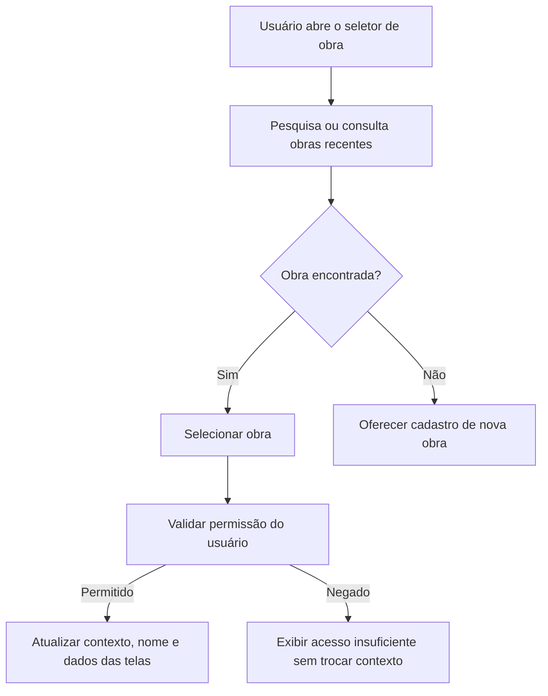
```mermaid
flowchart TD
    A[Usuário abre o seletor de obra] --> B[Pesquisa ou consulta obras recentes]
    B --> C{Obra encontrada?}
    C -- Sim --> D[Selecionar obra]
    D --> E[Validar permissão do usuário]
    E -->|Permitido| F[Atualizar contexto, nome e dados das telas]
    E -->|Negado| G[Exibir acesso insuficiente sem trocar contexto]
    C -- Não --> H[Oferecer cadastro de nova obra]
```

## 4. Perfis e responsabilidades

| Perfil | Capacidades principais | Restrições mínimas |
|---|---|---|
| Administrador | Organização, usuários, catálogos, parâmetros e acessos | Não altera silenciosamente registros financeiros aprovados |
| Gestor | Planejamento, configuração, orçamento, contratação e acompanhamento | Aprova somente dentro de alçada configurada |
| Financeiro | Obrigações, parcelas, pagamentos, estornos, contas e fluxo de caixa | Não aprova a própria exceção quando segregação estiver configurada |
| Responsável técnico | Cronograma, diário, medições, inspeções, qualidade e aceite técnico | Acesso financeiro depende de concessão |
| Proprietário | Visão executiva, documentos compartilhados e aprovações | Somente obras às quais foi associado |
| Fornecedor | Propostas, documentos, entregas e informações expressamente compartilhadas | Não acessa concorrentes, orçamento global ou outras obras |

Alçadas, segregação de funções e combinações de perfis são configuradas pela organização. A especificação não fixa valores de alçada.

## 5. Regras financeiras comuns

- Valores monetários usam decimal exato e BRL. Quantidades admitem até quatro casas; custos unitários, até seis; totais de linha são arredondados a centavos pela regra half-up.
- **B** = orçamento vigente aprovado dos serviços.
- **R** = reserva de contingência não alocada.
- **C** = compromissos autorizados atualizados, incluindo contratos, pedidos e aditivos aprovados.
- **E** = custo reconhecido por medição ou recebimento aprovado, líquido de reversões.
- **CR** = compromisso restante referente ao escopo contratado ainda não executado.
- **U** = estimativa explícita do escopo restante ainda não contratado.
- **F** = custo final projetado = `E + CR + U`.
- **Pago** = desembolsos efetivos menos estornos. Não integra a fórmula de F.
- **Desvio sobre o teto** = `F − (B + R)`.
- **Avanço físico** = soma do progresso dos serviços ponderada pelos pesos congelados na baseline.
- Parcelas de cartão ou de uma compra representam fluxo de caixa da aquisição original e não novas aquisições.
- A transferência de contingência para um serviço aumenta B e reduz R pelo mesmo valor; aumento do teto exige revisão distinta.

## 6. Estados globais de interface

Toda consulta deve prever carregando, vazio, sucesso, erro recuperável e sem permissão. Todo formulário deve prever rascunho local da sessão, validação, envio, sucesso confirmado, conflito de versão, rejeição de regra e falha de rede preservando os campos. Uploads devem indicar selecionado, enviando, em análise, disponível e rejeitado. Aprovações devem mostrar motivo e consequência antes da confirmação.

## 7. Requisitos funcionais detalhados

> As subseções seguintes descrevem as funcionalidades do menu, entidades, campos, fluxos e critérios de aceite.

# Especificação funcional — Pré-obra e Cadastro da Obra

> Rascunho técnico para consolidação na especificação funcional do **BOMzeika Obras**. Este documento descreve comportamento esperado; não comprova implementação, persistência, segurança ou aprovação do protótipo.

## 1. Convenções e origem dos requisitos

Esta especificação usa três marcadores:

- **[REQ] Requisito confirmado:** solicitado pelo usuário ou já estabelecido em `docs/02-produto.md`.
- **[PROT] Comportamento prototipado:** aparece em `prototipo/prumo-v9-completo.html`, mas ainda precisa ser validado como requisito definitivo.
- **[PROP] Proposta a validar:** detalhamento necessário para fechar lacunas de comportamento; não representa decisão aprovada.

Não há valores fixos de alçada nesta especificação. **[REQ]** A alçada e a segregação de aprovação serão configuradas pelo proprietário/organização e aplicadas conforme obra e operação.

## 2. Navegação global e contexto da obra

### Objetivo

Permitir acesso aos módulos globais e aos módulos vinculados a uma obra, deixando evidente em qual obra o usuário está trabalhando e evitando lançamentos no contexto errado.

### Atores

- Administrador da organização: consulta módulos globais e obras autorizadas; administra cadastros conforme permissão.
- Gestor: seleciona a obra e opera planejamento, orçamento e contratos conforme concessão.
- Financeiro, responsável técnico, proprietário e fornecedor: visualizam apenas obras e funções às quais receberam acesso.

### Pré-condições

- Usuário identificado e membro de uma organização. **[REQ]** A participação na organização não concede automaticamente acesso a todas as obras.
- Para abrir uma tela contextual, deve existir uma obra autorizada e selecionada.
- Etapas e Serviços e Fornecedores são catálogos globais da organização e não dependem de obra selecionada.

### Entidades e campos

**Contexto de navegação (`project_context`)** — entidade de sessão/UX, não registro financeiro:

| Campo | Tipo lógico | Regra |
|---|---|---|
| `organization_id` | UUID | Organização corrente e autorizada. |
| `user_id` | UUID | Usuário autenticado. |
| `project_id` | UUID opcional | Obra selecionada; obrigatório nos módulos por obra. |
| `project_name` | Texto derivado | Nome exibido no seletor. |
| `project_status` | Enum derivado | Planejamento, ativa, suspensa ou concluída. |
| `project_location` | Texto derivado | Cidade/UF ou endereço resumido. |
| `project_progress` | Decimal derivado | Avanço físico, quando calculável. |
| `last_selected_at` | Data/hora | **[PROP]** Auxilia na lista de obras recentes. |

### Regras funcionais

1. **[REQ]** O seletor de obra fica na parte superior e permanece disponível durante a navegação, sem ocupar uma etapa exclusiva da jornada.
2. **[REQ]** Ao trocar de obra, todas as telas contextuais passam a consultar a nova obra; filtros e registros da obra anterior não podem permanecer como se pertencessem à nova.
3. **[REQ]** Módulos de execução só exibem obras cadastradas, ativas e autorizadas; telas de cadastro podem permitir obras em planejamento conforme permissão.
4. **[REQ]** Registros vinculados a uma obra devem carregar `project_id`; vínculos entre organizações ou obras diferentes são inválidos.
5. **[PROT]** O seletor exibe busca por nome/endereço, nome, situação, localização, progresso e acesso rápido a Nova obra.
6. **[PROP]** Em telas contextuais sem obra selecionada, exibir seletor embutido no cabeçalho e manter a ação principal desabilitada até a seleção, sem ocultar a estrutura da tela.
7. **[PROP]** A URL/estado de navegação deve identificar a obra para permitir atualização da página sem perder contexto, sempre sujeita à autorização no servidor.

### Estados

- Sem obra selecionada.
- Obra selecionada e disponível.
- Obra selecionada sem permissão ou removida do acesso.
- Obra suspensa/concluída com operações restritas conforme módulo.
- Lista vazia, carregando, erro recuperável e sem permissão.

### Fluxo principal

1. Usuário abre um módulo contextual.
2. Sistema recupera obras autorizadas.
3. Sistema mantém a obra válida previamente selecionada ou solicita seleção no cabeçalho.
4. Usuário pesquisa e seleciona a obra.
5. Sistema valida acesso e situação da obra.
6. Sistema recarrega conteúdo, filtros, indicadores e ações no novo contexto.
7. Cabeçalho mantém nome e situação da obra visíveis.

### Exceções

- Obra deixou de ser autorizada: limpar contexto, bloquear dados e informar que o acesso mudou.
- Obra suspensa ou concluída: permitir consulta; bloquear mutações incompatíveis e explicar o motivo.
- Troca com formulário alterado: **[PROP]** alertar sobre dados não salvos antes de trocar.
- Falha de carregamento: manter seletor utilizável e oferecer nova tentativa sem indicar sucesso.

### Critérios de aceite

- CA-NAV-01: ao selecionar Casa Lago Azul, toda referência contextual muda para essa obra e nenhum registro da Residência Horizonte é exibido como pertencente a ela.
- CA-NAV-02: usuário sem concessão para a Obra B não a encontra no seletor nem acessa seus dados por URL ou identificador direto.
- CA-NAV-03: Etapas e Serviços e Fornecedores continuam acessíveis como catálogos globais sem obrigar a escolha de obra.
- CA-NAV-04: uma ação de cadastro contextual não pode ser salva sem `project_id` autorizado.
- CA-NAV-05: trocar a obra mantém o espaço principal da funcionalidade disponível e o seletor permanece no topo.

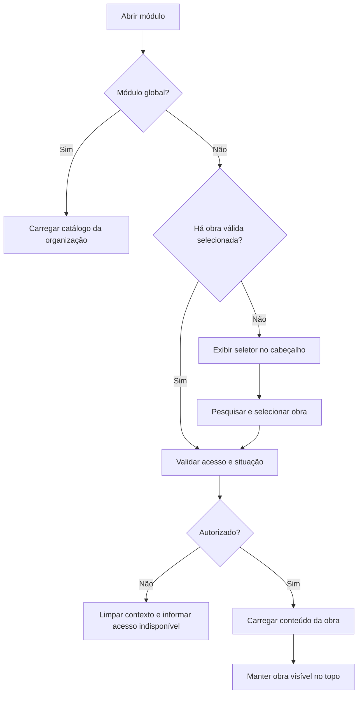
```mermaid
flowchart TD
    A[Abrir módulo] --> B{Módulo global?}
    B -- Sim --> C[Carregar catálogo da organização]
    B -- Não --> D{Há obra válida selecionada?}
    D -- Não --> E[Exibir seletor no cabeçalho]
    E --> F[Pesquisar e selecionar obra]
    D -- Sim --> G[Validar acesso e situação]
    F --> G
    G --> H{Autorizado?}
    H -- Não --> I[Limpar contexto e informar acesso indisponível]
    H -- Sim --> J[Carregar conteúdo da obra]
    J --> K[Manter obra visível no topo]
```

## 3. Etapas e Serviços — catálogo global

### Objetivo

Manter um catálogo reutilizável de etapas e serviços para compor uma ou várias obras, com unidade, categoria, estrutura hierárquica e parâmetros padrão editáveis em cada obra.

### Atores

- Administrador e gestor com permissão de catálogo.
- Demais perfis em consulta conforme concessão.

### Pré-condições

- Organização definida.
- Categorias de custo, unidades e fornecedores padrão existentes quando utilizados.

### Entidades e campos

**Item de catálogo (`catalog_item`)**:

| Campo | Tipo lógico | Obrigatoriedade/regra |
|---|---|---|
| `id`, `organization_id` | UUID | Identificação e isolamento da organização. |
| `type` | Enum | Etapa ou Serviço; obrigatório. |
| `code` | Texto | Obrigatório; único por organização e versão ativa. |
| `name` | Texto | Obrigatório. |
| `parent_stage_id` | UUID opcional | Serviço pode apontar para etapa pai; vínculo na mesma organização. |
| `cost_category_id` | UUID | Categoria de custo. |
| `unit_id` | UUID | Unidade, como vb, m², m, un, h ou kg. |
| `description_scope` | Texto | Descrição e limites do escopo. |
| `default_weight_percent` | Decimal opcional | Peso sugerido; não substitui o peso da obra. |
| `default_duration_days` | Inteiro opcional | Prazo de referência. |
| `progress_criterion` | Enum | Quantidade, percentual ou marco. |
| `default_supplier_id` | UUID opcional | Fornecedor sugerido, não contratação automática. |
| `display_order` | Inteiro | **[PROP]** Ordem padrão no template. |
| `status` | Enum | **[REQ]** Ativo ou inativo. |
| `version`, `created_by`, `created_at`, `updated_at` | Controle | **[PROP]** Versão e auditoria mínima. |

### Regras funcionais

1. **[REQ]** O catálogo é geral para todas as obras; a seleção cria/configura uma ocorrência por obra, sem alterar o item global.
2. **[REQ]** Etapas podem conter subetapas e serviços; a obra pode ativar, desativar, reordenar e personalizar a seleção.
3. **[REQ]** Um serviço ainda não utilizado pode ser excluído da configuração da obra; depois de possuir lançamento, deve ser encerrado/inativado preservando histórico.
4. **[PROP]** Item global já referenciado não deve ser apagado fisicamente; deve ser inativado para impedir novas seleções.
5. **[REQ]** O fornecedor padrão é apenas uma sugestão; a associação efetiva ocorre na configuração da obra.
6. **[PROT]** Listagem permite pesquisar, filtrar por tipo, editar e excluir.
7. **[PROP]** Alteração de unidade/tipo em item já usado exige nova versão ou bloqueio, evitando reinterpretar quantidades históricas.

### Estados

- Rascunho **[PROP]**.
- Ativo.
- Inativo/encerrado.
- Em uso em uma ou várias obras (estado derivado).

### Fluxo principal

1. Usuário abre Etapas e Serviços.
2. Pesquisa ou filtra itens existentes.
3. Aciona Nova etapa ou serviço.
4. Informa tipo, código, nome, categoria, unidade, escopo e parâmetros padrão.
5. Sistema valida código, hierarquia e referências.
6. Usuário salva.
7. Item fica disponível para seleção nas configurações das obras.

### Exceções

- Código duplicado: rejeitar e destacar o campo.
- Etapa pai de outra organização ou cadeia circular: rejeitar vínculo.
- Exclusão de item em uso: impedir exclusão física e oferecer inativação.
- Peso padrão inválido: rejeitar valor negativo ou superior a 100%; ele continua sendo apenas sugestão.

### Critérios de aceite

- CA-CAT-01: item ativo aparece na seleção de uma nova obra sem duplicar o cadastro global.
- CA-CAT-02: personalizar nome, fornecedor ou peso em uma obra não altera o item global nem outras obras.
- CA-CAT-03: código duplicado na mesma organização é rejeitado com mensagem de campo.
- CA-CAT-04: item já usado não perde histórico quando inativado.
- CA-CAT-05: serviço não pode referenciar etapa pai de outra organização.

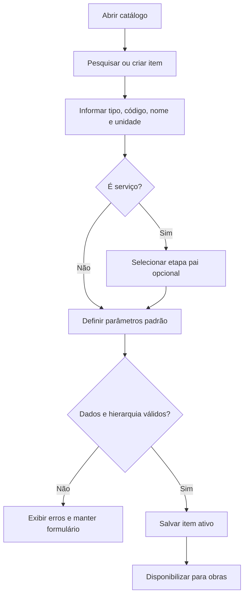
```mermaid
flowchart TD
    A[Abrir catálogo] --> B[Pesquisar ou criar item]
    B --> C[Informar tipo, código, nome e unidade]
    C --> D{É serviço?}
    D -- Sim --> E[Selecionar etapa pai opcional]
    D -- Não --> F[Definir parâmetros padrão]
    E --> F
    F --> G{Dados e hierarquia válidos?}
    G -- Não --> H[Exibir erros e manter formulário]
    G -- Sim --> I[Salvar item ativo]
    I --> J[Disponibilizar para obras]
```

## 4. Fornecedores — catálogo global

### Objetivo

Cadastrar empresas e profissionais reutilizáveis nas obras, com especialidades, contatos, documentos e dados de pagamento protegidos.

### Atores

- Administrador e gestor: cadastro e manutenção conforme permissão.
- Financeiro: consulta/edição de dados de pagamento conforme concessão.
- Fornecedor: acesso apenas aos próprios dados e conteúdos compartilhados, quando portal for implementado.

### Pré-condições

- Organização definida.
- Usuário autorizado a consultar dados pessoais e, separadamente, dados financeiros restritos.

### Entidades e campos

**Fornecedor (`supplier`)**:

| Campo | Tipo lógico | Regra |
|---|---|---|
| `id`, `organization_id` | UUID | Identificação e isolamento. |
| `person_type` | Enum | Empresa ou profissional autônomo. |
| `legal_name` | Texto | Razão social ou nome completo; obrigatório. |
| `trade_name` | Texto opcional | Nome fantasia. |
| `tax_id` | Texto | CPF ou CNPJ validado conforme tipo. |
| `state_registration` | Texto opcional | Inscrição estadual. |
| `primary_specialty` | Enum/referência | Especialidade principal. |
| `email`, `phone_whatsapp` | Texto | Contatos. |
| `full_address` | Texto | Endereço completo. |
| `accepted_payment_methods` | Lista | PIX, transferência, boleto, cartão etc. |
| `average_lead_time_days` | Inteiro opcional | Prazo médio de entrega. |
| `notes` | Texto | Observações. |
| `rating` | Decimal derivado/proposto | **[PROT]** Avaliação exibida; método ainda a especificar. |
| `status` | Enum | Ativo, em avaliação, inativo/bloqueado **[PROP]**. |

**Dados de pagamento restritos (`restricted_payment_details`)**:

| Campo | Tipo lógico | Regra |
|---|---|---|
| `supplier_id` | UUID | Fornecedor titular. |
| `bank`, `branch`, `account` | Texto protegido | Banco, agência e conta. |
| `pix_key` | Texto protegido | Chave PIX. |
| `valid_from`, `valid_to` | Data | **[PROP]** Vigência para preservar histórico. |
| `verified_status` | Enum | **[PROP]** Não verificado, em conferência, verificado. |

**Documento do fornecedor (`supplier_document`)**:

| Campo | Tipo lógico | Regra |
|---|---|---|
| `supplier_id`, `document_id` | UUID | Vínculo com arquivo privado. |
| `category` | Enum | Contrato social, certidão, comprovante bancário, portfólio ou referência. |
| `issued_at`, `expires_at` | Data opcional | Emissão e validade. |
| `status` | Enum | Pendente, válido, vencendo, vencido ou rejeitado **[PROP]**. |

### Regras funcionais

1. **[REQ]** Fornecedor é global à organização e pode participar de várias obras.
2. **[REQ]** Dados bancários ficam separados e com acesso restrito; não devem aparecer em listagens gerais.
3. **[REQ]** Fornecedor não acessa orçamento global, concorrentes ou contratos de outras partes.
4. **[PROP]** CPF/CNPJ duplicado na mesma organização deve alertar e impedir cadastro ativo duplicado, permitindo recuperar/inativar registro existente.
5. **[PROP]** Fornecedor com contratos, compras ou pagamentos não pode ser excluído fisicamente; deve ser inativado.
6. **[PROT]** Painel mostra ativos, em avaliação, documentos vencendo e especialidades; método de avaliação ainda precisa de especificação própria.

### Estados

- Em avaliação.
- Ativo.
- Inativo/bloqueado **[PROP]**.
- Documento: pendente, válido, vencendo, vencido ou rejeitado **[PROP]**.

### Fluxo principal

1. Usuário abre Fornecedores.
2. Aciona Novo fornecedor.
3. Informa tipo, identificação fiscal, contatos, especialidade e prazo médio.
4. Usuário autorizado informa dados de pagamento e anexa documentos.
5. Sistema valida documento fiscal e duplicidade.
6. Registro é salvo no estado permitido.
7. Fornecedor torna-se disponível para associação a etapas, propostas e contratos.

### Exceções

- CPF/CNPJ inválido ou duplicado: rejeitar ou direcionar ao registro existente.
- Dados bancários sem permissão: omitir valores e bloquear edição.
- Documento vencido: sinalizar; bloqueio operacional depende de regra futura, não presumida aqui.
- Exclusão com vínculo histórico: substituir por inativação.

### Critérios de aceite

- CA-FOR-01: o mesmo fornecedor ativo pode ser associado a várias obras sem duplicar CPF/CNPJ.
- CA-FOR-02: usuário sem permissão financeira não visualiza banco, conta ou chave PIX.
- CA-FOR-03: inativar fornecedor não elimina contratos, compras, documentos ou pagamentos históricos.
- CA-FOR-04: CPF/CNPJ inválido ou duplicado não gera um segundo registro ativo silenciosamente.
- CA-FOR-05: fornecedor não consulta proposta concorrente nem informações de outra obra sem compartilhamento expresso.

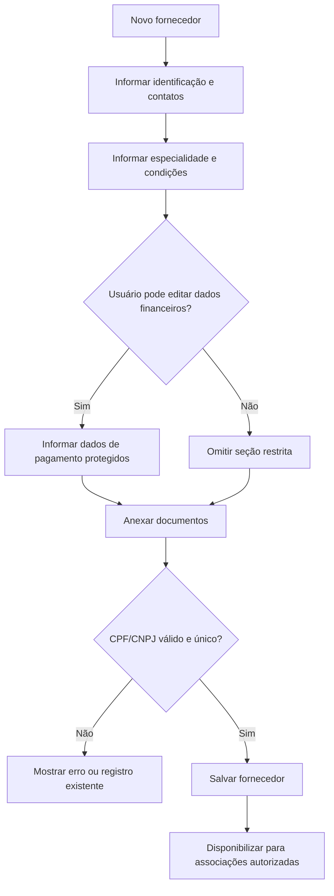
```mermaid
flowchart TD
    A[Novo fornecedor] --> B[Informar identificação e contatos]
    B --> C[Informar especialidade e condições]
    C --> D{Usuário pode editar dados financeiros?}
    D -- Sim --> E[Informar dados de pagamento protegidos]
    D -- Não --> F[Omitir seção restrita]
    E --> G[Anexar documentos]
    F --> G
    G --> H{CPF/CNPJ válido e único?}
    H -- Não --> I[Mostrar erro ou registro existente]
    H -- Sim --> J[Salvar fornecedor]
    J --> K[Disponibilizar para associações autorizadas]
```

## 5. Obras — cadastro da obra

### Objetivo

Criar e manter uma ou várias obras, com dados cadastrais, responsáveis, prazo, orçamento aprovado e modelo inicial de etapas.

### Atores

- Administrador e gestor autorizados.
- Proprietário em consulta e aprovação conforme configuração.

### Pré-condições

- Organização existente.
- Proprietário, gestor e responsáveis podem ser cadastrados ou convidados conforme fluxo posterior.
- Para usar modelo de etapas, deve haver itens ativos no catálogo global.

### Entidades e campos

**Obra (`project`)**:

| Campo | Tipo lógico | Regra |
|---|---|---|
| `id`, `organization_id` | UUID | Identificação e isolamento. |
| `name` | Texto | Obrigatório. |
| `status` | Enum | Planejamento, ativa, suspensa ou concluída. |
| `full_address` | Texto | Endereço completo. |
| `city`, `state`, `postal_code` | Texto | **[PROP]** Estrutura necessária para filtros. |
| `built_area_m2` | Decimal | Área construída positiva. |
| `standard` | Enum/texto | Alto padrão, superluxo ou opção configurável **[PROT]**. |
| `approved_budget` | Decimal monetário | Valor vigente aprovado; não se confunde com custo realizado. |
| `planned_start_date`, `planned_end_date` | Data | Início e término planejados; fim não anterior ao início. |
| `actual_start_date`, `actual_end_date` | Data opcional | **[REQ]** Datas reais quando aplicável. |
| `owner_id`, `manager_id`, `architect_id`, `engineer_id` | UUID | Responsáveis, com vigência/permissão apropriada. |
| `stage_template_id` | UUID/opção | Catálogo completo ou modelo personalizado. |
| `timezone`, `currency` | Configuração | **[PROP]** Fuso da obra e BRL. |
| `created_by`, `created_at`, `updated_at`, `version` | Controle | Auditoria e concorrência. |

Entidades relacionadas: `project_members`, `environments`, `cost_centers`, `project_stage`, `project_work_item`, `documents` e `budget_versions`.

### Regras funcionais

1. **[REQ]** O sistema administra uma ou várias obras com dados separados e visão consolidada autorizada.
2. **[REQ]** A criação da obra precede as configurações, projetos/documentação, orçamento, contratos e execução.
3. **[REQ]** Selecionar um modelo copia referências configuráveis para a obra; alterações posteriores não modificam o catálogo global.
4. **[REQ]** O orçamento aprovado informado no cadastro não autoriza somar orçamento, contratos, execução e pagamentos como despesas independentes.
5. **[PROP]** Obra sem configuração completa permanece em Planejamento; ativação exige validações mínimas a definir, sem inventar alçadas.
6. **[PROP]** Obra com registros financeiros/operacionais não pode ser excluída; pode ser suspensa ou encerrada com histórico.
7. **[PROT]** A tela apresenta cartões por obra, situação, área, local, período, progresso e ações Editar/Abrir.

### Estados

- Planejamento.
- Ativa.
- Suspensa, com motivo.
- Concluída/encerrada.
- **[PROP]** Arquivada apenas para organização visual, sem apagar histórico.

### Fluxo principal

1. Usuário aciona Nova obra.
2. Informa cadastro, área, padrão, orçamento, datas e responsáveis.
3. Seleciona modelo de etapas.
4. Sistema valida campos, datas, referências e permissões.
5. Sistema cria a obra em Planejamento e associa o usuário autorizado.
6. Itens do modelo ficam disponíveis em Configurações da obra.
7. Obra passa a aparecer no seletor conforme status e acesso.

### Exceções

- Data final anterior à inicial: rejeitar.
- Área ou orçamento negativo: rejeitar; orçamento zero exige tratamento explícito nos indicadores.
- Responsável sem vínculo/autorização: impedir associação até vínculo válido.
- Exclusão com histórico: impedir e oferecer suspensão/encerramento.
- Falha ao copiar modelo: não declarar obra configurada parcialmente sem indicar pendência.

### Critérios de aceite

- CA-OBR-01: criar a obra gera um identificador próprio e nenhum registro é compartilhado com outra obra sem relação explícita.
- CA-OBR-02: itens do modelo aparecem para configuração da nova obra sem alterar o catálogo global.
- CA-OBR-03: obra ativa e autorizada aparece no seletor superior dos módulos de execução.
- CA-OBR-04: obra com lançamentos não pode ser excluída silenciosamente.
- CA-OBR-05: datas inválidas e valores negativos são rejeitados antes da gravação.

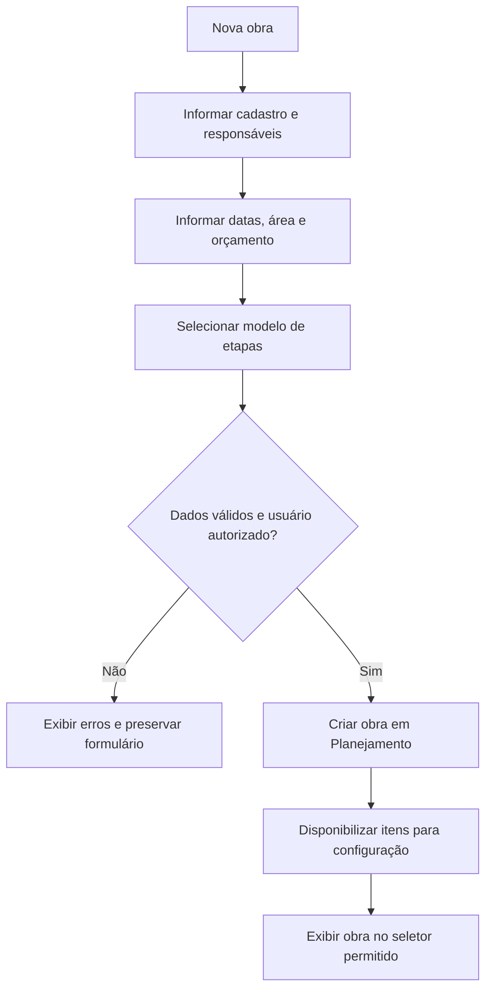
```mermaid
flowchart TD
    A[Nova obra] --> B[Informar cadastro e responsáveis]
    B --> C[Informar datas, área e orçamento]
    C --> D[Selecionar modelo de etapas]
    D --> E{Dados válidos e usuário autorizado?}
    E -- Não --> F[Exibir erros e preservar formulário]
    E -- Sim --> G[Criar obra em Planejamento]
    G --> H[Disponibilizar itens para configuração]
    H --> I[Exibir obra no seletor permitido]
```

## 6. Configurações da obra

### Objetivo

Selecionar e personalizar todas as etapas e serviços da obra, associando fornecedor, ambiente, prazo, peso, avanço e dependências de predecessor/sucessor.

### Atores

- Gestor da obra.
- Responsável técnico, em consulta ou edição conforme concessão.
- Administrador da organização.

### Pré-condições

- Obra selecionada e autorizada.
- Catálogo de etapas/serviços e fornecedores disponível.
- Para alterar baseline após início, deve existir fluxo de revisão rastreável.

### Entidades e campos

**Etapa/serviço da obra (`project_work_item`)**:

| Campo | Tipo lógico | Regra |
|---|---|---|
| `id`, `project_id`, `catalog_item_id` | UUID | Ocorrência da obra e origem no catálogo. |
| `type` | Enum | Etapa ou Serviço. |
| `parent_item_id` | UUID opcional | Serviço/etapa filho da mesma obra. |
| `name`, `description_scope` | Texto | Personalizáveis na obra. |
| `supplier_id` | UUID | **[REQ]** Fornecedor responsável associado a cada etapa/serviço configurado; deve pertencer à organização. |
| `environment_id` | UUID opcional | Toda obra ou ambiente específico. |
| `execution_order` | Inteiro | Ordem de exibição/execução. |
| `planned_start_date`, `planned_end_date` | Data | Período planejado. |
| `actual_start_date`, `actual_end_date` | Data opcional | Período real. |
| `weight_percent` | Decimal | Peso na etapa/obra; baseline deve normalizar 100%. |
| `quantity`, `unit_id` | Decimal/referência | Quantidade e unidade. |
| `progress_criterion` | Enum | Quantidade, percentual ou marco. |
| `progress_percent` | Decimal | 0 a 100, coerente com status. |
| `status` | Enum | Não iniciada/planejada, liberada, em contratação, contratada, bloqueada, em execução, suspensa, concluída ou cancelada. |
| `planned_cost`, `contracted_cost`, `recognized_cost`, `paid_amount` | Decimal derivado/vinculado | Valores distintos; não somar como despesas independentes. |
| `baseline_version_id` | UUID | Versão do planejamento/peso. |
| `notes`, `version` | Texto/inteiro | Observações e concorrência. |

**Dependência (`task_dependency`)**:

| Campo | Tipo lógico | Regra |
|---|---|---|
| `id`, `project_id` | UUID | Identificação e obra. |
| `successor_item_id` | UUID | Item cuja data depende da relação; no formulário é a “Etapa ou serviço”. |
| `predecessor_item_id` | UUID | Predecessor da mesma obra; não pode ser o próprio item. |
| `dependency_type` | Enum | TI (término→início), II (início→início), TT (término→término) ou IT (início→término). |
| `lag_days` | Inteiro | Defasagem; **[PROP]** admitir valor negativo apenas se política for aprovada. |
| `date_constraint_type` | Enum | Sem restrição, iniciar após, finalizar até ou data fixa **[PROT]**. |
| `constraint_date` | Data opcional | Obrigatória quando houver restrição datada. |
| `reason` | Texto | Justificativa da dependência/restrição. |
| `created_by`, `created_at`, `version` | Controle | Auditoria e edição concorrente. |

**Sucessores calculados**: relação derivada ao consultar dependências em que o item é `predecessor_item_id`; não deve ser mantida como lista manual independente.

### Regras funcionais

1. **[REQ]** Cada etapa/serviço configurado deve ser associado a um fornecedor. Se a operação precisar permitir item ainda sem fornecedor, isso deve ser explicitamente validado; o requisito atual considera a associação obrigatória.
2. **[REQ]** Datas, responsáveis, ambiente, quantidade, unidade, custo, peso e critério de avanço são específicos da obra.
3. **[REQ]** Pesos da baseline da obra devem totalizar 100%; enquanto não totalizarem, avanço geral é “não calculável”.
4. **[REQ]** Alterar pesos após início exige nova versão da baseline, preservando percentuais anteriores.
5. **[REQ]** Marcos padrão de conclusão são 0%, 25%, 50%, 75% e 100%; percentual livre exige justificativa quando permitido pela medição.
6. **[REQ]** Status e progresso: planejado/em contratação/contratado = 0%; em execução = 1%–99%; concluído = 100%; suspenso mantém percentual com motivo; cancelado preserva histórico e sai do avanço futuro conforme regra de reponderação versionada.
7. **[REQ]** O avanço da etapa é ponderado pelos serviços e o avanço da obra pelos pesos congelados na baseline; pagamento não determina avanço físico.
8. **[REQ]** Predecessor e sucessor devem pertencer à mesma obra. A relação define automaticamente os sucessores consultáveis.
9. **[PROP]** Não permitir dependência circular, autorrelação ou duplicata com mesmo par/tipo.
10. **[REQ]** Alteração de prazo deve mostrar atividades afetadas; conflitos devem permanecer visíveis até resolução.
11. **[PROP]** Excluir item sem lançamentos remove-o da configuração; com lançamentos, deve cancelar/encerrar de forma rastreável.

### Estados

- Configuração da obra: incompleta (pesos/fornecedores/datas pendentes), válida, com conflitos, baseline aprovada, superada por revisão.
- Item: não iniciado/planejado, liberado, bloqueado, em contratação, contratado, em execução, suspenso, concluído, cancelado.
- Dependência: ativa, inválida por conflito, removida com auditoria **[PROP]**.

### Fluxo principal — incluir item e dependência

1. Usuário seleciona a obra no topo e abre Configurações.
2. Sistema mostra contadores, peso distribuído, dependências e conflitos.
3. Usuário inclui etapa/serviço do catálogo.
4. Informa fornecedor, ambiente, ordem, período, peso, quantidade, unidade, critério e status inicial.
5. Sistema valida vínculo e soma de pesos.
6. Usuário abre Configurar dependências.
7. Seleciona o item sucessor, predecessor, tipo, defasagem e eventual restrição.
8. Sistema verifica ciclos e recalcula datas/impactos previstos.
9. Usuário salva e consulta sequência, predecessores e sucessores calculados.

### Exceções

- Dependência do item consigo mesmo ou ciclo: rejeitar e indicar o caminho do ciclo **[PROP]**.
- Datas incompatíveis com dependência/restrição: sinalizar conflito; não ajustar silenciosamente.
- Peso total diferente de 100%: permitir rascunho, bloquear cálculo/aprovação da baseline e mostrar diferença.
- Fornecedor inativo: impedir nova associação; preservar associação histórica existente.
- Exclusão de item usado: impedir remoção física e orientar cancelamento/encerramento.
- Mudança de peso após início: criar revisão de baseline; não sobrescrever a anterior.

### Critérios de aceite

- CA-CONF-01: cada item configurado identifica fornecedor, datas, peso e critério de avanço.
- CA-CONF-02: relação Fundações → Estrutura aparece como predecessor de Estrutura e sucessor calculado de Fundações, sem digitação duplicada.
- CA-CONF-03: ciclo A → B → C → A é rejeitado antes da gravação.
- CA-CONF-04: itens de obras diferentes não podem ser relacionados.
- CA-CONF-05: peso total de 95% resulta em “não calculável” para avanço geral e informa os 5% pendentes.
- CA-CONF-06: alterar pesos de obra iniciada cria nova versão e mantém a baseline anterior consultável.
- CA-CONF-07: pagamento de 100% sem execução física não altera o percentual físico do serviço.
- CA-CONF-08: mudança de duração/data apresenta sucessores impactados e conflitos.

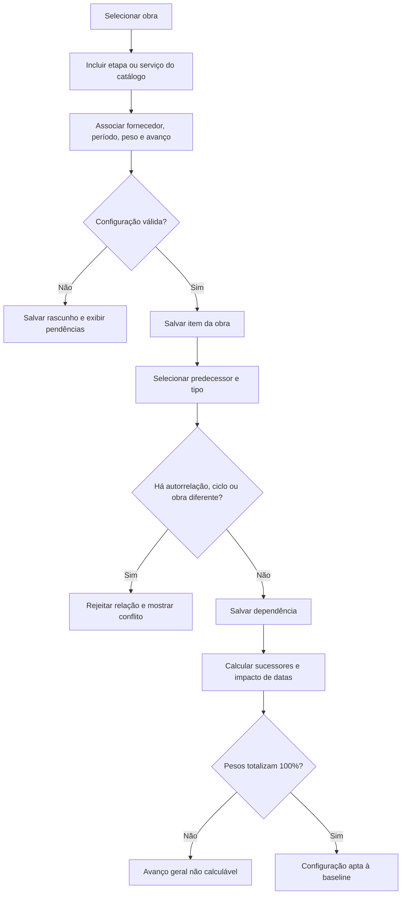
```mermaid
flowchart TD
    A[Selecionar obra] --> B[Incluir etapa ou serviço do catálogo]
    B --> C[Associar fornecedor, período, peso e avanço]
    C --> D{Configuração válida?}
    D -- Não --> E[Salvar rascunho e exibir pendências]
    D -- Sim --> F[Salvar item da obra]
    F --> G[Selecionar predecessor e tipo]
    G --> H{Há autorrelação, ciclo ou obra diferente?}
    H -- Sim --> I[Rejeitar relação e mostrar conflito]
    H -- Não --> J[Salvar dependência]
    J --> K[Calcular sucessores e impacto de datas]
    K --> L{Pesos totalizam 100%?}
    L -- Não --> M[Avanço geral não calculável]
    L -- Sim --> N[Configuração apta à baseline]
```

## 7. Projetos e documentação

### Objetivo

Centralizar por obra projetos, cartório, documentos, licenças, prefeitura, condomínio, concessionárias e demais requisitos documentais, com situação, validade, taxa, arquivo e histórico de versões.

### Atores

- Gestor e administrador.
- Responsável técnico para projetos, ART/RRT, inspeções e documentos técnicos.
- Financeiro para taxas e vínculos financeiros conforme permissão.
- Proprietário em consulta/aprovação conforme configuração.

### Pré-condições

- Obra selecionada.
- Categoria documental disponível.
- Arquivo deve ser tratado como privado e autorizado por obra.

### Entidades e campos

**Registro de projeto/documentação (`project_requirement`)**:

| Campo | Tipo lógico | Regra |
|---|---|---|
| `id`, `project_id` | UUID | Identificação e obra. |
| `category` | Enum/configurável | Projeto, Cartório, Documentos, Licença, Prefeitura, Condomínio, Concessionária; categorias adicionais configuráveis. |
| `document_type` | Texto | Tipo do documento/requisito. |
| `protocol_number` | Texto opcional | Número ou protocolo. |
| `authority_responsible` | Texto/UUID | Órgão, entidade ou responsável. |
| `responsible_user_id` | UUID opcional | **[REQ]** Responsável interno. |
| `issued_at`, `expires_at` | Data opcional | Emissão e validade. |
| `due_date`, `received_at` | Data opcional | **[REQ]** Limite e recebimento. |
| `status` | Enum | Pendente, recebido, em análise, aprovado, vencido ou dispensado. |
| `fee_amount` | Decimal monetário opcional | Taxa/valor; eventual pagamento é vínculo financeiro, não novo custo automático. |
| `dependency_requirement_id` | UUID opcional | Dependência documental da mesma obra. |
| `notes` | Texto | Observações e justificativa de dispensa. |

**Documento e versão (`document`, `document_version`, `document_link`)**:

| Campo | Tipo lógico | Regra |
|---|---|---|
| `document_id`, `organization_id` | UUID | Objeto privado. |
| `title`, `category` | Texto/enum | Identificação. |
| `version_number`, `revision_label` | Texto | Versão/revisão. |
| `storage_key`, `checksum`, `mime_type`, `size` | Metadados | Armazenamento e integridade. |
| `uploaded_by`, `uploaded_at` | Auditoria | Autor e momento. |
| `linked_entity_type`, `linked_entity_id` | Vínculo | Obra/requisito/projeto relacionado. |
| `access_scope` | Enum/lista | Equipe, proprietário, financeiro ou compartilhamento específico. |

### Regras funcionais

1. **[REQ]** Cada registro pertence a uma obra e categoria e pode possuir arquivo, responsável, prazo, status e dependência.
2. **[REQ]** Projetos e revisões preservam versões anteriores; substituir arquivo não apaga decisão histórica.
3. **[REQ]** Download exige autorização por obra e vínculo do documento.
4. **[REQ]** Taxa de condomínio, prefeitura ou licença pode originar obrigação financeira, mas o valor documental não deve ser duplicado como custo e pagamento.
5. **[REQ]** Vencido é derivado da validade/data atual quando ainda aplicável; dispensa exige justificativa.
6. **[PROP]** Documento obrigatório ausente pode bloquear atividade dependente apenas quando a regra de bloqueio for explicitamente configurada.
7. **[PROT]** Tela filtra por categoria e status, permite Novo documento e Editar.

### Estados

- Pendente.
- Recebido.
- Em análise.
- Aprovado.
- Vencido.
- Dispensado com justificativa.
- Upload: selecionado, enviando, em análise, disponível ou rejeitado **[REQ para implementação futura]**.

### Fluxo principal

1. Usuário seleciona obra e abre Projetos e documentação.
2. Filtra ou cria registro.
3. Informa categoria, tipo, protocolo, órgão/responsável, datas, status e taxa.
4. Anexa arquivo e observações.
5. Sistema valida obra, campos e arquivo.
6. Salva registro e versão documental.
7. Atualiza situação, validade e pendências da obra.

### Exceções

- Arquivo rejeitado: preservar metadados/rascunho e informar motivo.
- Validade anterior à emissão: rejeitar.
- Documento vencido: sinalizar sem apagar aprovação histórica.
- Dispensa sem justificativa: rejeitar.
- Vínculo a outra obra: rejeitar.

### Critérios de aceite

- CA-DOC-01: documento da Obra A não aparece nem pode ser baixado por usuário restrito à Obra B.
- CA-DOC-02: nova revisão mantém versão anterior, autor, data e vínculo.
- CA-DOC-03: validade expirada altera a situação derivada para vencido sem excluir o arquivo.
- CA-DOC-04: taxa vinculada ao financeiro possui uma única origem e não é somada novamente no pagamento.
- CA-DOC-05: dispensa exige justificativa e permanece auditável.

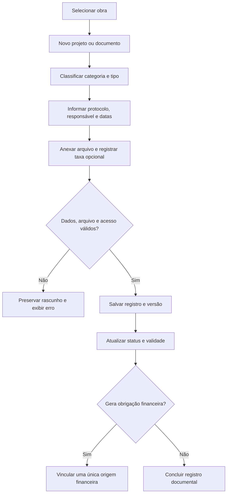
```mermaid
flowchart TD
    A[Selecionar obra] --> B[Novo projeto ou documento]
    B --> C[Classificar categoria e tipo]
    C --> D[Informar protocolo, responsável e datas]
    D --> E[Anexar arquivo e registrar taxa opcional]
    E --> F{Dados, arquivo e acesso válidos?}
    F -- Não --> G[Preservar rascunho e exibir erro]
    F -- Sim --> H[Salvar registro e versão]
    H --> I[Atualizar status e validade]
    I --> J{Gera obrigação financeira?}
    J -- Sim --> K[Vincular uma única origem financeira]
    J -- Não --> L[Concluir registro documental]
```

## 8. Orçamento inicial

### Objetivo

Registrar por obra custos de terreno, pré-obra, construção e contingência, detalhados por etapa/serviço e fornecedor, com cenários e formas de pagamento, mantendo versões e baseline aprovada.

### Atores

- Gestor: prepara e revisa orçamento.
- Financeiro: consulta condições e projeções; registra obrigações em fluxos posteriores.
- Proprietário/aprovador: aprova conforme alçada configurada, sem valor presumido.

### Pré-condições

- Obra selecionada.
- Etapas/serviços configurados e fornecedor cadastrado quando aplicável.
- Categorias e unidades existentes.

### Entidades e campos

**Versão do orçamento (`budget_version`)**:

| Campo | Tipo lógico | Regra |
|---|---|---|
| `id`, `project_id` | UUID | Versão da obra. |
| `version_number` | Inteiro/texto | Sequencial e imutável após aprovação. |
| `status` | Enum | Rascunho, em análise, aprovado, rejeitado ou superado. |
| `scenario` | Enum opcional | Econômico, provável ou máximo quando aplicado à versão. |
| `previous_version_id` | UUID opcional | Origem da revisão. |
| `change_reason`, `submitted_by`, `approved_by`, datas | Auditoria | Motivo e responsáveis. |
| `is_baseline` | Booleano | Uma baseline vigente por obra. |

**Linha do orçamento (`budget_line`)**:

| Campo | Tipo lógico | Regra |
|---|---|---|
| `id`, `budget_version_id`, `project_id` | UUID | Vínculos. |
| `group` | Enum | Terreno, pré-obra, construção ou contingência. |
| `project_stage_id`, `project_work_item_id` | UUID opcional | Etapa/serviço da mesma obra. |
| `supplier_id` | UUID opcional/obrigatório conforme item | Fornecedor estimado. |
| `scenario` | Enum | Econômico, provável ou máximo. |
| `description`, `code` | Texto | Item e código. |
| `quantity`, `unit_id` | Decimal/referência | Quantidade e unidade. |
| `unit_cost` | Decimal(19,6) conceitual | Preço unitário. |
| `freight`, `taxes`, `discount` | Decimal monetário | Componentes explícitos. |
| `loss_percent` | Decimal | Perdas/encargos percentuais. |
| `line_total` | Decimal monetário calculado | Arredondamento half-up por linha. |
| `payment_terms` | Estrutura/texto | À vista, parcelado, entrada + parcelas ou parcelas diferentes. |
| `covered_scope` | Texto/vínculo | Evita sobreposição da estimativa com compromisso. |
| `notes` | Texto | Observações. |

**Evento de contingência (`contingency_event`)**: valor, data, motivo, origem/destino, aprovador conforme alçada configurada e saldo após evento.

### Regras funcionais

1. **[REQ]** Orçamento é por obra e pode ser detalhado por etapa, serviço e fornecedor; múltiplos registros/propostas podem ser analisados antes da escolha.
2. **[REQ]** Terreno, pré-obra, construção e custos gerais são grupos distintos; pré-obra inclui projetos, condomínio, taxas, licenças, seguros, sondagem e aprovações.
3. **[REQ]** Versão aprovada torna-se baseline e não é sobrescrita; revisão registra motivo, data e responsável.
4. **[REQ]** Cenários econômico, provável e máximo não alteram automaticamente a baseline.
5. **[REQ]** Valores usam decimal exato em BRL; quantidade até quatro casas, unitário até seis e total da linha arredondado a centavos em half-up.
6. **[REQ]** Orçamento, compromisso, custo reconhecido e pagamento são conceitos distintos. Pagamento não é adicionado ao custo projetado.
7. **[REQ]** Contingência possui saldo separado e uso justificado. Transferência para serviço aumenta B e reduz R pelo mesmo valor; aporte adicional é revisão distinta.
8. **[REQ]** Projeção final `F = E + CR + U`, sem sobreposição de escopo; `U` deve indicar o escopo restante coberto.
9. **[PROP]** Forma de pagamento no orçamento é condição estimada; parcelas financeiras definitivas surgem de compra/contrato, sem duplicar previsão.
10. **[PROT]** Tela mostra totais de Terreno, Pré-obra, Construção e Total previsto e linhas com etapa/serviço, fornecedor, cenário, valor, pagamento e status.

### Estados

- Rascunho.
- Em análise.
- Aprovado/baseline vigente.
- Rejeitado, retornando para revisão rastreável.
- Superado por nova versão aprovada.

### Fluxo principal

1. Usuário seleciona obra e abre Orçamento inicial.
2. Cria versão em rascunho ou nova revisão.
3. Inclui linhas por grupo, etapa/serviço, fornecedor, cenário e condição de pagamento.
4. Sistema calcula totais por linha e grupo.
5. Usuário revisa escopo e contingência e envia para análise.
6. Aprovador autorizado aprova ou rejeita segundo configuração, sem alçada fixa nesta especificação.
7. Se aprovado, versão torna-se baseline vigente; versão anterior fica preservada como superada.

### Exceções

- Obra não selecionada: bloquear gravação e destacar seletor superior.
- Quantidade/custos inválidos ou referência de outra obra: rejeitar.
- Aprovação sem permissão/alçada configurada: rejeitar sem alterar totais aprovados.
- Orçamento igual a zero: desvio percentual é “não aplicável”.
- Escopo estimado sobreposto a contrato: sinalizar e impedir duplicidade na projeção.
- Falha durante envio/aprovação: manter rascunho e não informar sucesso antes da confirmação.

### Critérios de aceite

- CA-ORC-01: linha associa obra, grupo e, quando aplicável, etapa/serviço e fornecedor.
- CA-ORC-02: baseline aprovada permanece consultável e não pode ser editada diretamente.
- CA-ORC-03: revisão aprovada preserva motivo, autor, data e vínculo com versão anterior.
- CA-ORC-04: pagamento de uma compra não aumenta orçamento nem custo final projetado.
- CA-ORC-05: os totais do documento são a soma das linhas arredondadas, usando decimal e regra definida.
- CA-ORC-06: cenário alternativo não modifica a baseline sem fluxo explícito de revisão/aprovação.
- CA-ORC-07: contingência utilizada registra evento, justificativa e saldo, sem virar custo reconhecido automaticamente.

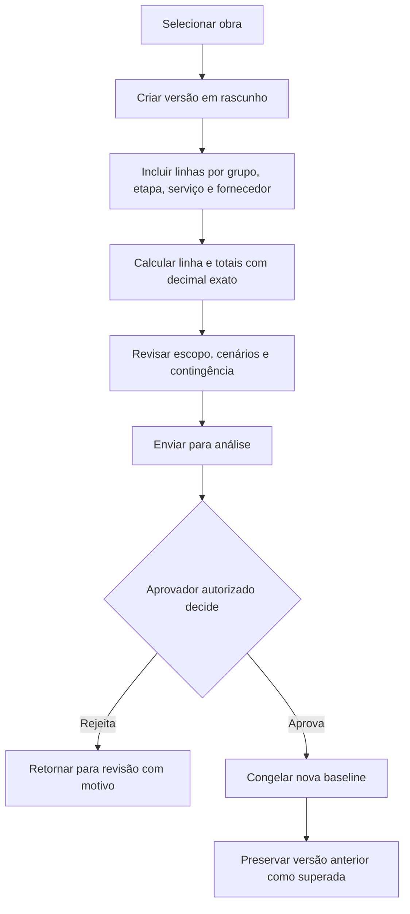
```mermaid
flowchart TD
    A[Selecionar obra] --> B[Criar versão em rascunho]
    B --> C[Incluir linhas por grupo, etapa, serviço e fornecedor]
    C --> D[Calcular linha e totais com decimal exato]
    D --> E[Revisar escopo, cenários e contingência]
    E --> F[Enviar para análise]
    F --> G{Aprovador autorizado decide}
    G -- Rejeita --> H[Retornar para revisão com motivo]
    G -- Aprova --> I[Congelar nova baseline]
    I --> J[Preservar versão anterior como superada]
```

## 9. Contratos, aditivos e supressões

### Objetivo

Gerir por obra contratos e alterações contratuais vinculados a fornecedor, etapa/serviço, valores, prazos, condições, retenções, garantias e documentos.

### Atores

- Gestor: elabora e acompanha contratos/aditivos.
- Financeiro: consulta condições, retenções e parcelas; gera obrigações em fluxo posterior.
- Proprietário/aprovador: decide conforme alçada configurada.
- Fornecedor: acessa apenas contrato e documentos expressamente compartilhados.

### Pré-condições

- Obra selecionada.
- Fornecedor cadastrado e autorizado para nova associação.
- Escopo vinculado a etapa/serviço da mesma obra.
- Orçamento/proposta aprovado quando exigido pelo fluxo configurado.

### Entidades e campos

**Contrato/compromisso (`contract`)**:

| Campo | Tipo lógico | Regra |
|---|---|---|
| `id`, `project_id`, `contract_number` | UUID/texto | Número único no contexto definido. |
| `supplier_id` | UUID | Fornecedor da organização. |
| `contract_type` | Enum | Empreitada global, preço unitário, diária, administração ou fornecimento. |
| `project_stage_id`, `project_work_item_id` | UUID/lista | Escopo da mesma obra. |
| `original_amount` | Decimal monetário | Imutável após aprovação. |
| `updated_amount` | Decimal derivado | Original + aditivos aprovados − supressões aprovadas. |
| `start_date`, `end_date` | Data | Prazo contratual. |
| `adjustment_terms` | Texto/estrutura | Reajuste e índice contratual, sem inventar regra fiscal. |
| `retention_percent` | Decimal | Retenção; sua liberação não cria novo custo. |
| `penalty_percent` | Decimal | Multa prevista. |
| `payment_terms` | Estrutura/texto | Condições e cronograma de pagamento. |
| `warranty_terms` | Texto | Garantia. |
| `scope`, `exclusions` | Texto | Inclusões e exclusões explícitas. |
| `status` | Enum | Rascunho, em aprovação, aprovado, em execução, suspenso, concluído ou cancelado. |
| `document_ids` | Lista UUID | Contrato e anexos privados/versionados. |
| `created_by`, `approved_by`, datas, `version` | Auditoria | Histórico e concorrência. |

**Linha do compromisso (`commitment_line`)**: contrato, item orçamentário/etapa/serviço, quantidade, unidade, preço unitário, valor autorizado, executado reconhecido e saldo.

**Aditivo/supressão (`amendment`)**:

| Campo | Tipo lógico | Regra |
|---|---|---|
| `id`, `project_id`, `contract_id` | UUID | Contrato da mesma obra. |
| `type` | Enum | Aditivo ou supressão. |
| `reason` | Texto | Obrigatório. |
| `amount` | Decimal monetário | Impacto no compromisso. |
| `schedule_impact_days` | Inteiro | Efeito no prazo. |
| `new_end_date` | Data opcional | Nova data prevista. |
| `status` | Enum | Solicitado, impacto avaliado, aprovado ou rejeitado. |
| `approval_actor_id`, `approved_at` | Auditoria | Aprovador conforme regra configurada. |
| `document_ids` | Lista UUID | Anexos/evidências. |

### Regras funcionais

1. **[REQ]** Contratos e aditivos pertencem ao menu Cadastro da Obra e usam a obra selecionada no topo.
2. **[REQ]** O valor original é preservado; valor atualizado deriva apenas de aditivos/supressões aprovados.
3. **[REQ]** Aditivo/supressão registra motivo, valor, efeito no prazo, aprovação e documentos.
4. **[REQ]** Aditivo pendente não altera valor contratado `C`, cronograma vigente ou projeções aprovadas.
5. **[REQ]** Medições, pagamentos ou aditivos acima dos limites autorizados exigem exceção específica, justificativa e aprovação conforme alçada configurada; nenhuma alçada numérica é definida aqui.
6. **[REQ]** Supressão não pode reduzir o limite abaixo do executado reconhecido sem procedimento de reversão/encerramento e crédito explicado.
7. **[REQ]** Compras diretas e contratos compõem compromissos sem duplicar a mesma unidade de escopo.
8. **[REQ]** Cancelar/substituir fornecedor afeta apenas compromisso restante; medições e pagamentos históricos permanecem.
9. **[PROP]** Excluir contrato é permitido apenas enquanto rascunho e sem vínculos; depois, usar cancelamento/suspensão rastreável.
10. **[PROT]** A listagem mostra número, fornecedor, tipo, original, atualizado, retenção, status e ações Abrir/+ Aditivo.

### Estados

- Contrato: rascunho → em aprovação → aprovado → em execução → concluído.
- Contrato: suspenso ou cancelado com motivo e tratamento de saldos.
- Aditivo: solicitado → impacto avaliado → aprovado ou rejeitado.
- Documento contratual: versão disponível, substituída/superada, acesso restrito.

### Fluxo principal — contrato

1. Usuário seleciona obra e aciona Novo contrato.
2. Informa fornecedor, tipo, etapa/serviço, valor original, prazo, reajuste, retenção, multa, pagamento, garantia, escopo e exclusões.
3. Anexa contrato/documentos.
4. Sistema valida obra, fornecedor, escopo e limites.
5. Contrato é salvo em rascunho e enviado para aprovação.
6. Aprovador autorizado aprova ou rejeita.
7. Aprovado, passa a compromisso e pode entrar em execução.

### Fluxo principal — aditivo/supressão

1. Usuário abre contrato e aciona Aditivo.
2. Informa tipo, motivo, valor e impacto de prazo.
3. Sistema calcula valor/data propostos e verifica limites/saldos.
4. Alteração segue para avaliação/aprovação.
5. Se aprovada, atualiza valor contratado e cronograma aplicável, preservando original.
6. Se rejeitada, mantém contrato vigente inalterado e registra motivo.

### Exceções

- Fornecedor ou item de outra obra: rejeitar.
- Valor negativo ou supressão superior ao saldo elegível: rejeitar.
- Aditivo acima de limite: manter pendente e exigir aprovação específica configurada.
- Edição concorrente do contrato: retornar conflito e solicitar recarga/reconciliação.
- Cancelamento com execução/pagamento: exigir tratamento explícito do saldo e preservar histórico.
- Arquivo indisponível: não declarar contrato completo; manter pendência.

### Critérios de aceite

- CA-CTR-01: contrato aprovado mantém valor original, valor atualizado e histórico de alterações separadamente.
- CA-CTR-02: aditivo pendente não altera o total contratado nem a data vigente.
- CA-CTR-03: supressão que reduziria o contrato abaixo do executado é rejeitada ou direcionada a procedimento de correção rastreável.
- CA-CTR-04: substituir fornecedor cancela somente saldo futuro; execução e pagamentos anteriores continuam consultáveis.
- CA-CTR-05: contrato da Obra A não pode vincular etapa, fornecedor restrito ou documento pertencente à Obra B.
- CA-CTR-06: retenção liberada altera caixa/obrigação, mas não reconhece novamente o custo.
- CA-CTR-07: valores que ultrapassem limites não são aprovados sem autorização específica e justificativa registrada.

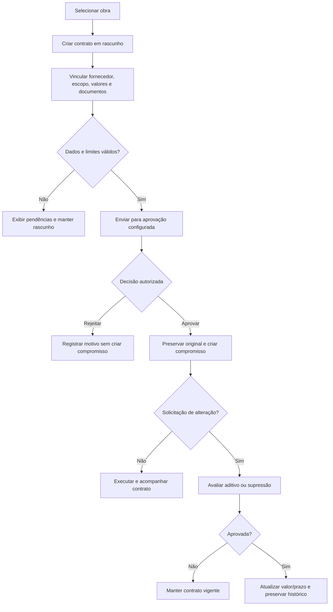
```mermaid
flowchart TD
    A[Selecionar obra] --> B[Criar contrato em rascunho]
    B --> C[Vincular fornecedor, escopo, valores e documentos]
    C --> D{Dados e limites válidos?}
    D -- Não --> E[Exibir pendências e manter rascunho]
    D -- Sim --> F[Enviar para aprovação configurada]
    F --> G{Decisão autorizada}
    G -- Rejeitar --> H[Registrar motivo sem criar compromisso]
    G -- Aprovar --> I[Preservar original e criar compromisso]
    I --> J{Solicitação de alteração?}
    J -- Não --> K[Executar e acompanhar contrato]
    J -- Sim --> L[Avaliar aditivo ou supressão]
    L --> M{Aprovada?}
    M -- Não --> N[Manter contrato vigente]
    M -- Sim --> O[Atualizar valor/prazo e preservar histórico]
```

## 10. Requisitos transversais deste conjunto

1. **Isolamento:** toda entidade por obra carrega `project_id`; cadastros globais carregam `organization_id`; vínculos cruzados são rejeitados.
2. **Rastreabilidade:** criação, edição, aprovação, rejeição, suspensão, cancelamento e inativação registram ator, data e motivo quando aplicável.
3. **Exclusão:** registros sem uso podem ser excluídos conforme permissão; registros com histórico operacional/financeiro são inativados, cancelados, revisados ou estornados, nunca apagados silenciosamente.
4. **Documentos:** arquivos são privados, versionados e vinculados ao registro de negócio; acesso depende de obra e ação.
5. **Concorrência:** registros relevantes usam versão/controle otimista; edição concorrente não sobrescreve silenciosamente dados aprovados.
6. **Valores:** moeda BRL, transporte decimal como string em API futura, sem `float` como fonte monetária; datas na tela em DD/MM/AAAA.
7. **UX:** consultas possuem carregando, vazio, erro com nova tentativa, sucesso e sem permissão; formulários preservam dados em falha e exibem erros por campo.
8. **Protótipo:** botões e formulários locais demonstram a jornada, mas não comprovam upload, autorização, gravação, aprovação, exportação ou auditoria.

## 11. Pendências para decisão do produto

- Definir quais perfis podem criar/editar/inativar itens globais e quais permissões são concedidas por obra.
- Confirmar se fornecedor é obrigatório desde a inclusão do item na configuração ou se é permitido estado “fornecedor a definir” antes da contratação.
- Definir regra de ativação da obra e conjunto mínimo de documentos/configurações.
- Definir se defasagem negativa é permitida nas dependências e como restrições rígidas/flexíveis afetam o cronograma.
- Definir estratégia de reponderação quando etapa/serviço é cancelado após início.
- Especificar metodologia e origem da avaliação de fornecedores exibida no protótipo.
- Definir categorias documentais obrigatórias por município/condomínio sem codificar exigências legais universais.
- Definir fluxo e permissões para revisão da baseline de orçamento e planejamento, sem fixar valores de alçada.
- Definir numeração de contratos por organização ou por obra.

## 12. Evidências consultadas

- `prototipo/prumo-v9-completo.html`: navegação, formulários, campos e estados visuais demonstrados.
- `docs/02-produto.md`: ordem de configuração, RF01/RF01A/RF01B/RF02/RF04/RF08/RF11/RF13/RF16, regras financeiras, estados e critérios críticos.
- `docs/04-dados-api.md`: entidades conceituais, isolamento por organização/obra, invariantes, auditoria e contratos de dados.
- `docs/05-telas.md`: jornadas, responsividade, estados de consulta/formulário e limites do protótipo.

# BOMzeika Obras — especificação funcional da execução e controle

> Rascunho para consolidação. Cobre os módulos de execução presentes no protótipo `prototipo/prumo-v9-completo.html`. Descreve comportamento desejado; não declara implementação, persistência, teste ou publicação.

## 1. Convenções compartilhadas

### 1.1 Contexto da obra

O seletor global no cabeçalho define a **obra ativa**. Painel, orçamento e custos, compras, pagamentos, financeiro, cronograma, diário e qualidade e infraestrutura consultam e gravam somente registros dessa obra. Ao trocar a obra, a tela mantém a funcionalidade aberta, limpa seleções incompatíveis, recarrega filtros e mostra nome, status e local da nova obra. Obra suspensa ou concluída pode ser consultada; mutações dependem da permissão e do estado da obra.

### 1.2 Campos comuns

Todas as entidades persistentes deste documento possuem, além dos campos específicos: `id`, `organizacao_id`, `obra_id`, `criado_em`, `criado_por`, `alterado_em`, `alterado_por`, `versao` para controle concorrente, `status` quando aplicável e referência de auditoria. Arquivos usam armazenamento privado e mantêm `arquivo_id`, nome original, tipo MIME, tamanho, hash, versão, autor, data e nível de acesso. Valores monetários são BRL com precisão decimal; quantidade admite até quatro casas, preço unitário até seis e total de linha é arredondado a centavos por half-up.

Registros aprovados ou com efeito financeiro não são apagados. Correções usam revisão, cancelamento, reversão ou estorno vinculado. Exclusão física fica restrita a rascunhos nunca utilizados e ainda assim gera auditoria.

### 1.3 Conceitos financeiros obrigatórios

- `B`: orçamento vigente aprovado dos serviços.
- `R`: reserva de contingência ainda não alocada. Teto vigente = `B + R`.
- `C`: compromissos autorizados atualizados, formados por contratos e pedidos, inclusive aditivos aprovados.
- `E`: custo reconhecido por medição ou recebimento aprovado, líquido de reversões.
- `CR`: parcela dos compromissos ainda não executada. No caso simples, `C - E` do escopo contratado.
- `U`: estimativa explícita para escopo restante ainda não contratado, sem sobrepor o escopo coberto por `C` ou `E`.
- `F`: custo final projetado = `E + CR + U`.
- `Pago`: desembolsos efetivos menos estornos. Pagamento liquida obrigação e **não cria novo custo**.
- Desvio sobre teto = `F - (B + R)`; desvio sobre serviços = `F - B`. Percentuais sempre exibem o denominador; orçamento zero resulta em “não aplicável”.

Cada indicador e gráfico deve registrar fonte, obra, filtros, data de corte e instante da atualização. A navegação até os registros de origem é obrigatória.

---

## 2. Painel da obra

### Objetivo

Fornecer visão executiva e rastreável do avanço físico, prazo, orçamento, compromissos, execução, pagamentos, contingência, riscos e evidências visuais da obra ativa.

### Atores

- Proprietário: consulta visão executiva e itens pendentes de sua aprovação.
- Gestor: acompanha desvios e acessa registros de origem.
- Financeiro: analisa caixa, obrigações e pagamentos.
- Responsável técnico: acompanha avanço, prazo, riscos e evidências.

### Pré-condições

- Usuário autenticado e autorizado na obra.
- Obra selecionada no cabeçalho.
- Para avanço calculável, baseline física aprovada com pesos normalizados em 100%; caso contrário, exibir “não calculável”.

### Entidades e campos

| Entidade | Campos específicos |
|---|---|
| `SnapshotPainel` (derivado) | `data_corte`, `filtros`, `orcamento_aprovado_b`, `contingencia_r`, `comprometido_c`, `executado_e`, `compromisso_restante_cr`, `estimativa_nao_contratada_u`, `custo_final_f`, `pago_liquido`, `adiantamento_aberto`, `obrigacoes_abertas`, `vencido`, `avanco_fisico`, `avanco_planejado`, `previsao_termino`, `atualizado_em` |
| `IndicadorEtapa` (derivado) | `etapa_id`, `peso_baseline`, `percentual_planejado`, `percentual_real`, `custo_previsto`, `comprometido`, `executado`, `pago`, `desvio`, `nivel_risco`, `motivos_risco` |
| `SerieFinanceira` (derivado) | `periodo`, `entrada_prevista`, `entrada_realizada`, `saida_prevista`, `saida_realizada`, `saldo_periodo`, `saldo_acumulado` |
| `RiscoEtapa` | `etapa_id`, `data_avaliacao`, `nivel` (baixo/médio/alto/crítico), `origem` (manual/regra), `motivos`, `impacto_dias`, `impacto_valor`, `responsavel_id`, `acao_mitigacao`, `prazo_acao`, `status` |
| `DestaqueImagem` | `foto_id`, `etapa_id`, `ambiente_id`, `legenda`, `data_registro`, `ordem`, `principal` |

### Regras

1. Avanço físico é a soma dos percentuais dos serviços ponderados pelos pesos congelados na baseline; não é inferido por pagamento.
2. O painel apresenta `B`, `C`, `E`, `Pago` e `F` separadamente. Nenhum cartão soma essas grandezas como despesas independentes.
3. Avanço financeiro de caixa, quando exibido, é `Pago / (B + R)` e deve ser rotulado como caixa, com denominador visível.
4. O gráfico “financeiro por mês” permite alternar previsto/realizado e entradas/saídas; valores do futuro não entram em realizado.
5. Risco de atraso considera diferença planejado x realizado, caminho de dependências, atividades bloqueadas, compras de longo prazo e prazo de entrega. O resultado é explicável e pode receber avaliação manual auditada.
6. Contingência mostra saldo disponível, valores reservados e utilizações aprovadas; reserva não vira custo automaticamente.
7. Filtros mínimos: período, etapa, ambiente, fornecedor e categoria. “Limpar filtros” retorna à visão integral da obra ativa.
8. Exportação usa os mesmos filtros e data de corte da tela e deve reconciliar com ela.

### Estados

O painel não possui estado transacional próprio. Os riscos possuem `aberto → em tratamento → mitigado` ou `aceito/cancelado`, sempre com responsável e justificativa.

### Fluxo principal

1. Usuário seleciona a obra no cabeçalho.
2. Sistema carrega data de corte, filtros padrão e indicadores reconciliados.
3. Usuário alterna período ou dimensão e visualiza gráficos de evolução, financeiro e riscos.
4. Usuário seleciona um cartão, uma etapa ou um ponto do gráfico.
5. Sistema abre a lista dos registros que formam o valor, preservando filtros.
6. Usuário pode exportar a visão atual.

### Exceções

- Sem baseline física: cartões financeiros continuam disponíveis; avanço exibe “não calculável” e aponta pesos pendentes.
- Dado em processamento ou indisponível: manter último resultado identificado com horário e sinalizar que está desatualizado; nunca mostrar zero como substituto.
- Orçamento zero: desvio percentual e custo por m² sem denominador exibem “não aplicável”.
- Troca de obra sem acesso: impedir carregamento e manter a obra anterior.

### Critérios de aceite

- PA-01: para o mesmo filtro e data de corte, o detalhamento soma exatamente o cartão e a exportação.
- PA-02: pagamento ou estorno altera `Pago` e caixa, sem alterar `E` ou `F` por si só.
- PA-03: etapa com pesos inconsistentes não produz percentual enganoso.
- PA-04: clicar no risco mostra atividades, dependências e compras que o justificam.
- PA-05: troca de obra atualiza todos os componentes sem misturar dados da obra anterior.

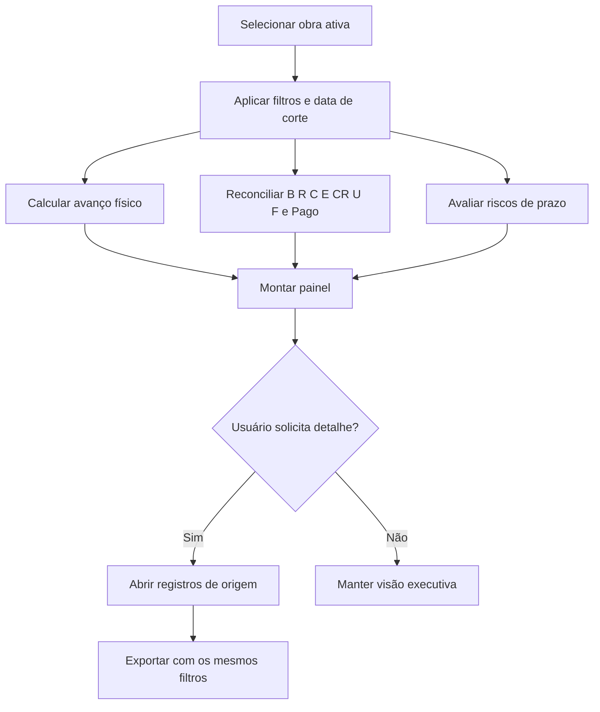
```mermaid
flowchart TD
    A[Selecionar obra ativa] --> B[Aplicar filtros e data de corte]
    B --> C[Calcular avanço físico]
    B --> D[Reconciliar B R C E CR U F e Pago]
    B --> E[Avaliar riscos de prazo]
    C --> F[Montar painel]
    D --> F
    E --> F
    F --> G{Usuário solicita detalhe?}
    G -- Sim --> H[Abrir registros de origem]
    G -- Não --> I[Manter visão executiva]
    H --> J[Exportar com os mesmos filtros]
```

---

## 3. Orçamento e custos — propostas e análise de custo-benefício

### Objetivo

Controlar orçamento vigente por etapa, serviço e fornecedor, receber múltiplas propostas comparáveis, analisar custo-benefício e escolher uma proposta com justificativa antes de efetivá-la em compra.

### Atores

- Gestor: prepara orçamento, solicita e compara propostas.
- Responsável técnico: valida escopo, quantidades, marca, modelo e prazo.
- Financeiro: valida impostos, frete, condições e impacto de caixa.
- Proprietário/aprovador: aprova conforme alçada configurada.
- Fornecedor: envia somente sua proposta e documentos compartilhados.

### Pré-condições

- Obra ativa selecionada.
- Etapa/serviço configurado na obra e associado a categoria de custo.
- Fornecedores cadastrados e autorizados a participar da solicitação.
- Versão de orçamento existente; apenas versão aprovada integra `B`.

### Entidades e campos

| Entidade | Campos específicos |
|---|---|
| `VersaoOrcamento` | `numero`, `nome`, `cenario` (econômico/provável/máximo), `motivo_revisao`, `vigencia`, `baseline`, `aprovado_em`, `aprovado_por`, `substitui_versao_id` |
| `ItemOrcamento` | `versao_id`, `codigo`, `grupo` (terreno/pré-obra/construção/custos gerais/contingência), `etapa_id`, `servico_id`, `ambiente_id`, `categoria_custo_id`, `centro_custo_id`, `unidade`, `quantidade`, `custo_unitario`, `frete`, `impostos`, `desconto`, `perda_percentual`, `total_linha`, `escopo_coberto`, `fornecedor_referencia_id`, `forma_pagamento_referencia`, `estimativa_restante_u` |
| `SolicitacaoProposta` | `codigo`, `etapa_id`, `servico_id`, `item_orcamento_id`, `descricao_escopo`, `quantidade`, `unidade`, `especificacoes`, `marcas_aceitas`, `data_limite`, `prazo_desejado`, `criterios_avaliacao`, `anexos` |
| `Proposta` | `solicitacao_id`, `fornecedor_id`, `numero`, `versao`, `data`, `validade`, `moeda`, `valor_itens`, `frete`, `impostos`, `descontos`, `valor_total`, `prazo_entrega_dias`, `garantia`, `marca_modelo`, `forma_pagamento`, `inclusoes`, `exclusoes`, `anexo`, `substitui_proposta_id` |
| `ParcelaProposta` | `proposta_id`, `sequencia`, `tipo` (entrada/parcela/medição/marco), `percentual`, `valor`, `vencimento_regra`, `periodicidade` |
| `AnaliseProposta` | `solicitacao_id`, `proposta_id`, `escopo_comparavel`, `divergencias`, `valor_normalizado`, `prazo_pontuacao`, `qualidade_pontuacao`, `garantia_pontuacao`, `condicao_pagamento_pontuacao`, `risco_pontuacao`, `nota_total`, `parecer_tecnico`, `parecer_financeiro` |
| `EscolhaProposta` | `solicitacao_id`, `proposta_id`, `justificativa`, `economia_valor`, `economia_referencia`, `aprovacao_id`, `escolhido_em`, `escolhido_por` |

### Regras

1. A linha de base aprovada não é sobrescrita; revisão cria nova versão e preserva o histórico.
2. Propostas só podem ser ranqueadas diretamente quando o escopo for comparável. Diferenças de quantidade, marca, impostos, frete, garantia, exclusões ou prazo são destacadas.
3. “Melhor custo-benefício” é resultado de critérios e pesos configurados pela organização/obra, com memória do cálculo; o sistema não inventa pesos nem escolhe automaticamente.
4. Menor preço não implica escolha. Selecionar proposta exige justificativa, inclusive quando não for a de menor preço.
5. Economia por etapa = referência comparável menos valor escolhido normalizado. A tela identifica a referência: orçamento-base, maior proposta comparável ou média comparável. Economia consolidada soma apenas grupos sem sobreposição.
6. Proposta em análise não integra `C`. Somente a compra/contrato autorizado criado após a escolha integra compromisso.
7. Versões anteriores da proposta permanecem consultáveis. Fornecedor não acessa propostas concorrentes.
8. Forma de pagamento influencia o fluxo previsto, mas não altera o valor do custo reconhecido; custos financeiros explícitos são linhas próprias.
9. Escopo de `U` deve ser identificado. Ao efetivar compra, a parcela coberta deixa de compor `U` e passa a `C`, sem dupla contagem.

### Estados

- Versão de orçamento: `rascunho → em análise → aprovada → superada`; rejeição retorna para revisão rastreável.
- Solicitação: `rascunho → aberta → recebendo propostas → em análise → encerrada/cancelada`.
- Proposta: `rascunho → enviada → válida → em análise → escolhida/não escolhida/expirada/cancelada`.
- Escolha: `pendente de aprovação → aprovada/rejeitada → efetivada`.

### Fluxo principal

1. Gestor escolhe etapa/serviço e abre solicitação com escopo e critérios.
2. Fornecedores enviam propostas e versões.
3. Sistema normaliza valores e sinaliza diferenças de escopo.
4. Responsável técnico e financeiro registram análises.
5. Gestor seleciona a proposta, informa justificativa e envia para aprovação.
6. Aprovador decide conforme alçada configurada.
7. Proposta aprovada fica disponível para “Efetivar compra”.

### Exceções

- Proposta vencida: bloquear efetivação até revalidação ou nova versão.
- Escopo divergente: permitir análise, mas impedir rótulo de comparação direta sem ajuste documentado.
- Total de parcelas diferente do total da proposta: bloquear aprovação.
- Alteração após aprovação: criar nova versão e nova decisão; não editar a escolhida.
- Fornecedor substituído: preservar escolha, compra e histórico; cancelar somente saldo ainda não comprometido por operação própria.

### Critérios de aceite

- OC-01: cada proposta mostra valor total conciliado com itens, frete, impostos e descontos.
- OC-02: propostas com escopos diferentes são sinalizadas antes da escolha.
- OC-03: escolha sem justificativa ou aprovação exigida não pode ser efetivada.
- OC-04: economia exibe referência e não soma propostas do mesmo escopo duas vezes.
- OC-05: mudança em rascunho não altera baseline; nova versão aprovada preserva a anterior.

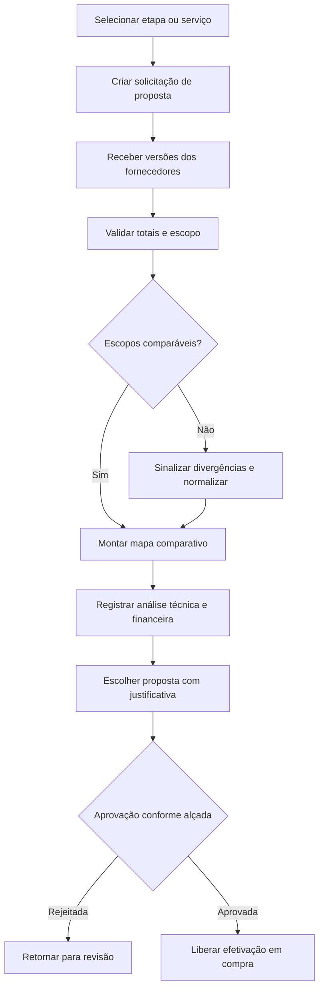
```mermaid
flowchart TD
    A[Selecionar etapa ou serviço] --> B[Criar solicitação de proposta]
    B --> C[Receber versões dos fornecedores]
    C --> D[Validar totais e escopo]
    D --> E{Escopos comparáveis?}
    E -- Não --> F[Sinalizar divergências e normalizar]
    E -- Sim --> G[Montar mapa comparativo]
    F --> G
    G --> H[Registrar análise técnica e financeira]
    H --> I[Escolher proposta com justificativa]
    I --> J{Aprovação conforme alçada}
    J -- Rejeitada --> K[Retornar para revisão]
    J -- Aprovada --> L[Liberar efetivação em compra]
```

---

## 4. Efetivação de proposta em Compras

### Objetivo

Converter uma proposta escolhida e aprovada em um pedido de compra rastreável, sem recadastro, perda de origem ou duplicação do compromisso.

### Atores

Gestor ou comprador autorizado; aprovador; financeiro como consultor das condições.

### Pré-condições

- Obra ativa coincide com a obra da solicitação.
- Proposta escolhida, aprovada, válida e ainda não efetivada.
- Escopo, fornecedor, total e condição de pagamento validados.

### Entidades e campos

| Entidade | Campos específicos |
|---|---|
| `EfetivacaoProposta` | `proposta_id`, `escolha_id`, `chave_idempotencia`, `solicitado_em`, `solicitado_por`, `compra_id`, `resultado`, `erro` |
| `VinculoOrigemCompra` | `compra_id`, `solicitacao_id`, `proposta_id`, `versao_proposta`, `item_orcamento_id`, `escopo_coberto_id`, `valor_origem` |
| `TransicaoEstimativaCompromisso` | `escopo_coberto_id`, `valor_u_anterior`, `valor_transferido_para_c`, `valor_u_posterior`, `compra_id`, `data` |

### Regras

1. A operação é atômica e idempotente: mesma proposta e mesma chave retornam a compra já criada.
2. A compra copia os dados aprovados; alterações materiais após criação exigem revisão/aprovação do pedido.
3. A efetivação registra `C` uma única vez e reduz `U` apenas no escopo explicitamente coberto.
4. Não cria pagamento, custo executado ou desembolso. Parcelas de proposta viram programação prevista; obrigação e baixa seguem seus fluxos.
5. Uma proposta não pode gerar duas compras ativas para o mesmo escopo, salvo divisão aprovada e documentada.
6. A economia consolidada é congelada com a referência usada na decisão e não muda retroativamente por nova proposta.

### Estados

`não efetivada → processando → efetivada`; falha retorna a `não efetivada` com erro rastreável. Cancelamento da compra não reabre a proposta automaticamente; o gestor decide se cria nova escolha.

### Fluxo principal

1. Usuário aciona “Efetivar compra”.
2. Sistema exibe resumo do escopo, fornecedor, total, prazo, pagamento e impacto em `C` e `U`.
3. Usuário confirma.
4. Sistema revalida aprovação, validade, saldo do escopo e duplicidade.
5. Em transação única, cria compra, itens, agenda prevista e vínculos de origem; atualiza compromisso/estimativa.
6. Sistema marca escolha como efetivada e abre a compra criada.

### Exceções

- Duplo clique/retry: retornar a mesma compra.
- Proposta expirada ou alterada: cancelar a operação e solicitar revalidação.
- Escopo já comprometido: bloquear ou exigir divisão explícita e nova aprovação.
- Falha parcial: reverter toda a transação e não informar sucesso.

### Critérios de aceite

- EF-01: duas solicitações com a mesma chave produzem um único pedido e um único efeito em `C`.
- EF-02: a compra mantém vínculo navegável com proposta, solicitação, item orçamentário e aprovação.
- EF-03: imediatamente após efetivação, `C` aumenta e `U` diminui somente pelo escopo coberto; `E` e `Pago` não mudam.
- EF-04: total e agenda previstos reconciliam com a proposta aprovada.

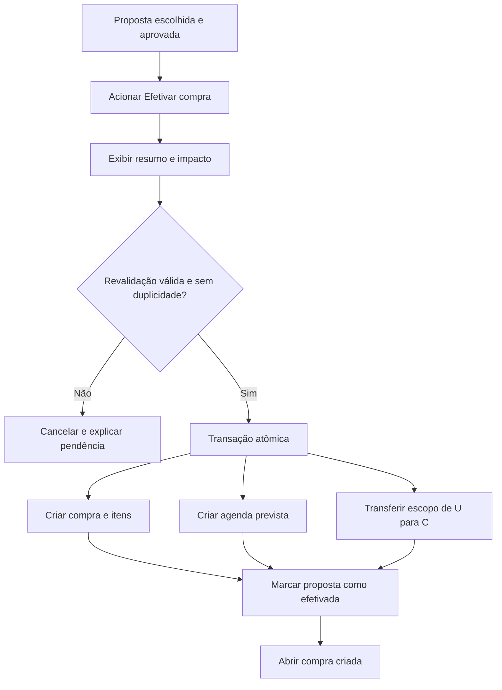
```mermaid
flowchart TD
    A[Proposta escolhida e aprovada] --> B[Acionar Efetivar compra]
    B --> C[Exibir resumo e impacto]
    C --> D{Revalidação válida e sem duplicidade?}
    D -- Não --> E[Cancelar e explicar pendência]
    D -- Sim --> F[Transação atômica]
    F --> G[Criar compra e itens]
    F --> H[Criar agenda prevista]
    F --> I[Transferir escopo de U para C]
    G --> J[Marcar proposta como efetivada]
    H --> J
    I --> J
    J --> K[Abrir compra criada]
```

---

## 5. Compras e recebimentos

### Objetivo

Gerir pedidos de materiais e serviços desde a emissão até recebimentos parciais, conferência, devolução, pendências e encerramento, preservando o compromisso e reconhecendo custo somente sobre recebimento aceito.

### Atores

Gestor/comprador; responsável técnico ou almoxarife; financeiro; aprovador; fornecedor com acesso limitado.

### Pré-condições

- Obra ativa selecionada.
- Fornecedor, etapa/serviço e item orçamentário válidos.
- Compra oriunda de proposta aprovada ou compra direta com justificativa e aprovação conforme regra configurada.

### Entidades e campos

| Entidade | Campos específicos |
|---|---|
| `Compra` | `numero_pedido`, `origem` (proposta/compra direta/contrato), `fornecedor_id`, `etapa_id`, `servico_id`, `item_orcamento_id`, `data_pedido`, `entrega_prevista`, `responsavel_id`, `valor_original`, `valor_atualizado`, `forma_pagamento_modelo`, `escopo`, `observacoes`, `anexos`, `aprovacao_id` |
| `ItemCompra` | `compra_id`, `codigo`, `descricao`, `marca_modelo`, `quantidade`, `unidade`, `preco_unitario`, `frete_rateado`, `imposto`, `desconto`, `total`, `quantidade_recebida_aceita`, `quantidade_devolvida`, `saldo_receber` |
| `ProgramacaoEntrega` | `compra_id`, `sequencia`, `data_prevista`, `quantidade_prevista`, `local_entrega`, `observacao` |
| `Recebimento` | `compra_id`, `numero`, `data`, `tipo` (total/parcial), `recebedor_id`, `nota_fiscal_numero`, `nota_fiscal_arquivo_id`, `conferencia` (aprovado/com pendência/rejeitado), `observacoes`, `valor_reconhecido` |
| `ItemRecebimento` | `recebimento_id`, `item_compra_id`, `quantidade_recebida`, `quantidade_aceita`, `quantidade_rejeitada`, `valor_aceito`, `lote_serie`, `condicao`, `motivo_rejeicao` |
| `PendenciaRecebimento` | `recebimento_id`, `descricao`, `responsavel_id`, `prazo`, `severidade`, `status`, `evidencias` |
| `Devolucao` | `recebimento_id`, `item_id`, `quantidade`, `valor`, `motivo`, `data`, `documento`, `credito_fornecedor_id` |

### Regras

1. A compra aprovada integra `C` pelo valor atualizado autorizado. Rascunho ou compra cancelada sem saldo não integra `C`.
2. Soma aceita de recebimentos não pode exceder quantidade ou valor autorizado, considerando devoluções e revisões.
3. Recebimento aprovado reconhece `E` uma única vez pelo valor aceito. Recebido com pendência pode reconhecer apenas a parte aceita; parte rejeitada não reconhece custo.
4. Devolução posterior cria evento reverso e crédito do fornecedor; não apaga o recebimento.
5. Compras de longo prazo mostram alertas de fabricação/entrega e impacto no cronograma.
6. Alteração de fornecedor ou valor após aprovação exige revisão, aditivo do pedido ou cancelamento do saldo, conforme governança.
7. Condição de pagamento gera agenda prevista vinculada à compra, sem duplicar a aquisição.
8. Compra direta segue os mesmos vínculos e cálculos de compromisso que a compra oriunda de proposta.

### Estados

- Compra: `rascunho → em aprovação → aprovada → emitida → parcialmente recebida → recebida → encerrada`; alternativas `suspensa/cancelada` com motivo e tratamento de saldo.
- Recebimento: `rascunho → em conferência → aprovado/aprovado com pendência/rejeitado`; após aprovado, correção por reversão.
- Pendência: `aberta → em tratamento → resolvida → aceita`; pode ser cancelada com justificativa.
- Devolução: `solicitada → autorizada → expedida → creditada/encerrada`.

### Fluxo principal

1. Compra aprovada é emitida ao fornecedor com agenda de entrega.
2. Material/serviço chega total ou parcialmente.
3. Responsável registra quantidades, NF, fotos e resultado da conferência.
4. Sistema valida saldo e calcula valor aceito.
5. Recebimento é aprovado; sistema reconhece `E`, atualiza saldo a receber e dispara obrigação conforme condição contratada.
6. Com todos os itens aceitos e pendências resolvidas, compra é encerrada.

### Exceções

- Quantidade acima do saldo: bloquear aprovação.
- Material divergente ou danificado: registrar rejeição/devolução e evidência.
- NF divergente: manter em conferência e impedir obrigação sobre valor não validado.
- Entrega atrasada: gerar alerta e recalcular risco das atividades dependentes.
- Cancelamento parcial: reduzir somente compromisso restante, preservando recebimentos e pagamentos.

### Critérios de aceite

- CP-01: recebimentos parciais acumulados nunca ultrapassam o item autorizado.
- CP-02: aprovação de recebimento aumenta `E` pelo valor aceito e reduz `CR` correspondente, sem alterar `Pago`.
- CP-03: devolução aprovada reverte o reconhecimento aplicável e registra crédito sem apagar histórico.
- CP-04: encerrar compra exige saldo zerado ou cancelamento justificado do saldo.
- CP-05: pedido exibe origem, entregas, recebimentos, obrigações e pagamentos relacionados.

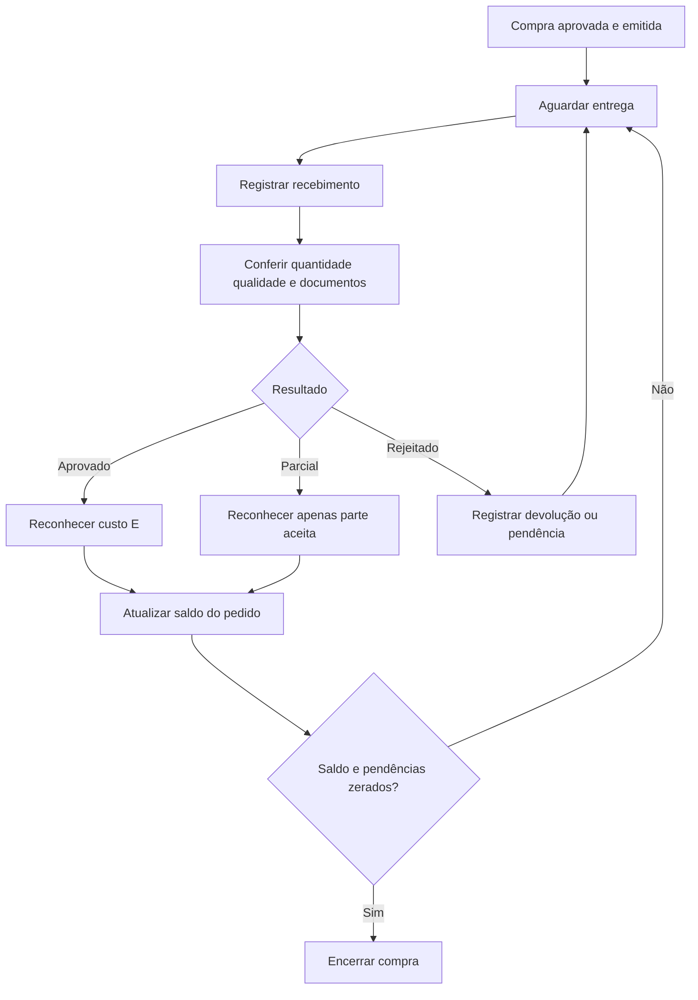
```mermaid
flowchart TD
    A[Compra aprovada e emitida] --> B[Aguardar entrega]
    B --> C[Registrar recebimento]
    C --> D[Conferir quantidade qualidade e documentos]
    D --> E{Resultado}
    E -- Aprovado --> F[Reconhecer custo E]
    E -- Parcial --> G[Reconhecer apenas parte aceita]
    E -- Rejeitado --> H[Registrar devolução ou pendência]
    F --> I[Atualizar saldo do pedido]
    G --> I
    H --> B
    I --> J{Saldo e pendências zerados?}
    J -- Sim --> K[Encerrar compra]
    J -- Não --> B
```

---

## 6. Pagamentos associados às compras

### Objetivo

Planejar obrigações e registrar liquidações financeiras vinculadas às compras, contemplando à vista, parcelas iguais, entrada mais parcelas, valores diferentes, medições, retenções, adiantamentos, pagamentos parciais, juros, multas e estornos.

### Atores

- Financeiro: cria agenda, valida obrigação, efetua baixa e estorno.
- Gestor: consulta vínculo com compra, etapa e fornecedor.
- Aprovador: autoriza conforme alçada configurada e exceções.
- Proprietário: consulta vencimentos, realizado e comprovantes conforme acesso.

### Pré-condições

- Obra ativa selecionada.
- Compra aprovada; para obrigação decorrente de entrega ou medição, respectivo reconhecimento aprovado.
- Conta financeira e fornecedor válidos.
- Usuário autorizado; alçada é configurável e não presumida pelo sistema.

### Entidades e campos

| Entidade | Campos específicos |
|---|---|
| `PlanoPagamento` | `compra_id`, `modelo` (à vista/parcelas iguais/entrada + parcelas/parcelas diferentes/medição/marco), `valor_base`, `entrada_valor`, `numero_parcelas`, `primeiro_vencimento`, `periodicidade`, `regra_vencimento`, `total_programado`, `observacoes`, `versao` |
| `ParcelaPrevista` | `plano_id`, `sequencia`, `rotulo`, `competencia`, `vencimento`, `percentual`, `valor_previsto`, `marco_id`, `medicao_id`, `status`, `substitui_parcela_id` |
| `Obrigacao` | `compra_id`, `recebimento_id`, `medicao_id`, `parcela_prevista_id`, `fornecedor_id`, `documento_fiscal_id`, `competencia`, `vencimento`, `valor_bruto`, `desconto`, `retencao`, `tributos`, `compensacao_adiantamento`, `juros`, `multa`, `valor_liquido`, `saldo_aberto`, `status`, `aprovacao_id` |
| `Pagamento` | `obrigacao_id`, `compra_id`, `data_efetiva`, `valor`, `forma` (PIX/transferência/boleto/cartão/dinheiro/outra), `conta_origem_id`, `identificador_bancario`, `comprovante_arquivo_id`, `chave_idempotencia`, `observacao` |
| `Adiantamento` | `compra_id`, `fornecedor_id`, `data`, `valor_original`, `valor_compensado`, `saldo_aberto`, `pagamento_id`, `regra_compensacao`, `status` |
| `Retencao` | `obrigacao_origem_id`, `compra_id`, `percentual`, `valor`, `motivo`, `condicao_liberacao`, `data_prevista`, `valor_liberado`, `saldo`, `status` |
| `EstornoPagamento` | `pagamento_id`, `data`, `valor`, `motivo`, `conta_destino_id`, `comprovante`, `chave_idempotencia`, `aprovacao_id` |
| `Renegociacao` | `obrigacao_id`, `motivo`, `saldo_anterior`, `novo_plano_id`, `encargos`, `aprovacao_id`, `data` |

### Regras

1. Compra, obrigação e pagamento são eventos distintos. Compra forma compromisso (`C`), recebimento/medição aprovada reconhece custo (`E`) e pagamento altera `Pago` e saldo de caixa.
2. O total do plano deve reconciliar com o total financiado da compra, incluindo entrada e custos financeiros explícitos. Valores diferentes são cadastrados parcela a parcela.
3. Uma parcela prevista existente é vinculada à obrigação real; não se cria outra previsão para o mesmo evento.
4. Pagamento pode liquidar obrigação total ou parcialmente. Soma líquida de pagamentos menos estornos não pode superar saldo sem autorização de adiantamento/crédito específica.
5. Adiantamento pago entra em `Pago`, permanece saldo aberto e é compensado em obrigações futuras. Compensação reduz valor líquido, sem reduzir `E`.
6. Retenção reduz o valor líquido da obrigação atual; sua liberação futura não reconhece custo novamente.
7. Cartão registra uma única aquisição/compra e várias parcelas de caixa. Cada parcela não é nova compra nem novo custo.
8. Juros e multas são componentes financeiros identificados, com aprovação quando exigida, e não alteram silenciosamente o custo original do item.
9. Estorno reduz `Pago` e reabre o saldo da obrigação ou do adiantamento correspondente; não altera `E` por si só.
10. Baixas usam chave idempotente. Clique duplo ou retry retorna o pagamento existente.
11. Vencida é condição derivada quando `vencimento < data_atual` e `saldo_aberto > 0`; não é editada manualmente.
12. Exclusão não é permitida após aprovação/baixa. Correção usa estorno e novo registro.

### Estados

- Plano: `rascunho → validado → vigente → substituído/cancelado`.
- Parcela prevista: `prevista → vinculada a obrigação → parcialmente liquidada → liquidada`; pode ser `renegociada/cancelada` com histórico.
- Obrigação: `rascunho → em aprovação → aberta → parcialmente liquidada → liquidada`; vencida é derivada; pode ser `cancelada/revertida`.
- Pagamento: `solicitado → aprovado → confirmado`; falha mantém obrigação aberta; `estornado parcial/total` preserva o original.
- Adiantamento: `aberto → parcialmente compensado → compensado/estornado`.
- Retenção: `retida → elegível → parcialmente liberada → liberada/revertida`.

### Fluxo principal

1. Na compra, usuário escolhe modelo e monta agenda: à vista, iguais, entrada + parcelas ou valores diferentes.
2. Sistema valida que entrada e parcelas fecham o total aplicável.
3. Recebimento/medição aprovada gera ou vincula obrigação à parcela prevista.
4. Sistema calcula bruto, deduções, retenção, compensação e líquido.
5. Financeiro seleciona obrigação, informa data, conta, forma, valor e comprovante.
6. Após autorização aplicável, baixa é confirmada e atualiza saldo e `Pago`.
7. Tela e gráfico mensal exibem competência, vencimento e data efetiva separadamente.

### Exceções

- Parcelas não fecham o total: impedir validação do plano e mostrar diferença.
- Parcela personalizada sem vencimento ou valor: impedir salvamento.
- Pagamento superior ao saldo: exigir classificação explícita da diferença como adiantamento/crédito e aprovação aplicável; do contrário, bloquear.
- Conta sem saldo ou arquivo de comprovante ausente quando obrigatório: manter pendente, sem registrar sucesso.
- Estorno parcial: recalcular saldo, status e caixa sem apagar o pagamento.
- Renegociação: cancelar/substituir somente previsões futuras; preservar liquidações realizadas.

### Critérios de aceite

- PG-01: à vista, parcelas iguais, entrada + parcelas e parcelas diferentes fecham exatamente o valor financiado.
- PG-02: uma compra no cartão aparece uma vez no custo e suas parcelas aparecem no caixa pelos vencimentos.
- PG-03: pagamento parcial deixa saldo correto e status “parcialmente liquidada”.
- PG-04: estorno de R$ 5.000 reduz `Pago` em R$ 5.000 e não altera `E`.
- PG-05: adiantamento e retenção seguem o exemplo conciliável: custo reconhecido não é duplicado na compensação ou liberação.
- PG-06: mesma chave de baixa gera um único efeito no caixa.
- PG-07: filtros por data inicial/final, compra, etapa e fornecedor atualizam lista e gráfico com o mesmo conjunto.

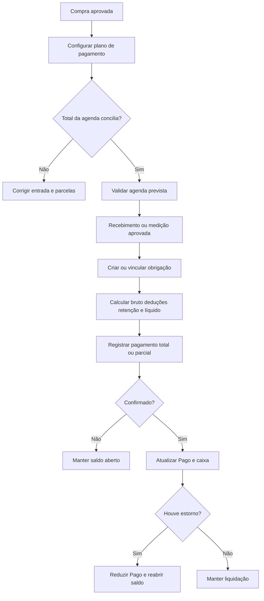
```mermaid
flowchart TD
    A[Compra aprovada] --> B[Configurar plano de pagamento]
    B --> C{Total da agenda concilia?}
    C -- Não --> D[Corrigir entrada e parcelas]
    C -- Sim --> E[Validar agenda prevista]
    E --> F[Recebimento ou medição aprovada]
    F --> G[Criar ou vincular obrigação]
    G --> H[Calcular bruto deduções retenção e líquido]
    H --> I[Registrar pagamento total ou parcial]
    I --> J{Confirmado?}
    J -- Não --> K[Manter saldo aberto]
    J -- Sim --> L[Atualizar Pago e caixa]
    L --> M{Houve estorno?}
    M -- Sim --> N[Reduzir Pago e reabrir saldo]
    M -- Não --> O[Manter liquidação]
```

---

## 7. Financeiro

### Objetivo

Apresentar e controlar fluxo de caixa previsto e realizado por obra, mês, etapa, serviço, fornecedor e categoria, separando entradas, saídas, obrigações e custos.

### Atores

Financeiro; gestor; proprietário; administrador da organização.

### Pré-condições

- Obra ativa selecionada ou, na visão autorizada de carteira, conjunto explícito de obras.
- Contas financeiras e categorias cadastradas.
- Usuário com permissão compatível com dados financeiros restritos.

### Entidades e campos

| Entidade | Campos específicos |
|---|---|
| `ContaFinanceira` | `nome`, `instituicao`, `tipo`, `identificador_mascarado`, `titular`, `moeda`, `ativa`, `acesso_restrito` |
| `CategoriaFinanceira` | `codigo`, `nome`, `natureza` (entrada/saída), `grupo` (pré-obra/construção/custos gerais/comercial), `categoria_pai_id`, `ativa` |
| `LancamentoFinanceiro` | `tipo` (entrada/saída), `origem` (obrigação/pagamento/aporte/reembolso/estorno/taxa/crédito), `origem_id`, `categoria_id`, `etapa_id`, `servico_id`, `fornecedor_id`, `compra_id`, `conta_id`, `competencia`, `vencimento`, `data_realizacao`, `valor_previsto`, `valor_realizado`, `descricao`, `documento_id` |
| `Aporte` | `origem_pagador`, `data_prevista`, `data_realizada`, `valor_previsto`, `valor_realizado`, `conta_destino_id`, `comprovante`, `status` |
| `Conciliacao` | `conta_id`, `periodo`, `saldo_inicial`, `entradas`, `saidas`, `saldo_final_calculado`, `saldo_extrato`, `diferenca`, `responsavel_id`, `data`, `status` |
| `VisaoFluxoCaixa` (derivada) | `periodo`, `dimensao`, `entrada_prevista`, `entrada_realizada`, `saida_prevista`, `saida_realizada`, `saldo_periodo`, `saldo_acumulado`, `data_corte`, `filtros` |

### Regras

1. Entrada prevista inclui aportes/recebimentos autorizados ainda não realizados; entrada realizada exige evento confirmado.
2. Saída prevista deriva de parcelas/obrigações futuras válidas. Saída realizada deriva de pagamentos líquidos de estornos.
3. Pagamento é saída de caixa, não novo custo. O módulo financeiro pode apresentar custo e caixa lado a lado, mas nunca somá-los.
4. Datas têm semânticas separadas: competência para apropriação, vencimento para exigibilidade e data efetiva para caixa.
5. Visões mínimas: por mês, etapa, fornecedor, obra, categoria e consolidado autorizado da carteira.
6. Filtros não alteram origem dos dados; toda série mostra período, data de corte e dimensões ativas.
7. Novo lançamento manual requer tipo, categoria, valor, datas e justificativa; quando existir compra/obrigação correspondente, deve vinculá-la para evitar duplicidade.
8. Estornos são lançamentos reversos vinculados. Não se exclui lançamento confirmado.
9. Pré-obra, construção, custos gerais e pós-obra/comercial ficam separados.
10. Dados de conta e comprovantes respeitam acesso restrito por obra e função.

### Estados

- Lançamento previsto: `rascunho → previsto → realizado/cancelado/substituído`.
- Aporte: `previsto → confirmado/realizado → estornado`; pode ser `cancelado` antes de realizado.
- Conciliação: `aberta → com divergência → conciliada → reaberta` com justificativa.

### Fluxo principal

1. Usuário define obra, período e dimensões.
2. Sistema consolida previsões a partir de planos e obrigações e realizados a partir de baixas/aportes.
3. Tela apresenta entradas, saídas, saldo, a pagar e gráfico previsto x realizado.
4. Usuário detalha uma barra, fornecedor ou etapa.
5. Sistema lista lançamentos de origem e seus vínculos.
6. Financeiro registra aporte ou lançamento autorizado, ou executa conciliação.
7. Exportação mantém filtros e data de corte.

### Exceções

- Lançamento manual aparentemente duplicado: alertar e exigir confirmação justificada.
- Estorno fora do período: aparece na data efetiva do estorno, com vínculo ao original; relatórios históricos informam reversão posterior.
- Troca de obra: limpar conta ou fornecedor que não pertença ao novo contexto.
- Divergência de conciliação: impedir encerramento sem ajuste ou justificativa aprovada.

### Critérios de aceite

- FN-01: entradas menos saídas realizadas reconciliam com a variação de saldo para o mesmo período e contas.
- FN-02: gráfico mensal e lista detalhada somam os mesmos valores.
- FN-03: uma obrigação prevista e seu pagamento não aparecem como duas saídas realizadas.
- FN-04: estorno aparece como reversão e atualiza saldo sem apagar o lançamento original.
- FN-05: visão consolidada respeita acesso às obras; obra sem concessão não participa do total.
- FN-06: exportação reconcilia com o painel para filtros e data de corte iguais.

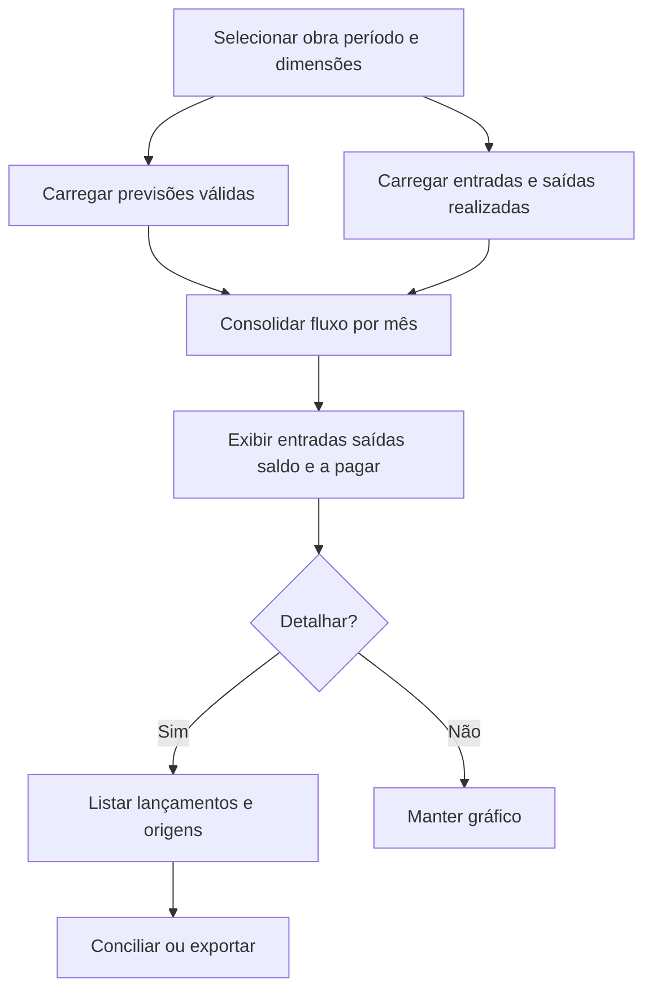
```mermaid
flowchart TD
    A[Selecionar obra período e dimensões] --> B[Carregar previsões válidas]
    A --> C[Carregar entradas e saídas realizadas]
    B --> D[Consolidar fluxo por mês]
    C --> D
    D --> E[Exibir entradas saídas saldo e a pagar]
    E --> F{Detalhar?}
    F -- Sim --> G[Listar lançamentos e origens]
    F -- Não --> H[Manter gráfico]
    G --> I[Conciliar ou exportar]
```

---

## 8. Cronograma físico-financeiro

### Objetivo

Planejar etapas, serviços, marcos, dependências, avanço físico e desembolsos previstos, comparando datas planejadas e reais e antecipando impactos de atraso.

### Atores

Gestor; responsável técnico; financeiro; fornecedor limitado às atividades compartilhadas; proprietário em consulta.

### Pré-condições

- Obra, etapas e serviços configurados.
- Pesos físicos e baseline aprovados para cálculo oficial de avanço.
- Relações de predecessor/sucessor válidas e sem ciclo.

### Entidades e campos

| Entidade | Campos específicos |
|---|---|
| `BaselineCronograma` | `numero`, `nome`, `data_base`, `motivo`, `aprovada`, `aprovado_por`, `aprovado_em`, `substitui_id` |
| `Atividade` | `baseline_id`, `etapa_id`, `servico_id`, `nome`, `responsavel_id`, `fornecedor_id`, `inicio_planejado`, `fim_planejado`, `duracao_dias`, `inicio_real`, `fim_real`, `marco`, `peso_fisico`, `percentual_concluido`, `criterio_avanco`, `status`, `restricao_tipo`, `restricao_data`, `observacao` |
| `DependenciaAtividade` | `predecessora_id`, `sucessora_id`, `tipo` (TI/II/TT/IT), `defasagem_dias`, `motivo`, `ativa` |
| `AtualizacaoAvanco` | `atividade_id`, `data_referencia`, `percentual_anterior`, `percentual_novo`, `quantidade_executada`, `medicao_id`, `evidencias`, `responsavel_id`, `justificativa` |
| `DesembolsoCronograma` | `atividade_id`, `compra_id`, `contrato_id`, `parcela_prevista_id`, `periodo`, `valor_previsto`, `origem`, `versao` |
| `ImpactoPrazo` | `evento_origem_tipo`, `evento_origem_id`, `atividade_id`, `dias_impacto`, `nova_previsao`, `atividades_afetadas`, `avaliado_por`, `data` |

### Regras

1. Dependência é armazenada uma vez da predecessora para sucessora; sucessores são derivados. Relações cíclicas são proibidas.
2. Tipos aceitos: término-início, início-início, término-término e início-término, com defasagem positiva ou negativa conforme política configurada.
3. Alterar datas ou dependências mostra atividades afetadas antes de salvar e registra o impacto.
4. Percentual segue critério da atividade: quantidade, percentual ou marco. Estados devem ser coerentes: planejada 0%; em execução 1%–99%; concluída 100%; suspensa preserva percentual; cancelada preserva histórico e sai do avanço futuro conforme baseline revisada.
5. Avanço oficial é ponderado pelos pesos congelados. Alterar pesos após início exige nova baseline.
6. Desembolsos previstos referenciam condições contratuais e parcelas existentes; não duplicam parcelas financeiras já lançadas.
7. Compra de longo prazo ou recebimento atrasado pode bloquear atividade e alimentar o risco do painel.
8. Visualizações mínimas: lista, calendário, Gantt e curva S físico-financeira.

### Estados

- Baseline: `rascunho → em análise → aprovada → superada`.
- Atividade: `planejada → liberada → em execução → concluída`; alternativas `bloqueada/suspensa/cancelada` com motivo.
- Atualização de avanço: `rascunho → enviada → aprovada/rejeitada`; correção preserva versão anterior.

### Fluxo principal

1. Gestor cria atividades a partir das etapas/serviços da obra.
2. Define responsável, datas, peso, critério e marcos.
3. Configura predecessoras, tipo e defasagem; sistema deriva sucessoras e valida ciclos.
4. Aprova baseline.
5. Durante a obra, responsável atualiza avanço e datas reais com evidências.
6. Sistema recalcula previsão, atividades afetadas, curva S e risco.
7. Gestor avalia impacto e, se necessário, cria nova baseline aprovada.

### Exceções

- Ciclo de dependências: bloquear e indicar o caminho do ciclo.
- Predecessora não concluída: sucessora permanece bloqueada, salvo exceção autorizada e justificada.
- Pesos não somam 100%: avanço da obra exibe “não calculável”.
- Atualização reduz percentual aprovado: exigir reversão/revisão com justificativa.
- Data real incompatível: alertar e exigir correção ou justificativa.

### Critérios de aceite

- CR-01: cadastrar A → B faz B mostrar A como predecessora e A mostrar B como sucessora derivada.
- CR-02: o sistema rejeita A → B → A e informa o ciclo.
- CR-03: mudança de data mostra atividades e previsão de término impactadas.
- CR-04: curva financeira usa parcelas já existentes e não duplica o fluxo previsto.
- CR-05: avanço por etapa e obra reconcilia com atividades e pesos da baseline.

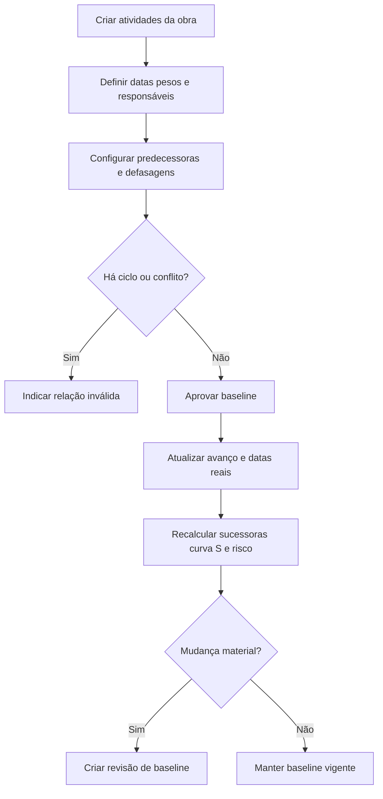
```mermaid
flowchart TD
    A[Criar atividades da obra] --> B[Definir datas pesos e responsáveis]
    B --> C[Configurar predecessoras e defasagens]
    C --> D{Há ciclo ou conflito?}
    D -- Sim --> E[Indicar relação inválida]
    D -- Não --> F[Aprovar baseline]
    F --> G[Atualizar avanço e datas reais]
    G --> H[Recalcular sucessoras curva S e risco]
    H --> I{Mudança material?}
    I -- Sim --> J[Criar revisão de baseline]
    I -- Não --> K[Manter baseline vigente]
```

---

## 9. Diário da obra e qualidade

### Objetivo

Registrar diariamente execução, equipes, clima, ocorrências, impedimentos e fotos por etapa/ambiente, além de inspeções, não conformidades, pendências, correções e aceite.

### Atores

Responsável técnico; gestor; inspetor; fornecedor responsável por correção; proprietário em consulta conforme compartilhamento.

### Pré-condições

- Obra ativa selecionada.
- Etapas, serviços, ambientes e equipe cadastrados.
- Usuário autorizado a registrar ou aprovar informações técnicas.

### Entidades e campos

| Entidade | Campos específicos |
|---|---|
| `DiarioObra` | `data`, `responsavel_id`, `clima`, `temperatura`, `servicos_realizados`, `ocorrencias`, `impedimentos`, `observacoes`, `status`, `assinado_em` |
| `DiarioEtapa` | `diario_id`, `etapa_id`, `servico_id`, `ambiente_id`, `descricao`, `percentual_informado`, `horas_trabalhadas` |
| `EquipeDiario` | `diario_id`, `fornecedor_id`, `funcao`, `quantidade_profissionais`, `horas`, `observacao` |
| `FotoObra` | `diario_id`, `etapa_id`, `servico_id`, `ambiente_id`, `data_hora`, `legenda`, `arquivo_id`, `autor_id`, `referencia_local` |
| `Inspecao` | `tipo`, `etapa_id`, `servico_id`, `ambiente_id`, `checklist_id`, `data`, `inspetor_id`, `resultado`, `observacoes`, `evidencias`, `status` |
| `ItemChecklist` | `inspecao_id`, `criterio`, `resultado` (conforme/não conforme/não aplicável), `observacao`, `evidencia_id` |
| `NaoConformidade` | `inspecao_id`, `codigo`, `descricao`, `severidade`, `fornecedor_responsavel_id`, `responsavel_id`, `prazo`, `causa`, `acao_corretiva`, `status`, `aceite_por`, `aceite_em` |
| `PendenciaQualidade` | `origem_tipo`, `origem_id`, `descricao`, `responsavel_id`, `prazo`, `prioridade`, `status`, `evidencias_abertura`, `evidencias_fechamento` |

### Regras

1. Diário indica autor, data, etapa, serviço e ambiente. Fotos herdam vínculo, mas podem ser recategorizadas com auditoria.
2. Um diário assinado/fechado não é sobrescrito; correção cria retificação vinculada.
3. Percentual informado no diário é evidência operacional e só altera avanço oficial após validação conforme critério da atividade.
4. Inspeção usa checklist versionado. Alterar checklist não modifica inspeções passadas.
5. Não conformidade só conclui após evidência de correção e aceite de usuário autorizado; fornecedor não aceita a própria exceção se a governança exigir segregação.
6. Atraso de pendência e severidade alimentam alertas do painel, sem mudar custo ou cronograma automaticamente.
7. Arquivos e fotos respeitam acesso da obra; fornecedor vê apenas itens compartilhados.
8. Exclusão de evidência usada em registro fechado é proibida; nova versão ou ocultação justificada preserva trilha.

### Estados

- Diário: `rascunho → enviado → validado/retornado → fechado`; retificação é nova versão.
- Inspeção: `planejada → em execução → concluída → aprovada/reprovada`.
- Não conformidade/pendência: `aberta → em correção → aguardando aceite → concluída`; pode ser `reaberta/cancelada` com justificativa.

### Fluxo principal

1. Responsável cria registro do dia e informa clima, equipes, serviços, ocorrências e impedimentos.
2. Associa etapas/ambientes e envia fotos.
3. Envia diário para validação e fecha o registro.
4. Inspetor cria inspeção e preenche checklist.
5. Item não conforme gera não conformidade ou pendência com responsável e prazo.
6. Responsável anexa evidência de correção.
7. Inspetor aceita ou devolve; conclusão alimenta histórico e memorial.

### Exceções

- Registro duplicado no mesmo dia: alertar e permitir múltiplos somente com turno/responsável distintos.
- Upload interrompido: preservar formulário e indicar quais arquivos falharam.
- Pendência vencida: derivar estado de atraso e notificar responsáveis.
- Evidência insuficiente: retornar para correção sem apagar histórico.
- Retificação após fechamento: exigir motivo e manter ambas as versões.

### Critérios de aceite

- DQ-01: registro fechado mostra autor, data, etapa, ambiente e evidências.
- DQ-02: foto carregada aparece na etapa correta e pode alimentar o memorial.
- DQ-03: não conformidade não conclui sem evidência e aceite.
- DQ-04: alteração do checklist não muda inspeções históricas.
- DQ-05: percentual de diário não altera avanço oficial sem validação.

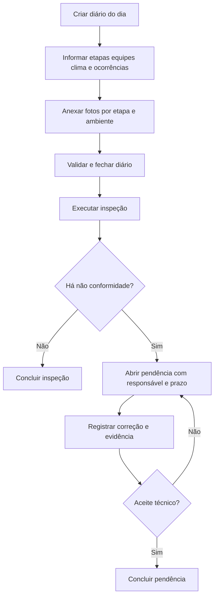
```mermaid
flowchart TD
    A[Criar diário do dia] --> B[Informar etapas equipes clima e ocorrências]
    B --> C[Anexar fotos por etapa e ambiente]
    C --> D[Validar e fechar diário]
    D --> E[Executar inspeção]
    E --> F{Há não conformidade?}
    F -- Não --> G[Concluir inspeção]
    F -- Sim --> H[Abrir pendência com responsável e prazo]
    H --> I[Registrar correção e evidência]
    I --> J{Aceite técnico?}
    J -- Não --> H
    J -- Sim --> K[Concluir pendência]
```

---

## 10. Infraestrutura da obra

### Objetivo

Gerir por obra as ligações e sistemas necessários à implantação e operação, como energia elétrica, água/esgoto, internet, câmeras, segurança, controle de acesso e gás, com fornecedor, protocolo, prazo, custo, documentos e impacto.

### Atores

Gestor; responsável técnico; financeiro; fornecedor/concessionária com acesso limitado; proprietário em consulta.

### Pré-condições

- Obra ativa selecionada.
- Item vinculado a etapa/serviço ou categoria de pré-obra/execução.
- Fornecedor ou concessionária cadastrado quando conhecido.

### Entidades e campos

| Entidade | Campos específicos |
|---|---|
| `ItemInfraestrutura` | `tipo` (energia/água e esgoto/internet/câmeras/controle de acesso/gás/outro), `nome`, `descricao`, `etapa_id`, `servico_id`, `ambiente_id`, `fornecedor_id`, `concessionaria`, `responsavel_id`, `prioridade`, `necessario_para_atividade_id`, `status` |
| `SolicitacaoInfraestrutura` | `item_id`, `protocolo`, `data_solicitacao`, `canal`, `prazo_previsto`, `data_conclusao`, `requisitos`, `observacoes`, `documentos` |
| `CustoInfraestrutura` | `item_id`, `item_orcamento_id`, `compra_id`, `valor_previsto`, `valor_aprovado`, `valor_realizado`, `categoria_custo_id`, `forma_pagamento`, `observacao` |
| `EventoInfraestrutura` | `item_id`, `data`, `tipo` (vistoria/agendamento/instalação/teste/falha/manutenção), `descricao`, `responsavel_id`, `resultado`, `proximo_passo`, `evidencias` |
| `TesteComissionamento` | `item_id`, `data`, `criterios`, `resultado`, `responsavel_tecnico_id`, `pendencias`, `laudo_arquivo_id`, `aceito_por`, `aceito_em` |

### Regras

1. Todo item pertence à obra ativa e pode bloquear uma atividade do cronograma. A relação deve ser explícita.
2. Custo previsto vem do orçamento; compra aprovada forma `C`; recebimento/serviço aprovado forma `E`; pagamento altera `Pago`. O cadastro de infraestrutura não cria custo paralelo.
3. Mudança de prazo atualiza risco das atividades dependentes, sem alterar datas aprovadas silenciosamente.
4. Protocolos, documentos, vistorias e contatos permanecem versionados e vinculados.
5. Item concluído exige evidência ou aceite/comissionamento conforme tipo.
6. Energia e água provisórias e definitivas são itens distintos quando ambos existirem.
7. Dados de câmera, segurança e controle de acesso têm permissão restrita; senhas e credenciais não devem ser armazenadas em campos livres.
8. Edição e exclusão seguem o histórico: rascunho sem uso pode ser excluído; item solicitado ou com custo usa cancelamento/revisão.

### Estados

`planejado → documentação pendente → solicitado → agendado/orçado → em execução → em teste → concluído`; alternativas `bloqueado/suspenso/cancelado` com motivo. Evento de falha após conclusão move para `em correção` sem apagar o aceite anterior.

### Fluxo principal

1. Gestor cria item de infraestrutura e associa etapa, responsável e atividade dependente.
2. Registra fornecedor/concessionária, requisitos, prazo e custo previsto.
3. Envia solicitação e registra protocolo/documentos.
4. Atualiza agendamentos e execução; sistema monitora prazo e impacto.
5. Registra instalação, teste, laudo e pendências.
6. Usuário autorizado aceita o item; status passa a concluído.
7. Custos e pagamentos permanecem nos módulos de compra/financeiro por vínculo.

### Exceções

- Protocolo duplicado para mesma concessionária/obra: alertar e permitir somente se identificado como reabertura/segunda solicitação.
- Prazo vencido: marcar atraso derivado e elevar risco da atividade dependente.
- Teste reprovado: abrir pendência e mover a em correção.
- Item cancelado com compra/recebimento: preservar efeitos históricos e cancelar apenas saldos futuros autorizados.
- Obra trocada: recarregar itens e impedir fornecedor/atividade de outra obra.

### Critérios de aceite

- IF-01: item mostra protocolo, responsável, prazo, custo e documentos da obra correta.
- IF-02: atraso em infraestrutura aparece no risco das atividades explicitamente dependentes.
- IF-03: custo não é duplicado entre infraestrutura, compra e financeiro.
- IF-04: conclusão que exige teste não é permitida sem resultado e evidência.
- IF-05: consulta histórica preserva eventos, versões e eventual correção após conclusão.

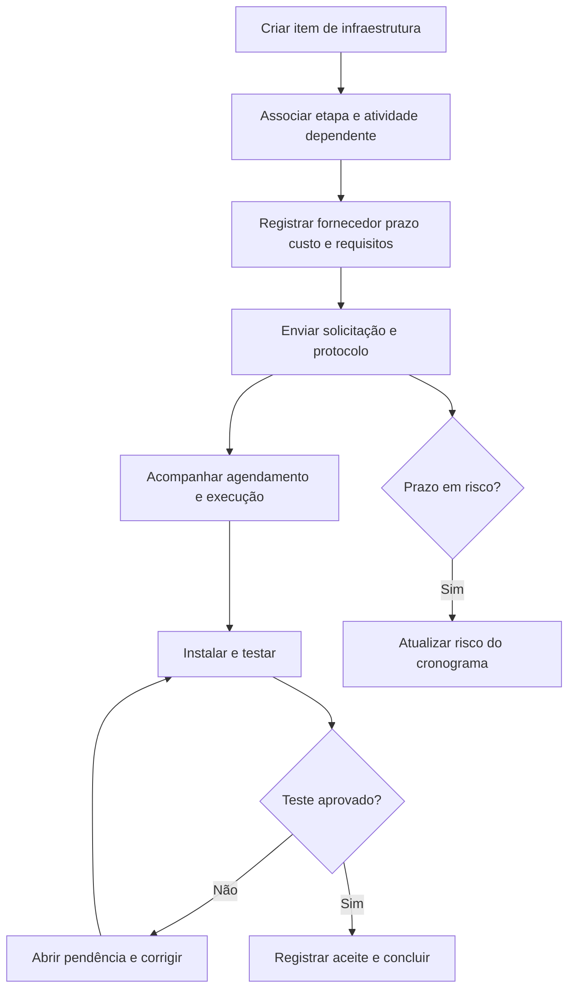
```mermaid
flowchart TD
    A[Criar item de infraestrutura] --> B[Associar etapa e atividade dependente]
    B --> C[Registrar fornecedor prazo custo e requisitos]
    C --> D[Enviar solicitação e protocolo]
    D --> E[Acompanhar agendamento e execução]
    E --> F[Instalar e testar]
    F --> G{Teste aprovado?}
    G -- Não --> H[Abrir pendência e corrigir]
    H --> F
    G -- Sim --> I[Registrar aceite e concluir]
    D --> J{Prazo em risco?}
    J -- Sim --> K[Atualizar risco do cronograma]
```

---

## 11. Integrações funcionais entre os módulos

| Evento de origem | Efeito autorizado | O que não deve acontecer |
|---|---|---|
| Proposta escolhida e aprovada | Libera efetivação | Não altera `C`, `E` ou `Pago` antes da compra |
| Compra aprovada | Cria/atualiza `C` e agenda prevista | Não reconhece execução e não paga |
| Recebimento/medição aprovado | Cria `E`, reduz `CR` e pode constituir obrigação | Não duplica compra nem desembolso |
| Obrigação aberta | Entra em contas a pagar/saída prevista | Não aumenta `E` se já veio do mesmo recebimento |
| Pagamento confirmado | Aumenta `Pago`, reduz saldo e altera caixa | Não aumenta custo final projetado |
| Estorno de pagamento | Reduz `Pago` e reabre saldo | Não reverte `E` sem evento operacional próprio |
| Devolução aprovada | Reverte recebimento/custo aplicável e registra crédito | Não apaga evidências históricas |
| Atualização de cronograma | Recalcula prazo, curva e risco | Não muda baseline aprovada sem revisão |
| Diário/inspeção | Acrescenta evidência, pendência e risco | Não aprova avanço ou custo automaticamente |
| Infraestrutura concluída | Libera atividade dependente conforme regra | Não cria custo financeiro paralelo |

## 12. Pendências de decisão para a consolidação

1. Definir, por organização ou obra, pesos da análise de custo-benefício; a especificação não presume pesos.
2. Definir quais tipos de infraestrutura exigem teste/comissionamento e quais evidências são obrigatórias.
3. Definir alçadas por valor e operação, inclusive compra direta, pagamento acima do saldo, juros/multas e cancelamento de compromisso.
4. Definir se obrigação pode nascer na aprovação do pedido, no recebimento/medição ou conforme marco contratual; o modelo suporta as três origens sem duplicação.
5. Definir calendário útil para vencimentos e defasagens do cronograma.
6. Definir política de atualização manual do risco e precedência entre avaliação automática e parecer do gestor.
7. Confirmar se o nome de menu “Orçamento e custos” deve concentrar solicitações/propostas ou se haverá subabas explícitas.
8. Confirmar critérios de obrigatoriedade de comprovante, nota fiscal, aceite técnico e segregação de funções.

## 13. Evidências usadas

- `prototipo/prumo-v9-completo.html`: menus, campos de formulários, exemplos de tabelas, gráficos e ação “Efetivar compra”.
- `docs/02-produto.md`: conceitos reconciliáveis, estados, fórmulas `F = E + CR + U`, regras de avanço, recebimento, pagamentos, estornos, acesso e critérios críticos.

# Rascunho — pós-obra e requisitos transversais do BOMzeika Obras

> Escopo deste rascunho: **Documentos e equipe**, **Memorial da obra**, **Entrega e garantias**, **Venda e marketing**, **Relatórios comerciais** e requisitos transversais. O conteúdo detalha o produto a construir. O protótipo HTML atual apenas simula navegação, formulários e dados fictícios; ele não autentica, não persiste, não exporta arquivos reais e não executa aprovações.

## Convenções do modelo funcional

- Todo registro de negócio pertence a uma `organizacao_id`; quando for específico de uma obra, também exige `obra_id`.
- Identificadores são UUIDs. Datas de calendário usam `date`; instantes auditáveis usam `timestamp` com fuso horário. Valores monetários usam decimal exato e moeda BRL nesta versão.
- Toda entidade mutável, exceto eventos imutáveis, contém: `id`, `organizacao_id`, `obra_id` quando aplicável, `criado_em`, `criado_por`, `atualizado_em`, `atualizado_por` e `versao_concorrencia`.
- Registros aprovados, financeiros, contratuais ou usados em prestação de contas não são apagados silenciosamente. A correção ocorre por nova versão, cancelamento ou evento reverso, conforme o domínio.
- Arquivos são privados. A entidade de negócio guarda apenas o vínculo ao arquivo; o binário permanece em armazenamento privado e o acesso depende de autorização por obra e por finalidade.
- Campos classificados como restritos incluem dados pessoais, bancários, documentos de comprador, contrato de venda e regras internas de aprovação. Eles não aparecem em busca, exportação ou notificação para usuário sem permissão.
- A seleção de obra no cabeçalho define o contexto das telas específicas de obra. Ao trocar a obra, a rota permanece e todo o conteúdo é recarregado para a obra selecionada. Se houver edição não salva, a interface deve pedir decisão antes da troca.
- Nenhuma alçada monetária é predefinida nesta especificação. Limites, tipos de operação, quantidade de aprovadores e separação de funções são configurações da organização definidas pelo proprietário ou administrador autorizado.

## 1. Documentos e equipe

### Objetivo e público

Centralizar arquivos, versões, comentários, responsáveis e acessos da obra, preservando a origem de cada documento e impedindo leitura por usuários sem concessão. É usada por administrador, gestor, responsável técnico, financeiro, proprietário e, apenas no conteúdo compartilhado, fornecedor.

### Requisitos funcionais

| ID | Requisito |
|---|---|
| DOC-01 | Listar documentos exclusivamente da obra ativa, com busca por título/código e filtros por categoria, vínculo, etapa, fornecedor, versão, situação, nível de acesso, autor e período. |
| DOC-02 | Cadastrar documento com categoria, título, data, vínculo de negócio, nível de acesso, arquivo e observação. Categoria, título, vínculo, acesso e ao menos um arquivo são obrigatórios. |
| DOC-03 | Criar nova versão sem sobrescrever a versão anterior. A versão vigente deve ser inequívoca e o usuário deve consultar e baixar versões históricas autorizadas. |
| DOC-04 | Vincular um mesmo documento a uma ou mais referências da mesma obra: etapa/serviço, fornecedor, contrato, compra, pagamento, item de entrega, garantia, campanha ou venda. O vínculo não concede acesso por si só. |
| DOC-05 | Permitir comentários e menções internas, com autor, data e resolução, mantendo o contexto da versão comentada. |
| DOC-06 | Registrar download, visualização, inclusão, substituição, mudança de acesso, comentário, compartilhamento e cancelamento na auditoria. |
| DOC-07 | Cadastrar membro da obra com período de vigência, perfil e permissões concedidas. Ser membro da organização não libera automaticamente todas as obras. |
| DOC-08 | Permitir mais de um perfil por pessoa quando autorizado, aplicando a união das permissões sem ignorar restrições explícitas nem separação de funções. |
| DOC-09 | Fornecedor só pode consultar documento explicitamente compartilhado com ele e nunca vê orçamento global, proposta concorrente ou contrato de terceiro. |
| DOC-10 | Remover acesso de um membro encerra sua vigência; não remove autoria, aprovações nem eventos históricos. |
| DOC-11 | Upload deve validar extensão, tamanho, integridade, nome seguro e verificação antimalware antes de disponibilizar o arquivo. Falha mantém o formulário e não cria versão utilizável. |
| DOC-12 | Documentos vencíveis geram alerta interno conforme antecedência configurada, sem presumir renovação automática. |
| DOC-13 | As ações `Abrir`, `Editar`, `Nova versão`, `Baixar`, `Compartilhar`, `Encerrar acesso` e `Excluir rascunho` só aparecem quando permitidas. Documento utilizado ou aprovado é cancelado/versionado, não excluído. |

### Entidades e campos

#### `Documento`

| Campo | Tipo | Obrigatório | Regra |
|---|---|---:|---|
| `id`, `organizacao_id`, `obra_id` | UUID | sim | Chaves e isolamento. |
| `codigo` | texto | sim | Único por obra; pode ser gerado pelo sistema. |
| `titulo` | texto | sim | Nome pesquisável do documento. |
| `categoria` | enum/configurável | sim | Projeto, contrato, nota fiscal, comprovante, foto, licença, manual, garantia ou categoria configurada. |
| `descricao` | texto longo | não | Resumo do conteúdo e finalidade. |
| `data_documento` | data | sim | Data declarada no documento. |
| `data_validade` | data | não | Obrigatória quando a categoria/controlador exigir vencimento. |
| `situacao` | enum | sim | `rascunho`, `vigente`, `substituido`, `vencido`, `cancelado`. Vencido pode ser derivado de validade e data atual. |
| `nivel_acesso` | enum | sim | `equipe`, `proprietario`, `financeiro`, `restrito` ou `fornecedor_especifico`. |
| `fornecedor_compartilhado_id` | UUID | condicional | Obrigatório quando acesso for `fornecedor_especifico`; deve pertencer à mesma organização/obra. |
| `versao_vigente_id` | UUID | sim após upload | Aponta para a versão corrente sem apagar as anteriores. |
| `observacoes` | texto longo | não | Informação operacional; não substitui metadados. |
| `criado_em`, `criado_por`, `atualizado_em`, `atualizado_por`, `versao_concorrencia` | auditoria | sim | Controle comum. |

#### `DocumentoVersao`

| Campo | Tipo | Obrigatório | Regra |
|---|---|---:|---|
| `id`, `documento_id`, `organizacao_id`, `obra_id` | UUID | sim | Mesma obra do documento. |
| `numero_versao` | texto | sim | Ex.: `Rev. 03`; único dentro do documento. |
| `arquivo_id` | UUID | sim | Arquivo privado aprovado na validação de upload. |
| `nome_original`, `mime_type`, `tamanho_bytes`, `hash_sha256` | texto/número | sim | Integridade e identificação do binário. |
| `motivo_revisao` | texto | sim a partir da 2ª versão | Explica a alteração. |
| `data_envio`, `enviado_por` | instante/UUID | sim | Imutáveis. |
| `status_processamento` | enum | sim | `enviando`, `verificando`, `disponivel`, `rejeitado`, `quarentena`. |
| `resultado_verificacao` | texto | não | Motivo técnico legível quando rejeitado/quarentena. |

#### `VinculoDocumento`

| Campo | Tipo | Obrigatório | Regra |
|---|---|---:|---|
| `id`, `documento_id`, `obra_id` | UUID | sim | Documento e alvo na mesma obra. |
| `tipo_alvo` | enum | sim | `obra`, `etapa`, `servico`, `fornecedor`, `contrato`, `compra`, `pagamento`, `entrega`, `garantia`, `campanha`, `venda`. |
| `alvo_id` | UUID | condicional | Nulo apenas quando o alvo é a própria obra. |
| `principal` | booleano | sim | Só um vínculo principal por documento. |
| `criado_em`, `criado_por` | auditoria | sim | Vínculo auditável. |

#### `ComentarioDocumento`

| Campo | Tipo | Obrigatório | Regra |
|---|---|---:|---|
| `id`, `documento_id`, `versao_id`, `obra_id` | UUID | sim | Comentário fica ancorado em uma versão. |
| `mensagem` | texto longo | sim | Conteúdo sanitizado. |
| `autor_id`, `criado_em` | UUID/instante | sim | Imutáveis. |
| `status` | enum | sim | `aberto`, `resolvido`. |
| `resolvido_por`, `resolvido_em` | UUID/instante | condicional | Exigidos no estado resolvido. |
| `mencoes_usuario_ids` | lista de UUID | não | Apenas usuários com acesso à obra e ao documento. |

#### `MembroObra`

| Campo | Tipo | Obrigatório | Regra |
|---|---|---:|---|
| `id`, `organizacao_id`, `obra_id`, `usuario_id` | UUID | sim | Um vínculo por usuário/obra/período ativo. |
| `nome_exibicao` | texto | sim | Derivado do usuário; exibido no protótipo. |
| `email`, `telefone` | texto | sim/não | E-mail obrigatório; telefone opcional e restrito. |
| `perfis` | lista enum | sim | Administrador, gestor, financeiro, responsável técnico, proprietário ou fornecedor. |
| `permissoes_adicionais` | lista | não | Concessões explícitas permitidas pela política. |
| `restricoes_explicitas` | lista | não | Prevalecem sobre concessões gerais. |
| `alcada_aprovacao_id` | UUID | não | Referência a regra configurada; nenhum valor padrão. |
| `inicio_vigencia`, `fim_vigencia` | data | sim/não | Início obrigatório; fim deve ser posterior. |
| `status` | enum | sim | `convidado`, `ativo`, `suspenso`, `encerrado`. |
| `motivo_suspensao_ou_encerramento` | texto | condicional | Exigido para suspensão/encerramento. |
| `criado_em`, `criado_por`, `atualizado_em`, `atualizado_por`, `versao_concorrencia` | auditoria | sim | Histórico preservado. |

### Estados e transições

- Documento: `rascunho → vigente → substituído`; `vigente → vencido` por data; `rascunho/vigente → cancelado` somente com motivo e permissão. Nova versão torna a anterior substituída e a nova vigente em uma única operação.
- Upload: `enviando → verificando → disponível` ou `rejeitado/quarentena`. Documento não pode apontar para arquivo indisponível.
- Membro: `convidado → ativo → suspenso/encerrado`; suspensão pode voltar a ativo; encerramento exige nova concessão para retorno.
- Comentário: `aberto → resolvido`; resolução não apaga a conversa.

### Fluxograma — documento e equipe

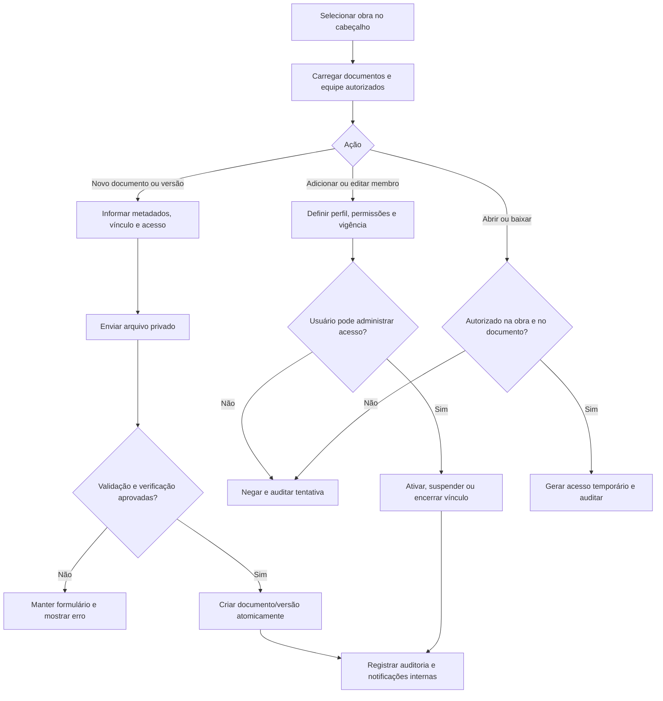
```mermaid
flowchart TD
    A[Selecionar obra no cabeçalho] --> B[Carregar documentos e equipe autorizados]
    B --> C{Ação}
    C -->|Novo documento ou versão| D[Informar metadados, vínculo e acesso]
    D --> E[Enviar arquivo privado]
    E --> F{Validação e verificação aprovadas?}
    F -->|Não| G[Manter formulário e mostrar erro]
    F -->|Sim| H[Criar documento/versão atomicamente]
    H --> I[Registrar auditoria e notificações internas]
    C -->|Adicionar ou editar membro| J[Definir perfil, permissões e vigência]
    J --> K{Usuário pode administrar acesso?}
    K -->|Não| L[Negar e auditar tentativa]
    K -->|Sim| M[Ativar, suspender ou encerrar vínculo]
    M --> I
    C -->|Abrir ou baixar| N{Autorizado na obra e no documento?}
    N -->|Não| L
    N -->|Sim| O[Gerar acesso temporário e auditar]
```

### Critérios de aceite

- **CA-DOC-01:** usuário da Obra A não lista, pesquisa, abre nem baixa arquivo da Obra B alterando filtro, URL ou ID.
- **CA-DOC-02:** fornecedor A não acessa documento de fornecedor B nem propostas concorrentes; um compartilhamento explícito libera somente o documento indicado.
- **CA-DOC-03:** enviar `Rev. 04` mantém `Rev. 03` consultável e auditada e passa a mostrar `Rev. 04` como vigente.
- **CA-DOC-04:** falha na verificação do arquivo não exibe sucesso nem cria versão disponível.
- **CA-DOC-05:** encerrar um membro remove acesso futuro sem alterar comentários, aprovações ou autoria histórica.
- **CA-DOC-06:** cada download autorizado registra usuário, obra, documento, versão, data e resultado.
- **CA-DOC-07:** busca e filtros retornam somente campos e documentos autorizados; exportação usa o mesmo conjunto filtrado.

## 2. Memorial da obra

### Objetivo e composição

Gerar uma visão consolidada e rastreável da obra com cadastro, participantes autorizados, etapas e serviços, evolução física, situação financeira, documentos e imagens por etapa. O memorial é uma apresentação derivada; não cria custo, pagamento, avanço ou documento de origem.

### Requisitos funcionais

| ID | Requisito |
|---|---|
| MEM-01 | Exibir dados da obra ativa: nome, endereço, área, padrão, responsáveis, datas planejadas/reais e situação. |
| MEM-02 | Exibir orçamento aprovado, contratado atualizado, custo reconhecido, pago líquido, custo final projetado, contingência e desvios em blocos separados e com data de corte. |
| MEM-03 | Exibir evolução física geral e por etapa, baseada nos pesos congelados da baseline. Quando os pesos não totalizarem 100%, mostrar `não calculável`. |
| MEM-04 | Exibir etapas/serviços, fornecedores, status, datas, riscos e documentos vinculados conforme o acesso do usuário. |
| MEM-05 | Organizar imagens por etapa, ambiente e data, com legenda, autor e referência ao registro de origem. |
| MEM-06 | Permitir configurar seções, filtros e data de corte antes de gerar uma versão. |
| MEM-07 | Gerar PDF com os mesmos números e filtros da prévia. O arquivo gerado deve informar obra, data de corte, momento de geração, filtros, versão e responsável. |
| MEM-08 | Compartilhamento deve escolher destinatários autorizados, prazo de expiração e versão fixa; revogação impede novos acessos e fica auditada. |
| MEM-09 | Dados pessoais, financeiros restritos e documentos de comprador são omitidos sem permissão, inclusive em PDF. |
| MEM-10 | Qualquer indicador deve permitir chegar à fonte no sistema; em PDF, incluir referência/código dos registros ou anexo de composição. |

### Entidades e campos

#### `ConfiguracaoMemorial`

| Campo | Tipo | Obrigatório | Regra |
|---|---|---:|---|
| `id`, `organizacao_id`, `obra_id` | UUID | sim | Uma configuração ativa pode ser padrão por obra. |
| `nome` | texto | sim | Identifica a configuração. |
| `secoes_incluidas` | lista enum | sim | Cadastro, equipe, etapas, financeiro, riscos, documentos, imagens, entrega, garantias. |
| `nivel_detalhe` | enum | sim | `executivo`, `detalhado`. |
| `incluir_valores_financeiros` | booleano | sim | Ainda depende da permissão do emissor/destinatário. |
| `incluir_dados_pessoais` | booleano | sim | Só produz efeito quando autorizado. |
| `filtros_etapa_ids`, `filtros_ambiente_ids`, `filtros_categoria_ids` | listas UUID | não | Devem pertencer à obra. |
| `ordenacao_imagens` | enum | sim | Por etapa/data ou ambiente/data. |
| `ativo` | booleano | sim | Mantém versões antigas referenciáveis. |
| campos comuns de auditoria | auditoria | sim | Conforme convenções. |

#### `MemorialGerado`

| Campo | Tipo | Obrigatório | Regra |
|---|---|---:|---|
| `id`, `organizacao_id`, `obra_id`, `configuracao_id` | UUID | sim | Contexto de geração. |
| `numero_versao` | inteiro | sim | Sequencial por obra/configuração. |
| `data_corte` | data/instante | sim | Todas as consultas usam a mesma referência. |
| `filtros_aplicados` | JSON estruturado | sim | Snapshot legível dos filtros. |
| `fontes_e_versoes` | JSON estruturado | sim | IDs/versões das baselines e agregações utilizadas. |
| `arquivo_pdf_id` | UUID | condicional | Preenchido quando a geração concluir. |
| `status` | enum | sim | `solicitado`, `processando`, `concluido`, `falhou`, `cancelado`. |
| `erro_processamento` | texto | condicional | Exigido em falha. |
| `gerado_por`, `solicitado_em`, `concluido_em` | UUID/instantes | sim/condicional | Rastreabilidade. |
| `hash_conteudo` | texto | condicional | Integridade da versão concluída. |

#### `CompartilhamentoMemorial`

| Campo | Tipo | Obrigatório | Regra |
|---|---|---:|---|
| `id`, `memorial_gerado_id`, `obra_id` | UUID | sim | Compartilha uma versão imutável. |
| `destinatario_tipo` | enum | sim | `usuario`, `membro_obra` ou outro destinatário interno autorizado. Link público não é padrão. |
| `destinatario_id` | UUID | sim | Deve possuir acesso compatível. |
| `expira_em` | instante | sim | Prazo definido pelo emissor conforme política. |
| `status` | enum | sim | `ativo`, `expirado`, `revogado`. |
| `revogado_por`, `revogado_em`, `motivo_revogacao` | dados de auditoria | condicional | Exigidos na revogação. |
| `ultimo_acesso_em`, `quantidade_acessos` | instante/inteiro | não | Telemetria auditável. |

### Estados e transições

- Geração: `solicitado → processando → concluído` ou `falhou`; cancelamento só enquanto não concluído.
- Compartilhamento: `ativo → expirado` por tempo ou `ativo → revogado` por ação autorizada.
- Uma nova geração cria nova versão; nunca altera o PDF e a composição de uma versão já concluída.

### Fluxograma — memorial

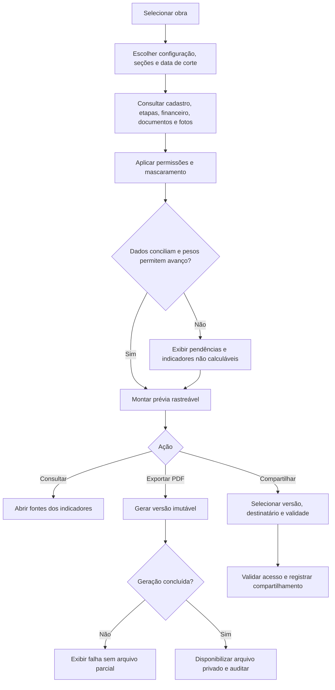
```mermaid
flowchart TD
    A[Selecionar obra] --> B[Escolher configuração, seções e data de corte]
    B --> C[Consultar cadastro, etapas, financeiro, documentos e fotos]
    C --> D[Aplicar permissões e mascaramento]
    D --> E{Dados conciliam e pesos permitem avanço?}
    E -->|Não| F[Exibir pendências e indicadores não calculáveis]
    E -->|Sim| G[Montar prévia rastreável]
    F --> G
    G --> H{Ação}
    H -->|Consultar| I[Abrir fontes dos indicadores]
    H -->|Exportar PDF| J[Gerar versão imutável]
    J --> K{Geração concluída?}
    K -->|Não| L[Exibir falha sem arquivo parcial]
    K -->|Sim| M[Disponibilizar arquivo privado e auditar]
    H -->|Compartilhar| N[Selecionar versão, destinatário e validade]
    N --> O[Validar acesso e registrar compartilhamento]
```

### Critérios de aceite

- **CA-MEM-01:** orçamento, contratado, executado e pago aparecem separados; pagamento não aumenta custo projetado.
- **CA-MEM-02:** o PDF gerado com o mesmo filtro e data de corte reconcilia com a prévia.
- **CA-MEM-03:** trocar a obra no cabeçalho elimina do memorial todo dado da obra anterior antes de exibir o novo conteúdo.
- **CA-MEM-04:** usuário sem permissão financeira recebe memorial sem valores financeiros, inclusive no arquivo exportado.
- **CA-MEM-05:** foto exibida permite identificar etapa, ambiente, data, autor e registro de origem.
- **CA-MEM-06:** falha parcial de uma fonte mostra pendência e não apresenta o memorial como completo.

## 3. Entrega e garantias

### Objetivo e escopo

Controlar vistoria final, correções, aceite, manuais, garantias, manutenção e assistência pós-entrega. A conclusão de uma etapa de construção não encerra automaticamente suas pendências de entrega.

### Requisitos funcionais

| ID | Requisito |
|---|---|
| ENT-01 | Criar checklist de entrega por etapa, ambiente, sistema ou item, com responsável, prazo, situação e evidências. |
| ENT-02 | Registrar vistoria e cada pendência/correção de modo independente; itens rejeitados voltam ao responsável com motivo e prazo. |
| ENT-03 | Aceite exige evidência e usuário autorizado. Aceite não apaga ciclos anteriores de rejeição e correção. |
| ENT-04 | Registrar manuais e termos como documentos versionados vinculados à obra, ao equipamento/sistema e ao item de entrega. |
| ENT-05 | Registrar garantia com fornecedor, objeto coberto, início, término, condições, exclusões e documento. Alertas de vencimento são internos e configuráveis. |
| ENT-06 | Registrar plano e ocorrências de manutenção, distinguindo preventiva, corretiva e assistência em garantia. |
| ENT-07 | Chamado de garantia deve mostrar responsável, SLA/prazo acordado quando informado, evolução, evidências, solução e aceite. O sistema não inventa prazo legal. |
| ENT-08 | Um item só fica `aceito` quando suas pendências bloqueadoras estiverem concluídas ou formalmente dispensadas por usuário autorizado. |
| ENT-09 | Permitir filtrar por etapa, ambiente, tipo, responsável, fornecedor, prazo, vencimento e status. |
| ENT-10 | Alterações, anexos, mudanças de responsável, dispensa, rejeição e aceite geram auditoria e notificações internas aos envolvidos. |

### Entidades e campos

#### `ItemEntrega`

| Campo | Tipo | Obrigatório | Regra |
|---|---|---:|---|
| `id`, `organizacao_id`, `obra_id` | UUID | sim | Isolamento. |
| `codigo` | texto | sim | Único por obra. |
| `tipo` | enum | sim | `vistoria`, `correcao`, `manual`, `garantia`, `manutencao`. |
| `etapa_id`, `servico_id`, `ambiente_id` | UUID | não | Ao menos um contexto ou descrição abrangente. |
| `titulo` | texto | sim | Identificação curta. |
| `descricao` | texto longo | sim | Critério do item. |
| `responsavel_usuario_id` | UUID | sim | Membro vigente da obra. |
| `fornecedor_id` | UUID | não | Quando a responsabilidade for externa. |
| `prioridade` | enum | sim | `baixa`, `media`, `alta`, `critica`. |
| `bloqueia_entrega` | booleano | sim | Informa se impede aceite global. |
| `prazo` | data | sim | Prazo operacional configurado. |
| `status` | enum | sim | `pendente`, `em_andamento`, `aguardando_vistoria`, `rejeitado`, `concluido`, `aceito`, `dispensado`, `cancelado`. |
| `percentual_conclusao` | decimal | não | 0–100; não substitui o estado. |
| `motivo_rejeicao_dispensa_cancelamento` | texto | condicional | Obrigatório conforme transição. |
| `aceito_por`, `aceito_em` | UUID/instante | condicional | Obrigatórios no aceite. |
| campos comuns de auditoria | auditoria | sim | Controle concorrente. |

#### `EvidenciaEntrega`

| Campo | Tipo | Obrigatório | Regra |
|---|---|---:|---|
| `id`, `item_entrega_id`, `obra_id`, `arquivo_id` | UUID | sim | Arquivo autorizado da mesma obra. |
| `tipo` | enum | sim | `foto_antes`, `foto_depois`, `laudo`, `termo`, `manual`, `outro`. |
| `legenda` | texto | sim | Explica a evidência. |
| `etapa_id`, `ambiente_id` | UUID | não | Contexto opcional. |
| `capturado_em`, `enviado_por`, `enviado_em` | data/UUID/instante | sim | Rastreabilidade. |

#### `Garantia`

| Campo | Tipo | Obrigatório | Regra |
|---|---|---:|---|
| `id`, `organizacao_id`, `obra_id` | UUID | sim | Isolamento. |
| `codigo` | texto | sim | Único por obra. |
| `titulo`, `descricao_objeto` | texto | sim | Objeto coberto. |
| `etapa_id`, `servico_id`, `equipamento_ou_item` | UUID/texto | não | Identifica cobertura. |
| `fornecedor_id`, `contrato_id`, `compra_id` | UUID | não | Fonte da garantia quando existente. |
| `inicio_vigencia`, `fim_vigencia` | data | sim | Término posterior ao início. |
| `condicoes_cobertura`, `exclusoes` | texto longo | sim/não | Condições exigidas; exclusões quando informadas na fonte. |
| `documento_id` | UUID | sim | Termo/manual vigente. |
| `responsavel_acompanhamento_id` | UUID | sim | Membro da obra. |
| `status` | enum | sim | `futura`, `vigente`, `proxima_do_vencimento`, `vencida`, `cancelada`. Estados temporais podem ser derivados. |
| `antecedencia_alerta_dias` | inteiro | não | Configurável; sem valor presumido. |
| campos comuns de auditoria | auditoria | sim | Histórico. |

#### `PlanoManutencao`

| Campo | Tipo | Obrigatório | Regra |
|---|---|---:|---|
| `id`, `organizacao_id`, `obra_id` | UUID | sim | Isolamento. |
| `titulo`, `descricao` | texto | sim | Atividade planejada. |
| `tipo` | enum | sim | `preventiva`, `inspecao_periodica`. Corretiva nasce como ocorrência. |
| `etapa_id`, `ambiente_id`, `equipamento_ou_sistema` | UUID/texto | não | Contexto. |
| `periodicidade_tipo`, `periodicidade_valor` | enum/inteiro | sim | Unidade e intervalo explícitos. |
| `primeira_data`, `proxima_data` | data | sim | Próxima data recalculada após conclusão. |
| `responsavel_id`, `fornecedor_id` | UUID | sim/não | Responsável obrigatório; fornecedor opcional. |
| `instrucao_documento_id` | UUID | não | Manual/procedimento. |
| `status` | enum | sim | `ativo`, `pausado`, `encerrado`. |
| campos comuns de auditoria | auditoria | sim | Histórico. |

#### `ChamadoPosObra`

| Campo | Tipo | Obrigatório | Regra |
|---|---|---:|---|
| `id`, `organizacao_id`, `obra_id` | UUID | sim | Isolamento. |
| `codigo` | texto | sim | Único por obra. |
| `tipo` | enum | sim | `garantia`, `manutencao_corretiva`, `assistencia`. |
| `garantia_id`, `item_entrega_id` | UUID | não | Vínculos quando aplicáveis. |
| `solicitante_id`, `responsavel_id`, `fornecedor_id` | UUID | sim/sim/não | Participantes. |
| `descricao`, `prioridade` | texto/enum | sim | Descrição e criticidade. |
| `aberto_em`, `prazo_acordado` | instante/data | sim/não | Prazo apenas quando informado/acordado. |
| `status` | enum | sim | `aberto`, `triagem`, `em_atendimento`, `aguardando_terceiro`, `resolvido`, `aceito`, `cancelado`. |
| `solucao` | texto longo | condicional | Obrigatória para resolver. |
| `resolvido_em`, `aceito_por`, `aceito_em` | dados | condicional | Conforme estado. |
| `motivo_cancelamento` | texto | condicional | Obrigatório em cancelamento. |
| campos comuns de auditoria | auditoria | sim | Histórico. |

### Estados e transições

- Item de entrega: `pendente → em andamento → aguardando vistoria → concluído → aceito`; vistoria pode levar a `rejeitado → em andamento`. `dispensado` e `cancelado` exigem motivo e permissão.
- Garantia: `futura → vigente → próxima do vencimento → vencida`; cancelamento exige motivo e não apaga chamados.
- Chamado: `aberto → triagem → em atendimento/aguardando terceiro → resolvido → aceito`; reabertura de resolvido cria evento e retorna a atendimento.

### Fluxograma — entrega e garantias

```mermaid
flowchart TD
    A[Selecionar obra] --> B[Criar checklist por etapa/ambiente]
    B --> C[Executar vistoria e anexar evidências]
    C --> D{Item conforme?}
    D -->|Não| E[Registrar rejeição/correção, responsável e prazo]
    E --> F[Executar correção]
    F --> C
    D -->|Sim| G{Existem pendências bloqueadoras?}
    G -->|Sim| E
    G -->|Não| H[Concluir e obter aceite autorizado]
    H --> I[Vincular manuais, termos e garantias]
    I --> J[Programar manutenção e alertas]
    J --> K{Surge ocorrência pós-obra?}
    K -->|Sim| L[Abrir chamado e vincular garantia quando aplicável]
    L --> M[Atender, comprovar solução e obter aceite]
    K -->|Não| N[Acompanhar vigências e próximas manutenções]
```

### Critérios de aceite

- **CA-ENT-01:** item bloqueador pendente impede aceite global e informa exatamente qual pendência bloqueia.
- **CA-ENT-02:** rejeitar uma correção preserva evidências e ciclos anteriores, responsável, data e motivo.
- **CA-ENT-03:** usuário sem permissão de aceite consegue registrar evidência quando autorizado, mas não altera o estado para `aceito`.
- **CA-ENT-04:** garantia próxima do vencimento usa a antecedência configurada e não presume prazo legal.
- **CA-ENT-05:** encerrar ou substituir fornecedor não elimina garantia, evidência ou chamado histórico.
- **CA-ENT-06:** manual substituído continua acessível na versão usada na entrega original.

## 4. Venda e marketing

### Objetivo e limites

Controlar preparação comercial, preço de anúncio, campanhas, fornecedores, corretoras, interessados, propostas, venda e comissões da obra ativa. Custos comerciais permanecem separados do custo de construção. O sistema registra eventos e obrigações; ele não publica anúncio, transfere dinheiro, assina contrato certificado nem calcula tributação fiscal por conta própria.

### Requisitos funcionais

| ID | Requisito |
|---|---|
| VEN-01 | Configurar a oferta do imóvel/unidade com preço anunciado, situação, canais, fotos e documentos comerciais. |
| VEN-02 | Registrar campanha ou custo comercial com tipo, fornecedor/corretora, valor previsto, valor realizado reconhecido, período, forma de pagamento, situação e comprovante. |
| VEN-03 | Registrar corretora e corretor vinculados, sem conceder acesso automático aos dados completos da obra ou de outros participantes. |
| VEN-04 | Registrar interessado/comprador com acesso restrito e base/finalidade de tratamento definida pela organização. Dados não devem aparecer em notificações abertas. |
| VEN-05 | Registrar várias propostas de venda com valor, validade, forma de pagamento, comissão e estado. Aceitar uma proposta exige permissão e mantém as rejeitadas/expiradas no histórico. |
| VEN-06 | A proposta aceita pode originar uma venda; a venda conserva valor proposto, ajustes aprovados, comprador, contrato e datas. Não é permitido criar duas vendas ativas para a mesma obra/unidade sem tratamento explícito. |
| VEN-07 | Comissão prevista nasce da regra/valor informado; comissão reconhecida e paga são dimensões distintas. Pagamento de comissão não cria novo custo comercial. |
| VEN-08 | Marketing, corretagem, comissão e demais despesas de venda usam categorias próprias e não alteram orçamento/custo da construção. |
| VEN-09 | Permitir comparar propostas por valor, validade, forma de pagamento, condição, canal e impacto líquido, sem classificar automaticamente a melhor quando os escopos/condições diferirem. |
| VEN-10 | Permitir filtros por período, campanha, canal, corretora, status e obra; indicadores informam data de corte e fonte. |
| VEN-11 | Fotos e documentos comerciais seguem versionamento e autorização do módulo Documentos e equipe. |

### Entidades e campos

#### `OfertaImovel`

| Campo | Tipo | Obrigatório | Regra |
|---|---|---:|---|
| `id`, `organizacao_id`, `obra_id` | UUID | sim | Uma oferta ativa por unidade/canal, conforme configuração. |
| `unidade_ou_identificacao` | texto | sim | Identifica o bem ofertado. |
| `titulo_anuncio`, `descricao_comercial` | texto | sim | Conteúdo comercial. |
| `preco_anuncio` | decimal | sim | Maior ou igual a zero; BRL. |
| `data_inicio`, `data_fim` | data | sim/não | Fim posterior ao início. |
| `status` | enum | sim | `preparacao`, `anunciado`, `reservado`, `vendido`, `suspenso`, `encerrado`. |
| `canal_ids` | lista UUID | não | Canais cadastrados. |
| `corretora_ids` | lista UUID | não | Participantes autorizados. |
| `foto_destaque_documento_id`, `documento_comercial_ids` | UUID/lista | não | Arquivos autorizados. |
| `responsavel_id` | UUID | sim | Membro vigente. |
| `motivo_suspensao_encerramento` | texto | condicional | Exigido. |
| campos comuns de auditoria | auditoria | sim | Histórico. |

#### `ParticipanteComercial`

| Campo | Tipo | Obrigatório | Regra |
|---|---|---:|---|
| `id`, `organizacao_id` | UUID | sim | Cadastro reutilizável na organização. |
| `tipo` | enum | sim | `corretora`, `corretor`, `agencia`, `fornecedor_marketing`, `canal`. |
| `pessoa_tipo` | enum | sim | `juridica`, `fisica`. |
| `nome_razao_social`, `nome_fantasia` | texto | sim/não | Identificação. |
| `cpf_cnpj` | texto restrito | não | Validado quando informado; acesso restrito. |
| `email`, `telefone` | texto | sim/não | Contato. |
| `corretora_pai_id` | UUID | não | Para corretor associado. |
| `registro_profissional` | texto | não | Somente registro informado; sistema não valida juridicamente. |
| `dados_pagamento_id` | UUID | não | Referência restrita, nunca exibida em listagem comum. |
| `status` | enum | sim | `ativo`, `inativo`, `bloqueado`. |
| campos comuns de auditoria | auditoria | sim | Histórico. |

#### `CampanhaComercial`

| Campo | Tipo | Obrigatório | Regra |
|---|---|---:|---|
| `id`, `organizacao_id`, `obra_id`, `oferta_id` | UUID | sim | Contexto. |
| `nome`, `objetivo` | texto | sim | Identificação e propósito. |
| `tipo` | enum | sim | `campanha`, `fotografia`, `anuncio`, `evento` ou tipo configurado. |
| `canal_id`, `fornecedor_id` | UUID | não | Canal/participante comercial. |
| `data_inicio`, `data_fim` | data | sim | Período válido. |
| `valor_previsto` | decimal | sim | Não é custo reconhecido. |
| `valor_realizado_reconhecido` | decimal | sim | Derivado dos lançamentos aprovados vinculados, não digitado livremente quando houver integração interna. |
| `forma_pagamento_descricao` | texto | não | Condição acordada; parcelas ficam em compras/pagamentos quando aplicável. |
| `status` | enum | sim | `planejada`, `em_aprovacao`, `aprovada`, `em_execucao`, `concluida`, `suspensa`, `cancelada`. |
| `comprovante_documento_id` | UUID | não | Documento autorizado. |
| `responsavel_id` | UUID | sim | Membro da obra. |
| campos comuns de auditoria | auditoria | sim | Histórico. |

#### `CustoComercial`

| Campo | Tipo | Obrigatório | Regra |
|---|---|---:|---|
| `id`, `organizacao_id`, `obra_id` | UUID | sim | Isolamento. |
| `categoria` | enum/configurável | sim | Marketing, corretora, comissão ou outra despesa de venda. |
| `campanha_id`, `venda_id`, `comissao_id` | UUID | não | Origem, quando aplicável. |
| `descricao` | texto | sim | Escopo do custo. |
| `fornecedor_ou_participante_id` | UUID | não | Favorecido. |
| `valor_previsto`, `valor_reconhecido`, `valor_pago_liquido` | decimal | sim | Exibidos separadamente; pago não soma novamente ao custo. |
| `competencia`, `data_reconhecimento` | data | não | Conforme estado. |
| `status` | enum | sim | `previsto`, `em_aprovacao`, `aprovado`, `reconhecido`, `cancelado`. |
| `documento_origem_id` | UUID | não | Nota, contrato ou comprovante. |
| campos comuns de auditoria | auditoria | sim | Histórico. |

#### `InteressadoComprador`

| Campo | Tipo | Obrigatório | Regra |
|---|---|---:|---|
| `id`, `organizacao_id`, `obra_id` | UUID | sim | Dado restrito à obra/oferta. |
| `tipo` | enum | sim | `interessado`, `comprador`. |
| `nome_razao_social` | texto restrito | sim | Exibição somente a autorizados. |
| `cpf_cnpj`, `documento_identificacao` | texto/arquivo restrito | não | Criptografado/protegido conforme arquitetura. |
| `email`, `telefone` | texto restrito | não | Contato. |
| `origem_lead`, `canal_id`, `corretora_id`, `corretor_id` | texto/UUID | não | Atribuição comercial. |
| `consentimento_ou_base_tratamento`, `registrado_em` | texto/data | sim | Definidos pela organização conforme política. |
| `status` | enum | sim | `ativo`, `inativo`, `convertido`, `descartado`. |
| `observacoes_restritas` | texto longo | não | Não entra em exportação ampla. |
| campos comuns de auditoria | auditoria | sim | Histórico. |

#### `PropostaVenda`

| Campo | Tipo | Obrigatório | Regra |
|---|---|---:|---|
| `id`, `organizacao_id`, `obra_id`, `oferta_id`, `interessado_id` | UUID | sim | Mesma obra. |
| `codigo` | texto | sim | Único por obra. |
| `valor_proposta` | decimal | sim | BRL, maior que zero. |
| `data_proposta`, `validade` | data | sim | Validade não anterior à proposta. |
| `forma_pagamento` | texto estruturado/JSON | sim | Entrada, parcelas, marcos e condições explicitados. |
| `corretora_id`, `corretor_id` | UUID | não | Origem da proposta. |
| `comissao_percentual`, `comissao_valor_previsto` | decimal | não | Se ambos informados, devem reconciliar ou exigir justificativa. |
| `condicoes`, `observacoes` | texto longo | não | Condições comerciais. |
| `documento_ids` | lista UUID | não | Proposta e anexos privados. |
| `status` | enum | sim | `rascunho`, `recebida`, `em_analise`, `em_negociacao`, `aceita`, `rejeitada`, `expirada`, `cancelada`. |
| `motivo_rejeicao_cancelamento` | texto | condicional | Obrigatório. |
| `aceita_por`, `aceita_em` | UUID/instante | condicional | Conforme permissão/alçada configurada. |
| campos comuns de auditoria | auditoria | sim | Histórico. |

#### `Venda`

| Campo | Tipo | Obrigatório | Regra |
|---|---|---:|---|
| `id`, `organizacao_id`, `obra_id`, `oferta_id`, `proposta_id`, `comprador_id` | UUID | sim | Venda originada de proposta aceita ou exceção justificada. |
| `codigo` | texto | sim | Único por obra. |
| `valor_venda` | decimal | sim | Valor contratual. |
| `data_aceite`, `data_contrato`, `data_prevista_liquidacao` | data | sim/não | Marcos distintos. |
| `forma_pagamento` | JSON estruturado | sim | Condições acordadas; recebimentos são registros separados. |
| `corretora_id`, `corretor_id` | UUID | não | Participantes. |
| `contrato_documento_id` | UUID | condicional | Obrigatório para `contratada/concluida`. |
| `status` | enum | sim | `em_formalizacao`, `contratada`, `em_liquidacao`, `concluida`, `rescindida`, `cancelada`. |
| `motivo_rescisao_cancelamento` | texto | condicional | Obrigatório. |
| campos comuns de auditoria | auditoria | sim | Histórico preservado. |

#### `ComissaoVenda`

| Campo | Tipo | Obrigatório | Regra |
|---|---|---:|---|
| `id`, `organizacao_id`, `obra_id`, `venda_id` | UUID | sim | Uma venda pode ter várias comissões. |
| `beneficiario_id` | UUID | sim | Corretora/corretor. |
| `base_calculo` | decimal | sim | Valor declarado no acordo. |
| `percentual`, `valor_previsto` | decimal | não/sim | Valor previsto obrigatório; percentual opcional. |
| `valor_reconhecido`, `valor_pago_liquido` | decimal | sim | Dimensões separadas. |
| `condicao_devida`, `data_prevista` | texto/data | sim/não | Gatilho contratual informado. |
| `status` | enum | sim | `prevista`, `devida`, `parcialmente_paga`, `paga`, `cancelada`, `estornada`. |
| `obrigacao_financeira_id` | UUID | não | Vínculo sem duplicar o custo. |
| `documento_id` | UUID | não | Contrato/recibo. |
| campos comuns de auditoria | auditoria | sim | Histórico. |

### Estados e transições

- Oferta: `preparação → anunciada → reservada → vendida/encerrada`; suspensão exige motivo.
- Campanha: `planejada → em aprovação → aprovada → em execução → concluída`; rejeição retorna para revisão rastreável quando houver fluxo de aprovação configurado.
- Proposta: `rascunho → recebida → em análise → em negociação → aceita/rejeitada/expirada`; cancelamento exige motivo. `expirada` é derivada da validade enquanto não aceita.
- Venda: `em formalização → contratada → em liquidação → concluída`; rescisão/cancelamento preservam contrato, valores e efeitos reversos.
- Comissão: `prevista → devida → parcialmente paga → paga`; cancelamento/estorno preservam a trilha e atualizam o pago líquido.

### Fluxograma — venda e marketing

```mermaid
flowchart TD
    A[Selecionar obra] --> B[Configurar oferta, preço e materiais]
    B --> C[Planejar campanhas e custos comerciais]
    C --> D{Exige aprovação configurada?}
    D -->|Sim| E[Submeter e obter decisão autorizada]
    D -->|Não| F[Executar campanha]
    E -->|Aprovada| F
    E -->|Rejeitada| C
    F --> G[Registrar interessados e propostas]
    G --> H[Comparar valor, validade e condições]
    H --> I{Proposta aceita por usuário autorizado?}
    I -->|Não| J[Negociar, rejeitar ou aguardar expiração]
    I -->|Sim| K[Formalizar venda e contrato]
    K --> L[Reconhecer despesas e comissões conforme origem]
    L --> M[Vincular obrigações e pagamentos sem duplicar custos]
    M --> N[Atualizar relatórios comerciais]
```

### Critérios de aceite

- **CA-VEN-01:** custo de campanha e comissão não alteram custo de construção e aparecem em despesas comerciais separadas.
- **CA-VEN-02:** pagar comissão reduz seu saldo financeiro, mas não cria uma segunda despesa comercial.
- **CA-VEN-03:** proposta aceita mantém valor, condição, documentos e aprovador originais; revisão posterior cria versão/evento auditável.
- **CA-VEN-04:** usuário sem acesso restrito não vê CPF/CNPJ, documentos, contato nem contrato do comprador em tela, busca, notificação ou exportação.
- **CA-VEN-05:** duas tentativas concorrentes de aceitar propostas incompatíveis não criam duas vendas ativas da mesma unidade.
- **CA-VEN-06:** ao rescindir venda, o sistema preserva custos, comissões e recebimentos históricos e exige o tratamento explícito de saldos/reversões.

## 5. Relatórios comerciais

### Objetivo e indicadores

Fornecer prestação de contas da venda com filtros por obra e período, sempre distinguindo valores previstos, reconhecidos e pagos. Relatórios são derivados das fontes; não podem permitir edição direta dos totais.

Indicadores mínimos:

| Indicador | Fórmula/regras |
|---|---|
| Receita contratada | Soma do valor de vendas no estado incluído pelo filtro, com estados e data de corte visíveis. Não confundir com recebimento financeiro. |
| Receita recebida | Recebimentos efetivos líquidos de estornos vinculados à venda. |
| Custo do empreendimento | Custo final ou reconhecido de pré-obra + construção + custos gerais, conforme perspectiva selecionada; a perspectiva deve aparecer no relatório. |
| Despesas comerciais reconhecidas | Marketing + corretagem + comissões + demais custos de venda reconhecidos, líquidos de reversões e sem somar pagamentos. |
| Custo total gerencial | Custo do empreendimento + despesas comerciais reconhecidas. |
| Resultado bruto | Receita contratada − custo do empreendimento. |
| Resultado líquido gerencial | Receita contratada − custo total gerencial. Tributos só entram se registrados como despesa explícita; o sistema não presume regra fiscal. |
| Margem bruta | Resultado bruto ÷ receita contratada × 100. Receita zero gera `não aplicável`. |
| Margem líquida gerencial | Resultado líquido gerencial ÷ receita contratada × 100. Receita zero gera `não aplicável`. |
| Saldo comercial de caixa | Receitas recebidas − despesas comerciais pagas, para o filtro; não substitui resultado econômico. |

### Requisitos funcionais

| ID | Requisito |
|---|---|
| REL-01 | Exibir filtros por obra, período/data de corte, venda, campanha, canal, corretora, categoria de custo e estado. |
| REL-02 | Exibir em separado receita contratada/recebida, custo reconhecido/projetado, despesas comerciais reconhecidas/pagas e resultado econômico/caixa. |
| REL-03 | Cada cartão e gráfico informa fonte, data de corte, filtros, perspectiva e denominador. Clique abre a composição autorizada. |
| REL-04 | Exportar XLSX e PDF com os mesmos filtros, data de corte e permissões da tela, incluindo cabeçalho de rastreabilidade. |
| REL-05 | XLSX deve apresentar aba de resumo e abas de composição; totais devem reconciliar com a tela para a mesma consulta. |
| REL-06 | Relatório sem receita não mostra margem infinita/zero enganoso; mostra `não aplicável`. |
| REL-07 | Dados restritos de comprador são omitidos ou mascarados conforme permissão. |
| REL-08 | Se alguma fonte estiver indisponível ou inconsistente, o relatório fica `com pendência`, identifica a fonte e não apresenta exportação como final. |
| REL-09 | Permitir salvar filtros pessoais e, com permissão, modelos compartilhados da obra. Salvar filtro não altera dados de origem. |

### Entidades e campos

#### `ModeloRelatorio`

| Campo | Tipo | Obrigatório | Regra |
|---|---|---:|---|
| `id`, `organizacao_id`, `obra_id` | UUID | sim/não | `obra_id` nulo apenas para modelo da organização. |
| `nome`, `descricao` | texto | sim/não | Identificação. |
| `tipo` | enum | sim | `comercial_executivo`, `comercial_detalhado`, `prestacao_contas` ou tipo configurado. |
| `filtros_padrao`, `colunas`, `agrupamentos`, `ordenacoes` | JSON estruturado | sim | Campos permitidos e validados. |
| `perspectiva_custo` | enum | sim | `reconhecido` ou `projetado`; nunca implícita. |
| `visibilidade` | enum | sim | `privado`, `obra`, `organizacao`. |
| `proprietario_usuario_id` | UUID | sim | Dono do modelo. |
| `ativo` | booleano | sim | Desativação não remove exportações. |
| campos comuns de auditoria | auditoria | sim | Histórico. |

#### `SolicitacaoRelatorio`

| Campo | Tipo | Obrigatório | Regra |
|---|---|---:|---|
| `id`, `organizacao_id`, `obra_id`, `modelo_id` | UUID | sim/não | Modelo opcional. |
| `tipo_relatorio` | enum | sim | Tipo escolhido. |
| `formato` | enum | sim | `tela`, `pdf`, `xlsx`. |
| `data_corte`, `periodo_inicio`, `periodo_fim` | data | sim/não | Data de corte obrigatória; período conforme relatório. |
| `filtros_aplicados` | JSON estruturado | sim | Snapshot da solicitação. |
| `permissoes_snapshot` | JSON estruturado | sim | Campos/seções autorizados no momento da geração. |
| `status` | enum | sim | `solicitado`, `processando`, `concluido`, `concluido_com_pendencia`, `falhou`, `cancelado`. |
| `arquivo_id` | UUID | condicional | Apenas PDF/XLSX concluído. |
| `fontes_e_versoes` | JSON estruturado | sim ao concluir | Rastreabilidade. |
| `mensagens_pendencia_ou_erro` | lista | condicional | Explica falhas/inconsistências. |
| `solicitado_por`, `solicitado_em`, `concluido_em` | auditoria | sim/condicional | Rastreabilidade. |

### Fluxograma — relatório comercial

```mermaid
flowchart TD
    A[Selecionar obra e relatório] --> B[Definir período, data de corte e filtros]
    B --> C[Consultar vendas, custos do empreendimento e despesas comerciais]
    C --> D[Aplicar permissões e mascaramento]
    D --> E[Calcular indicadores com decimais exatos]
    E --> F{Fontes conciliam?}
    F -->|Não| G[Marcar pendência e indicar composição divergente]
    F -->|Sim| H[Exibir relatório e composição]
    G --> H
    H --> I{Exportar?}
    I -->|Não| J[Permitir detalhamento e salvar filtro]
    I -->|Sim| K[Gerar PDF ou XLSX com snapshot]
    K --> L{Arquivo confere com a consulta?}
    L -->|Não| M[Falhar geração sem arquivo final]
    L -->|Sim| N[Disponibilizar arquivo privado e auditar]
```

### Critérios de aceite

- **CA-REL-01:** PDF e XLSX reconciliam com a tela para os mesmos filtros, perspectiva e data de corte.
- **CA-REL-02:** pagar uma despesa não aumenta o custo reconhecido; o relatório mostra reconhecido e pago em colunas distintas.
- **CA-REL-03:** receita zero exibe margem `não aplicável`.
- **CA-REL-04:** todo total permite consultar os registros de composição autorizados.
- **CA-REL-05:** alterar um filtro salvo muda somente a consulta; não altera venda, custo, baseline ou lançamento.
- **CA-REL-06:** exportação de usuário sem acesso a comprador não contém dados ocultos em células, metadados ou nome do arquivo.

## 6. Requisitos transversais

### 6.1 Usuários, perfis e permissões por obra

Perfis-base e limites funcionais:

| Perfil | Capacidades usuais | Restrições obrigatórias |
|---|---|---|
| Administrador da organização | Gerenciar cadastros, membros, políticas e acessos. | Não altera silenciosamente histórico financeiro aprovado. |
| Gestor | Planejamento, orçamento, contratação, entrega e coordenação. | Aprova somente dentro de regra/alçada configurada. |
| Financeiro | Obrigações, baixas, conciliação e relatórios financeiros. | Não aprova a própria exceção financeira quando a política exigir segregação. |
| Responsável técnico | Medições, diário, inspeções, entrega e evidências. | Vê financeiro apenas quando houver concessão. |
| Proprietário | Visão executiva, documentos e decisões/aprovações autorizadas. | Acesso somente às obras concedidas. |
| Fornecedor | Proposta, documento, medição/chamado expressamente compartilhado. | Não vê orçamento global, concorrentes, outros contratos ou documentos não compartilhados. |

Entidades transversais:

#### `Usuario`

`id`, `nome`, `email_normalizado` (único por mecanismo de identidade), `telefone`, `status` (`convidado`, `ativo`, `bloqueado`, `desativado`), `ultimo_acesso_em`, `autenticacao_mfa_habilitada`, `preferencias_locale`, `criado_em`, `atualizado_em`. Senhas, quando houver provedor próprio, nunca são armazenadas em texto; o sistema deve preferir provedor de identidade configurado.

#### `MembroOrganizacao`

`id`, `organizacao_id`, `usuario_id`, `perfis_organizacao`, `status`, `inicio_vigencia`, `fim_vigencia`, `convidado_por`, `criado_em`, `atualizado_em`. Este vínculo não concede acesso automático a obras.

#### `RegraAprovacao`

`id`, `organizacao_id`, `obra_id` opcional, `nome`, `tipo_operacao`, `valor_minimo` opcional, `valor_maximo` opcional, `quantidade_aprovadores`, `perfis_ou_usuarios_aprovadores`, `exige_separacao_solicitante_aprovador`, `ordem_etapas`, `vigencia_inicio`, `vigencia_fim`, `status`, campos comuns de auditoria. Os valores são sempre configurados; esta especificação não define faixas padrão.

#### `SolicitacaoAprovacao`

`id`, `organizacao_id`, `obra_id`, `regra_id`, `tipo_objeto`, `objeto_id`, `versao_objeto`, `solicitante_id`, `valor_referencia` opcional, `justificativa`, `status` (`pendente`, `parcialmente_aprovada`, `aprovada`, `rejeitada`, `cancelada`, `expirada`), `solicitado_em`, `decidido_em`, `motivo_cancelamento`. A aprovação se refere à versão exata do objeto; alteração material invalida/renova a solicitação conforme regra.

#### `DecisaoAprovacao`

`id`, `solicitacao_id`, `etapa_ordem`, `decisor_id`, `decisao` (`aprovada`, `rejeitada`, `devolvida_para_revisao`), `justificativa`, `decidido_em`, `origem_sessao`. É imutável; correção ocorre por novo evento autorizado.

Regras:

- Autorização deve ser aplicada no servidor e no banco/armazenamento, não apenas ocultando botões.
- A permissão efetiva combina vínculo ativo na organização, concessão na obra, perfil, ação, estado do registro e restrições explícitas.
- Toda consulta, contagem, busca e exportação aplica o mesmo escopo. Não retornar existência de registro proibido por mensagens diferentes.
- Operação sem regra de aprovação usa a permissão explícita configurada para aquela ação; operação marcada como sujeita a aprovação nunca é autoaprovada por ausência de regra.
- Mudança de regra não altera decisões históricas; registra nova versão com vigência.

### Fluxograma — autorização e aprovação

```mermaid
flowchart TD
    A[Usuário solicita ação] --> B{Vínculo ativo na organização e obra?}
    B -->|Não| C[Negar sem expor dados e auditar]
    B -->|Sim| D{Perfil e permissão permitem solicitar?}
    D -->|Não| C
    D -->|Sim| E{Ação exige aprovação configurada?}
    E -->|Não| F[Executar transação e auditar]
    E -->|Sim| G[Criar solicitação para a versão do objeto]
    G --> H[Notificar aprovadores autorizados]
    H --> I{Decisão e quantidade exigida alcançadas?}
    I -->|Rejeitada| J[Manter efeito fora dos totais aprovados]
    I -->|Ainda pendente| K[Manter na fila]
    I -->|Aprovada| L{Objeto continua na mesma versão?}
    L -->|Não| M[Invalidar decisão para revisão]
    L -->|Sim| F
```

### 6.2 Auditoria

#### `EventoAuditoria`

Campos: `id`, `organizacao_id`, `obra_id` opcional, `ocorrido_em`, `ator_usuario_id` opcional para evento de sistema, `ator_tipo`, `acao`, `tipo_objeto`, `objeto_id`, `versao_objeto`, `resultado` (`sucesso`, `negado`, `falhou`), `motivo`, `dados_antes` e `dados_depois` com mascaramento, `ip_hash_ou_referencia`, `sessao_id`, `correlation_id`, `origem`. Eventos são append-only, pesquisáveis apenas por autorizados e não armazenam segredo ou binário.

Eventos mínimos: login e falha relevante, leitura/baixar/compartilhar arquivo restrito, criação/edição/cancelamento, mudança de acesso, submissão/decisão de aprovação, exportação, importação, estorno/reversão, troca de obra em operação sensível e falha de autorização.

### 6.3 Arquivos

#### `ArquivoPrivado`

Campos: `id`, `organizacao_id`, `obra_id`, `chave_armazenamento`, `nome_original`, `mime_type`, `tamanho_bytes`, `hash_sha256`, `status_verificacao`, `resultado_verificacao`, `criptografia_referencia`, `criado_por`, `criado_em`, `retencao_ate` opcional, `excluido_logicamente_em` opcional. Acesso é por URL temporária de curta duração após nova autorização. Backup e restauração devem recuperar binário, metadados e vínculos.

### 6.4 Notificações

#### `Notificacao`

Campos: `id`, `organizacao_id`, `obra_id`, `destinatario_id`, `tipo`, `titulo`, `mensagem_resumida_sem_dado_sensivel`, `tipo_objeto`, `objeto_id`, `prioridade`, `criada_em`, `lida_em`, `arquivada_em`, `status_entrega`. Eventos: menção, documento próximo do vencimento, aprovação pendente/decidida, prazo de entrega, garantia/manutenção, chamado atribuído e exportação concluída/falha. Integrações externas são opcionais e fora deste escopo até configuração específica.

### 6.5 Busca e filtros

#### `FiltroSalvo`

Campos: `id`, `organizacao_id`, `obra_id` opcional, `usuario_id`, `modulo`, `nome`, `criterios_json`, `ordenacao_json`, `colunas_json`, `visibilidade` (`privado`, `obra`, `organizacao`), `padrao`, `criado_em`, `atualizado_em`. Critérios aceitam apenas campos previstos; filtros compartilhados exigem permissão. Busca global retorna título e contexto mínimos autorizados, nunca trechos de documentos ou dados pessoais sem permissão.

Regras de UX:

- Filtros ativos ficam visíveis como chips e podem ser limpos individualmente.
- Tela mostra contagem, ordenação e data de corte quando aplicável.
- `Sem dados` e `nenhum resultado para os filtros` são estados distintos.
- A troca da obra remove filtros incompatíveis e conserva os compatíveis, informando o que foi alterado.

### 6.6 Importação e exportação

#### `LoteImportacao`

Campos: `id`, `organizacao_id`, `obra_id`, `modulo`, `arquivo_id`, `layout_versao`, `status` (`recebido`, `validando`, `com_erros`, `pronto_para_confirmar`, `processando`, `concluido`, `falhou`, `cancelado`), `total_linhas`, `linhas_validas`, `linhas_invalidas`, `duplicidades`, `solicitado_por`, `confirmado_por`, `criado_em`, `concluido_em`, `resumo_erro`.

#### `LinhaImportacao`

Campos: `id`, `lote_id`, `numero_linha`, `dados_originais`, `dados_normalizados`, `status`, `erros`, `avisos`, `chave_duplicidade`, `objeto_criado_id` opcional. Prévia é obrigatória antes de gravar; confirmação processa apenas o conjunto mostrado, de forma idempotente. Linhas inválidas não podem ser gravadas silenciosamente.

Exportação reutiliza `SolicitacaoRelatorio` ou entidade equivalente com formato, filtro, data de corte, permissões snapshot, status e arquivo. PDF/XLSX deve respeitar idioma pt-BR, BRL e datas DD/MM/AAAA na apresentação; dados tabulares preservam tipos adequados.

### Fluxograma — importação

```mermaid
flowchart TD
    A[Selecionar obra e arquivo] --> B[Validar formato e verificar arquivo]
    B --> C[Mapear colunas e normalizar valores]
    C --> D[Validar linhas e detectar duplicidades]
    D --> E[Exibir prévia com erros e avisos]
    E --> F{Usuário autorizado confirma?}
    F -->|Não| G[Cancelar sem gravar registros]
    F -->|Sim| H[Processar lote de forma idempotente]
    H --> I{Alguma falha transacional?}
    I -->|Sim| J[Reverter unidade transacional e informar linhas]
    I -->|Não| K[Concluir, auditar e disponibilizar resumo]
```

### 6.7 Segurança, privacidade e continuidade

- Autenticação com sessão segura, expiração, revogação e MFA configurável para perfis sensíveis.
- TLS em trânsito; criptografia e gestão de segredo conforme plataforma escolhida. Dados bancários, comprador e arquivos privados recebem controles reforçados.
- Proteção contra enumeração de IDs, CSRF quando aplicável, XSS, injeção, upload malicioso, força bruta e abuso de exportação.
- Isolamento por organização e obra em API, banco e armazenamento; testes negativos cobrem acesso cruzado e fornecedor concorrente.
- Chaves idempotentes em mutações financeiras e operações que podem ser repetidas por retry.
- Backups com retenção configurada e restauração ensaiada em ambiente isolado, incluindo banco, arquivos e vínculos. Não declarar restauração atendida sem evidência do ensaio.
- Minimização de dados e mascaramento em logs, auditoria, notificações e exports. Política de retenção e descarte deve ser configurada antes de produção.
- Sessão perde acesso imediatamente após suspensão/encerramento do vínculo, respeitando propagação técnica definida na arquitetura.

### 6.8 Responsividade e acessibilidade

- Desktop: menu lateral e seletor de obra no cabeçalho; tabelas podem usar colunas completas e painel lateral de edição.
- Tablet: menu recolhível, cartões em uma ou duas colunas e tabelas com colunas prioritárias + detalhe.
- Celular: navegação compacta, obra ativa sempre identificável, cartões empilhados, ações principais acessíveis e formulários em uma coluna. Tabela não deve exigir gesto impossível; usar rolagem indicada ou lista responsiva.
- Nenhuma ação depende exclusivamente de cor, hover ou arrastar. Status combina texto, ícone e cor.
- Ordem de foco acompanha a leitura; modal/drawer prende foco enquanto aberto, possui título associado, fecha por ação visível e devolve foco ao acionador.
- Campos têm rótulo persistente, indicação textual de obrigatoriedade, ajuda e erro associado. O primeiro erro recebe foco após validação.
- Teclado opera menus, seletor de obra, filtros, tabelas, formulários e gráficos. Gráficos têm resumo textual e tabela equivalente.
- Contraste, tamanho do alvo, zoom e leitores de tela devem atender como meta verificável WCAG 2.2 nível AA.
- Datas são exibidas em DD/MM/AAAA e moeda em BRL, mantendo valor sem perda de precisão internamente.

### 6.9 Estados de interface

Toda tela e ação deve tratar explicitamente:

| Estado | Comportamento esperado |
|---|---|
| Inicial | Exibir título, obra ativa e filtros padrão sem dados da obra anterior. |
| Carregando | Skeleton/progresso com contexto; bloquear apenas a ação dependente. |
| Vazio | Explicar que não há registros e oferecer ação permitida para criar/importar. |
| Sem resultado | Informar filtros ativos e permitir limpá-los. |
| Sucesso | Confirmar somente após resposta persistida; oferecer acesso ao registro criado. |
| Erro de validação | Preservar dados, marcar campos e explicar correção. |
| Erro de servidor/rede | Preservar formulário, permitir retry seguro e não informar sucesso. |
| Sem permissão | Explicar impossibilidade sem revelar conteúdo; registrar tentativa quando sensível. |
| Conflito de versão | Informar que o registro mudou, mostrar opções de recarregar/comparar; nunca sobrescrever silenciosamente. |
| Dados parciais/inconsistentes | Identificar fonte pendente e marcar indicador/relatório como não final. |
| Somente leitura | Informar estado do registro e motivo da indisponibilidade de edição. |
| Alteração não salva | Alertar antes de fechar drawer, navegar ou trocar de obra. |
| Processamento assíncrono | Mostrar status consultável; notificar conclusão/falha sem manter modal bloqueado. |

## 7. Critérios transversais de aceite

- **CA-TRV-01:** usuário pertencente à organização, mas sem `MembroObra` ativo, não lê nem conta registros da obra.
- **CA-TRV-02:** uma decisão de aprovação se aplica à versão analisada; alteração material após aprovação exige novo tratamento conforme a regra configurada.
- **CA-TRV-03:** solicitante não aprova a própria exceção quando a regra configurada exigir separação de funções.
- **CA-TRV-04:** tela, busca, relatório e exportação retornam o mesmo universo autorizado para obra/filtro/data de corte equivalentes.
- **CA-TRV-05:** indisponibilidade durante `Salvar` mantém os campos e retry não duplica registro.
- **CA-TRV-06:** troca de obra com formulário alterado exige decisão; após confirmar a troca, nenhum dado da obra anterior permanece no conteúdo.
- **CA-TRV-07:** teste por teclado completa criação de documento, aplicação de filtro e consulta de relatório; leitor de tela recebe nome/estado dos controles.
- **CA-TRV-08:** restauração em ambiente isolado recupera registros, arquivos, versões e vínculos e produz evidência; backup sem ensaio não satisfaz o critério.
- **CA-TRV-09:** upload em quarentena não pode ser baixado nem usado como versão vigente.
- **CA-TRV-10:** importação mostra prévia, erros e duplicidades antes da confirmação e repetir a mesma confirmação não duplica dados.

## 8. Pendências para decisão do proprietário

1. Definir alçadas, tipos de operação sujeitos a aprovação, quantidade/ordem de aprovadores e regras de substituição. Nenhum valor foi presumido.
2. Definir categorias adicionais de documentos, prazos de validade e antecedência de alertas.
3. Definir quais seções do memorial podem ser compartilhadas com proprietário, fornecedor e participante externo.
4. Definir se haverá acesso externo temporário ao memorial; o requisito atual limita compartilhamento a destinatário interno autorizado.
5. Definir política de aceite global da entrega e quais tipos de pendência são sempre bloqueadores.
6. Definir periodicidades de manutenção e alertas de garantia por categoria.
7. Definir estados de venda que contam como receita contratada e a perspectiva padrão dos relatórios, mantendo o seletor explícito.
8. Definir política de dados de interessados/compradores, retenção, descarte e base de tratamento com orientação jurídica própria.
9. Definir limites de arquivo, extensões permitidas, retenção de versões e prazos de expiração de compartilhamento.
10. Definir canais de notificação além da caixa interna; integrações externas continuam opcionais e exigem especificação própria.

## 8. Entidades transversais

### 8.1 Organização

Campos: identificador; razão social; nome fantasia; CPF/CNPJ; endereço; moeda; fuso horário; situação; parâmetros de aprovação; data de criação; data de atualização.

### 8.2 Usuário

Campos: identificador; nome; e-mail; telefone; situação; autenticação; último acesso; data de criação; data de atualização. Credenciais e segredos não devem ser retornados em consultas funcionais.

### 8.3 Vínculo de acesso

Campos: usuário; organização; obra opcional; perfil; permissões adicionais; alçada opcional; vigência inicial; vigência final; situação; concedido por; motivo.

### 8.4 Aprovação

Campos: identificador; organização; obra; tipo de objeto; objeto; valor de referência; regra aplicada; nível; aprovador; decisão; justificativa; data; versão do objeto; substituição ou revogação vinculada.

### 8.5 Auditoria

Campos: identificador; organização; obra; usuário; data e hora; ação; entidade; identificador do registro; versão anterior; versão nova; origem; endereço de rede quando permitido; motivo; correlação da operação.

### 8.6 Anexo

Campos: identificador; organização; obra; entidade vinculada; registro vinculado; categoria; nome original; tipo MIME; tamanho; versão; situação; visibilidade; autor; data; hash; validade opcional; motivo de rejeição.

### 8.7 Comentário e notificação

Campos do comentário: identificador; organização; obra; entidade; registro; autor; texto; menções; data; edição; situação. Campos da notificação: destinatário; evento; título; mensagem; canal interno; data; lida em; vínculo de destino.

## 9. Requisitos não funcionais

- Interface responsiva em desktop, tablet e celular, sem depender de hover para ações essenciais.
- Navegação por teclado, foco visível, labels associados aos campos, contraste adequado e status acompanhados de texto.
- Isolamento por organização e obra também em pesquisas, relatórios, exportações e arquivos.
- Operações financeiras mutáveis devem ser idempotentes e auditáveis.
- Arquivos devem ser privados e entregues somente após autorização.
- Datas devem registrar instante e fuso; a interface apresenta DD/MM/AAAA.
- Pesquisas e filtros não podem alterar os dados de origem.
- Exportações devem registrar filtro, data de corte e usuário solicitante.
- O sistema deve suportar backup e restauração verificável de dados e arquivos.

## 10. Fora do escopo funcional inicial

Movimentação bancária direta, emissão fiscal, assinatura eletrônica certificada, contabilidade fiscal completa, BIM, aplicativo nativo, execução offline de aprovações e decisões autônomas por IA. O sistema registra e controla pagamentos; qualquer integração que movimente dinheiro requer especificação própria.

## 11. Critérios de aceite transversais

1. Um usuário sem acesso à obra não consulta dados, arquivos ou relatórios dela, inclusive por URL ou identificador direto.
2. Duplo clique ou repetição da mesma operação financeira com a mesma chave não duplica o efeito.
3. Uma correção de registro aprovado preserva o histórico anterior.
4. O mesmo filtro e a mesma data de corte produzem totais reconciliáveis entre painel, consulta e exportação.
5. Falha de rede mantém os dados digitados e não exibe sucesso antes da confirmação do servidor.
6. A troca da obra ativa atualiza o contexto sem misturar registros da obra anterior.
7. Valores exibidos no painel permitem detalhamento até as fontes.
8. Pagamento e estorno afetam caixa, sem alterar indevidamente o custo executado.

## 12. Pendências para validação do proprietário

- Valores e níveis das alçadas de aprovação.
- Política de exigência documental por categoria de fornecedor.
- Catálogo definitivo de unidades, categorias de custo e centros de custo.
- Critério de bloqueio da execução quando projeto, licença ou infraestrutura estiver pendente.
- Regras comerciais de comissão e momento de reconhecimento da receita da venda.
- Prazos padrão de alertas para documentos, compras, parcelas, garantias e atividades.
