# BOMzeika Obras — Modelo Entidade-Relacionamento

**Versão:** 1.0 para validação  
**Estado:** modelo lógico proposto; não representa tabelas, migrações ou banco implementado  
**Fontes:** especificação funcional consolidada, protótipo navegável e `docs/04-dados-api.md`

## 1. Objetivo e convenções

Este MER organiza as entidades necessárias para administrar várias organizações e obras, mantendo separação entre orçamento, compromisso, execução reconhecida, obrigação e pagamento.

Convenções:

- `UUID` para chaves primárias e estrangeiras.
- Toda entidade de negócio pertence a uma `ORGANIZACAO`.
- Entidades específicas de obra também possuem `obra_id`.
- Valores monetários usam decimal exato; datas de calendário usam `date`; eventos auditáveis usam `timestamptz`.
- `PK` identifica chave primária; `FK`, chave estrangeira; `UK`, unicidade lógica.
- Relações com `||` são obrigatórias e únicas; `o|` são opcionais e únicas; `o{` são opcionais e múltiplas; `|{` são obrigatórias e múltiplas.
- Entidades aprovadas ou com efeito financeiro são corrigidas por revisão, reversão, cancelamento ou estorno, sem exclusão silenciosa.
- Os diagramas exibem os campos necessários para validar identidade e relacionamentos. O catálogo completo de atributos está na especificação funcional.

## 2. Visão geral dos domínios

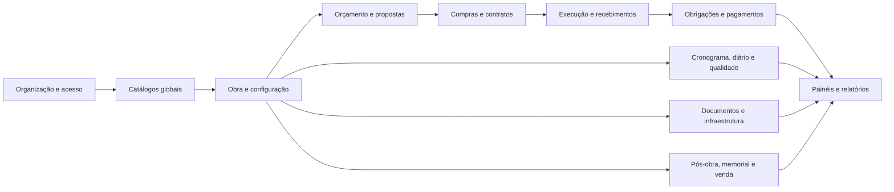

## 3. Organização, usuários e acesso

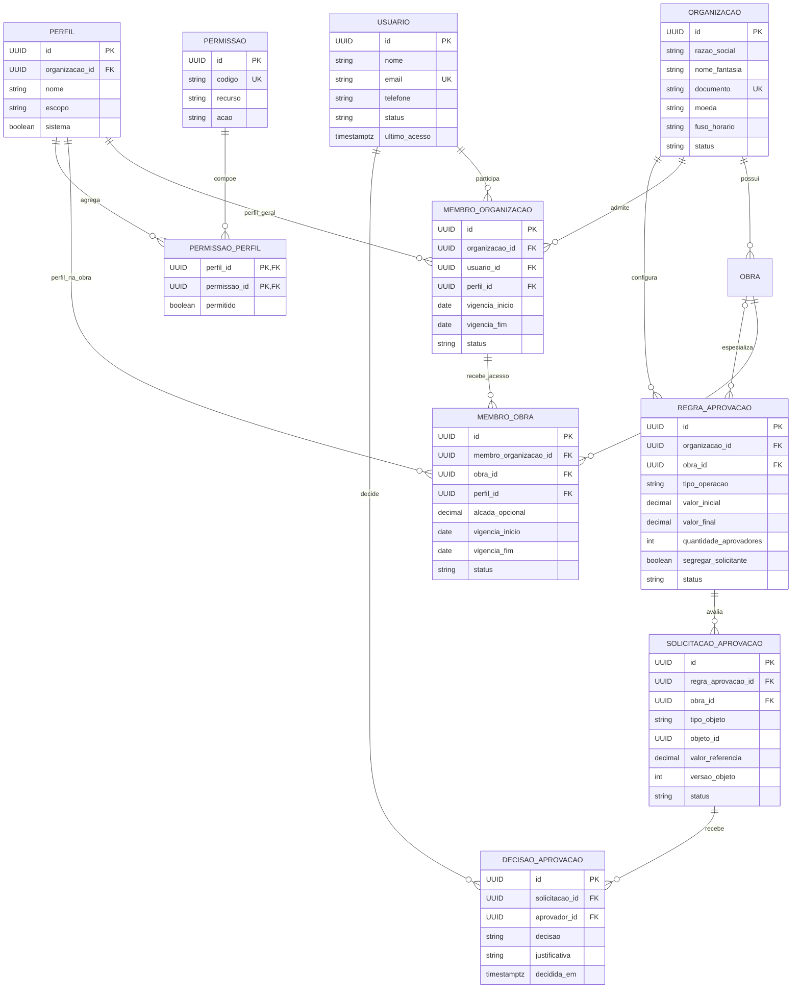

### Regras para validação

1. Participar da organização não concede acesso automático a todas as obras.
2. `MEMBRO_OBRA` deve referenciar um membro da mesma organização da obra.
3. Valores e quantidades de aprovadores são configuráveis; não existem alçadas fixas no modelo.
4. A decisão registra a versão exata do objeto submetido.

## 4. Catálogos, fornecedores e configuração da obra

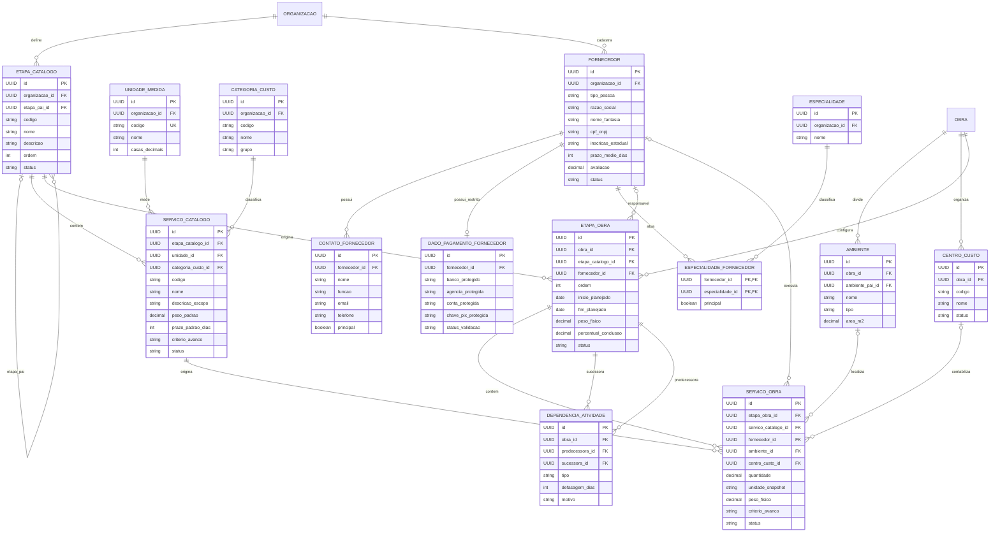

### Regras para validação

1. Cada etapa e serviço configurado deve estar vinculado à obra e, antes de contratação, a um fornecedor responsável.
2. A dependência não pode formar ciclo nem ligar atividades de obras diferentes.
3. O sucessor é obtido pela relação cuja atividade atual é predecessora; não deve existir campo textual divergente.
4. A soma dos pesos da baseline ativa deve ser 100%; caso contrário, o avanço é “não calculável”.
5. Alterar pesos após início da execução cria nova baseline e preserva a anterior.

## 5. Planejamento, progresso e baseline

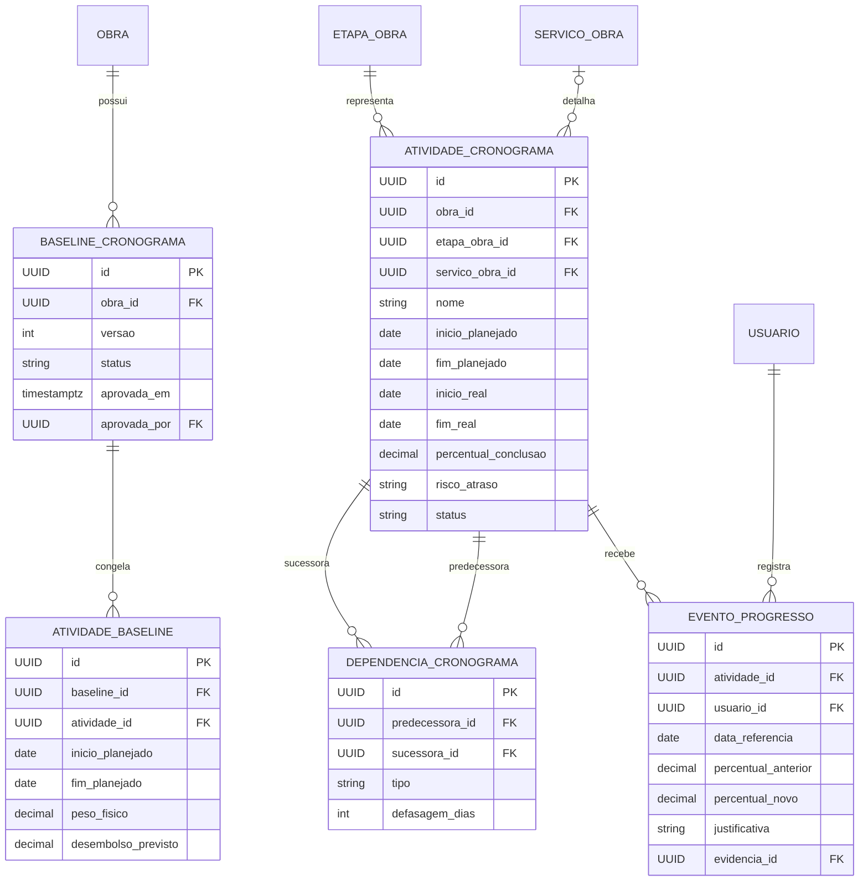

## 6. Orçamento, cenários e contingência

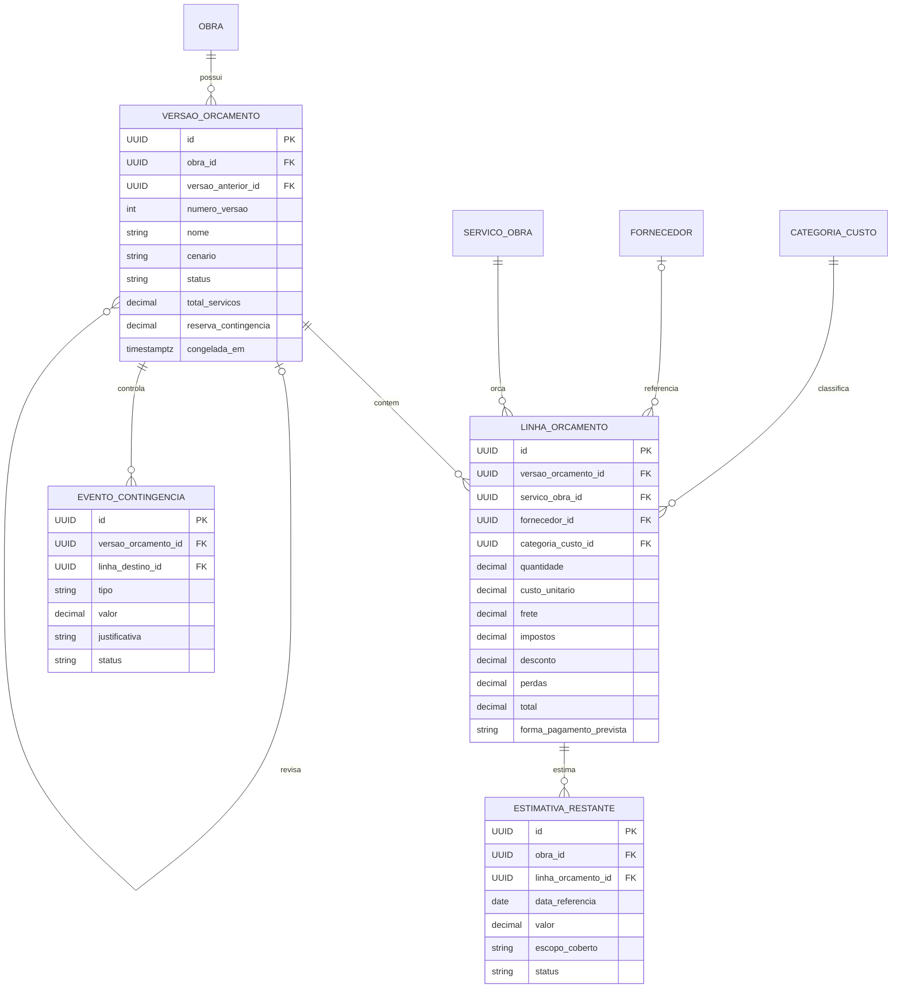

### Regras para validação

1. Somente uma versão pode ser a baseline vigente da obra em uma data de corte.
2. Aprovar revisão não sobrescreve a versão anterior.
3. Cada estimativa restante declara o escopo coberto para não sobrepor contratos ou custos executados.
4. Eventos de contingência preservam saldo anterior, destino, justificativa e aprovação.

## 7. Propostas, compras, contratos e compromissos

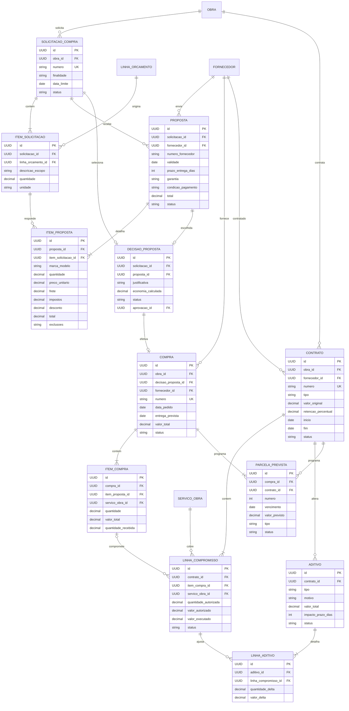

### Regras para validação

1. A efetivação usa uma chave idempotente e cria no máximo uma compra para a mesma decisão aprovada.
2. A proposta escolhida não precisa ser a de menor preço, mas exige justificativa de custo-benefício.
3. A compra conserva vínculo com proposta, solicitação e orçamento de origem.
4. Aditivo aprovado altera o compromisso atualizado; rascunho ou rejeitado não altera totais.
5. Supressão não reduz limite abaixo do valor já executado sem procedimento explícito de reversão ou encerramento.

## 8. Execução, recebimentos, obrigações e pagamentos

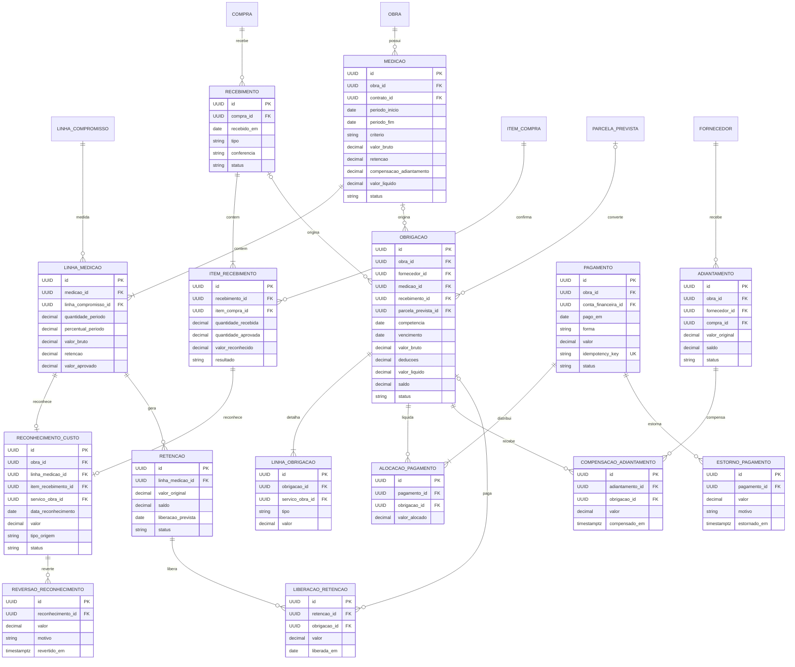

### Regras para validação

1. Medições acumuladas não podem exceder o compromisso autorizado atualizado.
2. Cada linha de medição ou recebimento aprovado gera no máximo um reconhecimento de custo ativo.
3. Cada origem financeira gera no máximo uma obrigação correspondente por tipo.
4. Uma obrigação pode receber pagamentos parciais; um pagamento pode liquidar várias obrigações.
5. A soma das alocações não pode exceder o pagamento líquido nem o saldo das obrigações.
6. Estorno reduz o pago líquido e reabre saldo da obrigação, mas não estorna automaticamente o custo reconhecido.
7. Compensação não excede o saldo do adiantamento nem o valor elegível da obrigação.
8. Liberação de retenção não reconhece novamente o custo.

## 9. Contas e movimentos financeiros

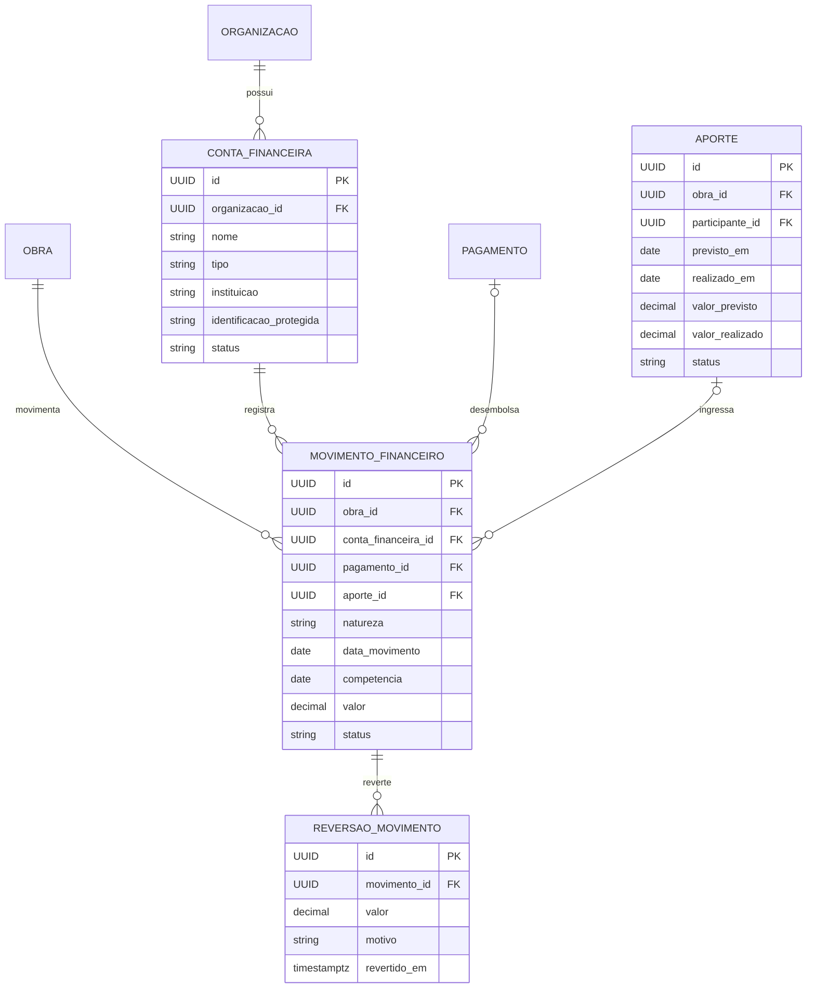

## 10. Diário, qualidade, mudanças e infraestrutura

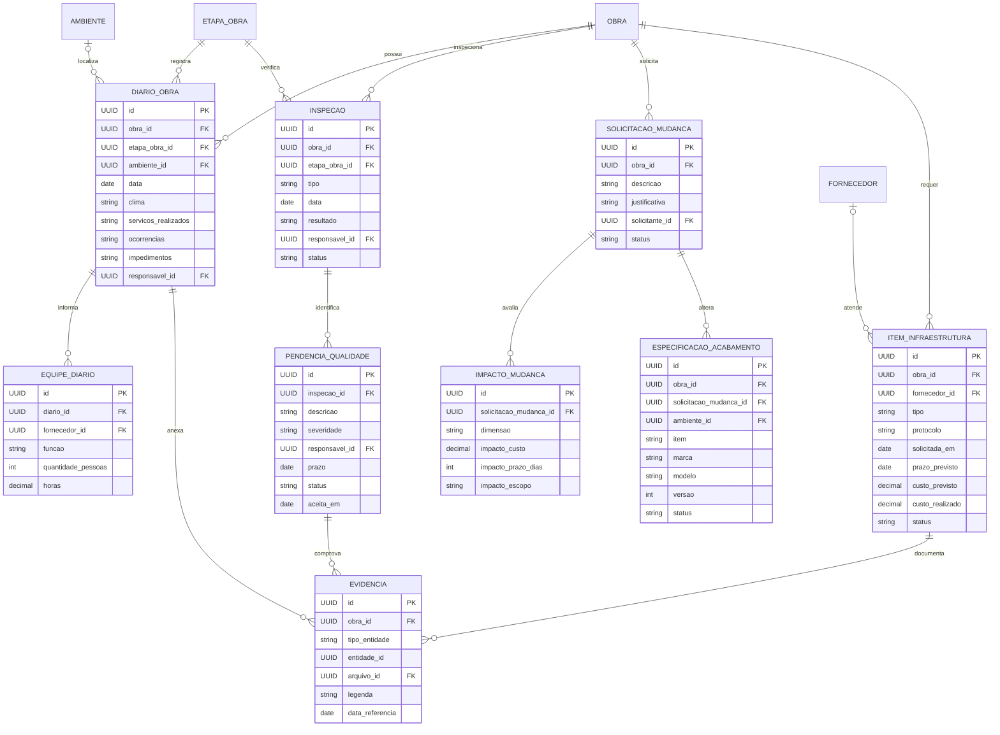

## 11. Documentos, versões, comentários e notificações

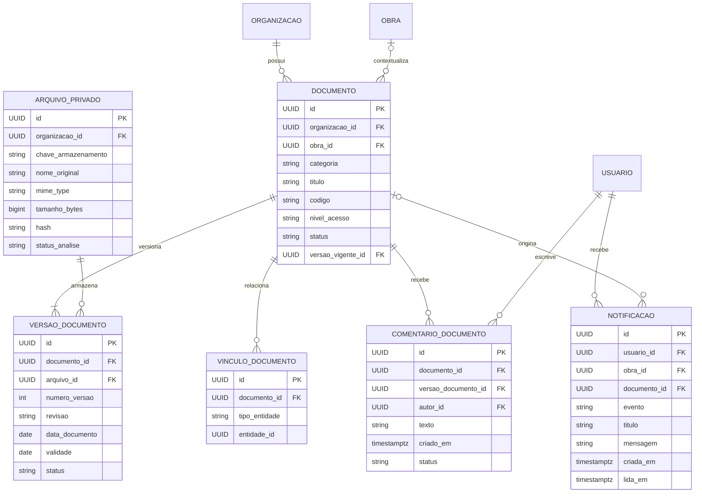

## 12. Pós-obra, garantias, memorial e venda

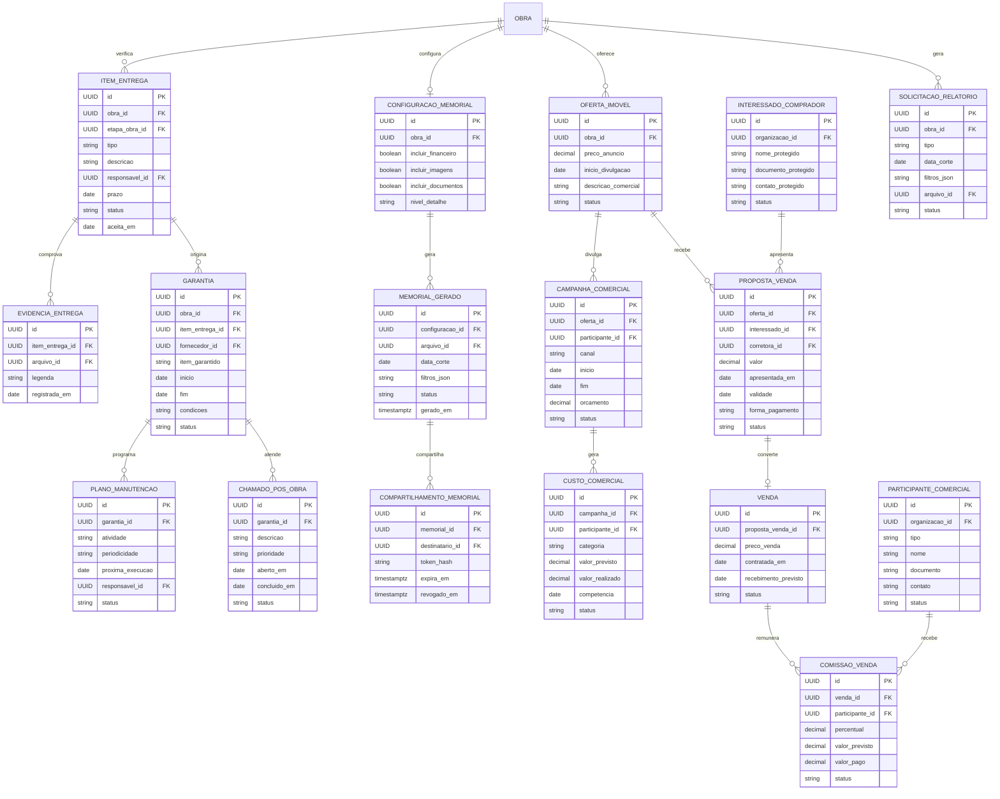

### Regras para validação

1. Custos de marketing, corretagem e comissões são custos comerciais, separados do custo de construção.
2. O memorial é um artefato derivado, com data de corte e filtros; não substitui os registros de origem.
3. Compartilhamentos possuem prazo, destinatário e possibilidade de revogação.
4. Dados do comprador são restritos e não aparecem em buscas ou exportações sem permissão.
5. Garantia preserva fornecedor, item, período e documentos mesmo após seu vencimento.

## 13. Controle, auditoria e idempotência

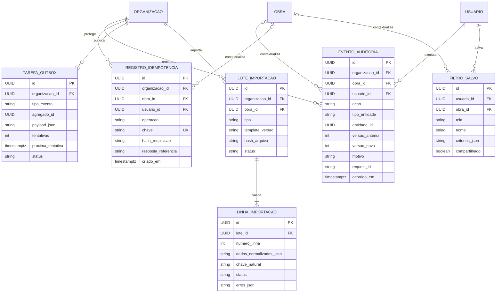

## 14. Histórico, auditoria e flexibilidade evolutiva

O modelo utiliza três mecanismos complementares. Eles não devem ser confundidos:

1. **Auditoria técnica:** registra quem alterou o quê, quando, por qual requisição e quais campos mudaram.
2. **Histórico temporal de negócio:** permite reconstruir a configuração válida de obra, etapas, serviços, dependências e parâmetros em uma data de corte.
3. **Eventos financeiros imutáveis:** reconhecimentos, reversões, pagamentos e estornos continuam sendo a autoridade para saldos; snapshots de auditoria não substituem esses eventos.

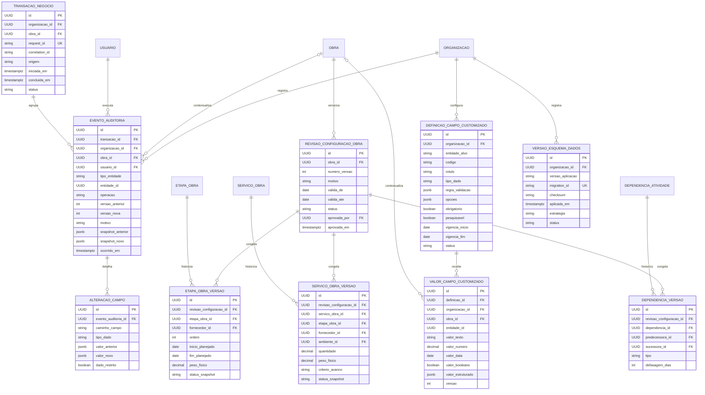

### 14.1 Tabelas de histórico propostas

| Tabela | Finalidade | Fonte oficial? | Retenção sugerida |
|---|---|---|---|
| `transacao_negocio` | Agrupar alterações atômicas, aprovações e eventos gerados pela mesma requisição | Não; correlação | Conforme auditoria da organização |
| `evento_auditoria` | Registrar inclusão, alteração, mudança de status, cancelamento e tentativa relevante | Evidência de auditoria | Longa duração; política formal |
| `alteracao_campo` | Permitir consulta de campos modificados sem comparar snapshots completos | Evidência de alteração | Mesma do evento pai |
| `revisao_configuracao_obra` | Identificar versões válidas da configuração da obra | Sim, para versão da configuração | Durante vida da obra e pós-obra |
| `etapa_obra_versao` | Congelar fornecedor, datas, peso, ordem e estado da etapa por revisão | Sim, para consulta temporal | Permanente enquanto houver prestação de contas |
| `servico_obra_versao` | Congelar quantidade, ambiente, fornecedor, peso e critério do serviço | Sim, para consulta temporal | Permanente enquanto houver prestação de contas |
| `dependencia_versao` | Preservar predecessor, sucessor, tipo e defasagem por revisão | Sim, para cronograma histórico | Permanente enquanto houver prestação de contas |
| Tabelas já versionadas | `versao_orcamento`, `baseline_cronograma`, `versao_documento`, `aditivo`, reversões e estornos | Sim, em seus domínios | Conforme exigência de negócio |
| `versao_esquema_dados` | Registrar migrations aplicadas e estratégia expand-contract | Evidência técnica | Permanente |

### 14.2 Regras de histórico

1. Toda alteração mutável recebe `versao`, `criado_em`, `criado_por`, `atualizado_em` e `atualizado_por` na tabela corrente.
2. `EVENTO_AUDITORIA` é append-only para a aplicação. Correção de auditoria cria novo evento correlacionado.
3. Dados sensíveis devem ser mascarados, cifrados ou omitidos dos snapshots; `ALTERACAO_CAMPO.dado_restrito` controla a apresentação.
4. A mesma transação de negócio grava a alteração, o histórico e a auditoria atomicamente.
5. Histórico temporal usa intervalos sem sobreposição: `valida_de` inclusivo e `valida_ate` exclusivo ou nulo para a versão vigente.
6. Aprovar nova configuração encerra a vigência anterior e inicia a nova no mesmo instante lógico.
7. Snapshots JSONB servem para investigação e evidência; relatórios financeiros continuam calculados a partir de eventos e tabelas de domínio.
8. Exclusões permitidas de rascunhos ainda geram evento de auditoria com identificadores e campos não sensíveis necessários.
9. Leitura de histórico respeita organização, obra, perfil e classificação do campo.

### 14.3 Flexibilidade para alterações futuras

- Usar **expand-contract**: adicionar estruturas compatíveis, migrar consumidores e dados, verificar, depois retirar estruturas antigas em migração futura autorizada.
- Migração aplicada é imutável; correções usam uma nova migração com checksum próprio.
- Novos campos operacionais estáveis devem virar colunas tipadas e constraints. Campos customizados atendem variações locais ainda não estabilizadas.
- `DEFINICAO_CAMPO_CUSTOMIZADO` controla tipo, validação, opções, vigência e entidades permitidas. Valores monetários oficiais, chaves e relacionamentos críticos não podem existir somente como JSONB customizado.
- Novos estados de processo exigem revisão das transições, relatórios e regras de autorização; não devem ser apenas textos livres.
- Baselines e versões permitem incorporar mudanças após o início da construção sem reescrever o passado.
- Views e materialized views podem acelerar painéis, mas são derivadas e reconstruíveis; nunca são autoridade de aprovação ou saldo.
- Flags de funcionalidade e parâmetros de organização podem liberar novos recursos gradualmente, preservando compatibilidade da API.

### 14.4 Índices candidatos para histórico

| Tabela | Índice candidato | Uso |
|---|---|---|
| `evento_auditoria` | `(organizacao_id, obra_id, ocorrido_em desc)` | Linha do tempo da obra |
| `evento_auditoria` | `(organizacao_id, tipo_entidade, entidade_id, ocorrido_em desc)` | Histórico de um registro |
| `evento_auditoria` | `(transacao_id)` | Explicar uma operação completa |
| `alteracao_campo` | `(evento_auditoria_id)` | Detalhamento do evento |
| `revisao_configuracao_obra` | `(obra_id, valida_de desc)` | Configuração em uma data de corte |
| `etapa_obra_versao` | `(etapa_obra_id, revisao_configuracao_id)` | Evolução da etapa |
| `servico_obra_versao` | `(servico_obra_id, revisao_configuracao_id)` | Evolução do serviço |
| `valor_campo_customizado` | `(definicao_id, entidade_id)` | Resolver extensão de uma entidade |

## 15. Matriz de relacionamentos críticos

| Origem | Cardinalidade | Destino | Regra principal |
|---|---:|---|---|
| Organização | 1:N | Obras | Obra pertence a uma única organização |
| Organização | N:N via membro | Usuários | Acesso geral não libera todas as obras |
| Obra | 1:N | Etapas da obra | Etapas são configurações próprias da obra |
| Etapa da obra | 1:N | Serviços da obra | Serviço pertence a uma etapa configurada |
| Fornecedor | 1:N | Etapas/serviços | Associação pode variar entre obras |
| Atividade | N:N via dependência | Atividade | Relação dirigida predecessor → sucessor, sem ciclos |
| Obra | 1:N | Versões de orçamento | Uma baseline vigente por data de corte |
| Versão de orçamento | 1:N | Linhas de orçamento | Linhas preservam quantidade, preço e encargos da versão |
| Solicitação | 1:N | Propostas | Propostas devem responder ao mesmo escopo comparável |
| Proposta | 0:1 | Decisão | Escolha exige justificativa e aprovação aplicável |
| Decisão | 0:1 | Compra | Efetivação idempotente |
| Compra | 1:N | Itens e recebimentos | Recebimentos podem ser parciais |
| Contrato | 1:N | Linhas de compromisso | Valor original permanece imutável |
| Contrato | 1:N | Aditivos | Somente aprovados alteram o compromisso |
| Compromisso | 1:N | Linhas de medição | Acumulado não ultrapassa limite autorizado |
| Medição/recebimento | 1:0..1 | Reconhecimento | Cada escopo é reconhecido uma única vez |
| Origem financeira | 1:0..N | Obrigações | Unicidade por origem e tipo evita duplicidade |
| Obrigação | N:N via alocação | Pagamento | Permite baixa parcial e consolidação |
| Pagamento | 1:N | Estornos | Estorno não altera automaticamente o custo executado |
| Documento | 1:N | Versões | Versão anterior não é sobrescrita |
| Obra | 1:N | Itens de entrega/garantias | Histórico permanece após encerramento |
| Oferta | 1:N | Propostas de venda | Uma proposta aceita pode gerar uma venda |
| Venda | 1:N | Comissões | Comissão permanece separada do custo da construção |

## 16. Fórmulas e fontes do painel

| Indicador | Grão e fonte | Fórmula ou regra |
|---|---|---|
| Orçamento vigente `B` | Linhas da versão aprovada vigente | Soma das linhas arredondadas |
| Reserva `R` | Saldo dos eventos de contingência | Reserva inicial + créditos − alocações aprovadas |
| Compromisso `C` | Linhas de compromisso e compras autorizadas | Valor original + aditivos aprovados − supressões aprovadas |
| Executado `E` | Reconhecimentos de custo | Reconhecimentos ativos − reversões |
| Compromisso restante `CR` | Compromissos por escopo | Compromisso atualizado − executado vinculado |
| Não contratado `U` | Estimativas restantes ativas | Soma sem sobreposição com E ou CR |
| Projeção `F` | E, CR e U | `F = E + CR + U` |
| Pago | Pagamentos e estornos | Pagamentos efetivos − estornos |
| Avanço físico | Eventos de progresso e baseline | Soma de percentual × peso congelado |
| Economia em propostas | Orçamento-base e decisão | Base comparável − valor efetivado, com escopo equivalente |
| Risco de atraso | Atividades e dependências | Derivado de datas, caminho dependente, bloqueios e prazo |

## 17. Restrições de integridade recomendadas

1. Chaves estrangeiras compostas ou gatilhos equivalentes devem impedir vínculos entre organizações e obras diferentes.
2. `UNIQUE (organizacao_id, cpf_cnpj)` para fornecedor, permitindo política explícita para documentos ausentes.
3. `UNIQUE (obra_id, numero_versao)` para orçamento e baseline.
4. `UNIQUE (decisao_proposta_id)` em compra quando a decisão gerar uma única compra.
5. `CHECK (predecessora_id <> sucessora_id)` e validação de ciclo para dependências.
6. `CHECK (valor >= 0)` nos valores positivos; reversões usam entidade própria em vez de números negativos livres.
7. `UNIQUE (tipo_origem, origem_id, tipo_obrigacao)` para geração de obrigação.
8. `UNIQUE (organizacao_id, usuario_id, operacao, chave)` para idempotência.
9. Soma de alocações de pagamento limitada ao valor líquido do pagamento.
10. Soma de medições aprovada limitada à linha de compromisso atualizada.
11. Soma de compensações limitada ao saldo do adiantamento.
12. Soma de liberações limitada ao saldo da retenção.
13. Exclusão física permitida apenas para rascunho sem referências; demais registros usam estado ou evento reverso.

## 18. Pontos para validação do modelo

- Confirmar se contrato e compra usam uma entidade unificada de compromisso ou permanecem entidades separadas com `LINHA_COMPROMISSO` comum. A proposta deste MER mantém origens separadas e consolidação na linha de compromisso.
- Confirmar se uma etapa pode possuir vários fornecedores simultâneos. O modelo permite vários fornecedores nos serviços e um responsável principal na etapa.
- Confirmar se o recebimento físico precisa controlar estoque de materiais; estoque não está incluído nesta versão.
- Confirmar se uma venda pode incluir mais de uma unidade ou imóvel; o modelo atual considera uma oferta vinculada a uma obra.
- Confirmar se taxas de cartório, condomínio e prefeitura entram como orçamento de pré-obra e também como documentos. O modelo permite ambos por vínculos distintos, sem duplicar custo.
- Definir quais tipos de documento exigem validade e alertas obrigatórios.
- Definir política de retenção de dados pessoais de interessados e compradores.
- Definir se comissão é reconhecida na assinatura, no recebimento ou em outro marco configurável.

## 19. Checklist de aprovação do MER

- [ ] Organização e obra isolam todos os registros específicos.
- [ ] Catálogo global não altera obras já configuradas sem revisão explícita.
- [ ] Etapas, serviços, ambientes, fornecedores e dependências refletem a operação real.
- [ ] Não existem ciclos entre predecessor e sucessor.
- [ ] Baselines preservam pesos, datas e versões anteriores.
- [ ] Proposta escolhida mantém justificativa e origem até a compra.
- [ ] Contrato e compra geram compromissos sem duplicar escopo.
- [ ] Medição e recebimento reconhecem custo uma única vez.
- [ ] Obrigação e pagamento permanecem separados.
- [ ] Parcelamento não duplica o custo da compra.
- [ ] Adiantamentos, retenções e estornos possuem saldos próprios.
- [ ] Documentos são versionados e protegidos por obra e finalidade.
- [ ] Memorial e relatórios são derivados com data de corte.
- [ ] Custos comerciais permanecem separados do custo da construção.
- [ ] Auditoria, aprovação e idempotência cobrem operações críticas.
